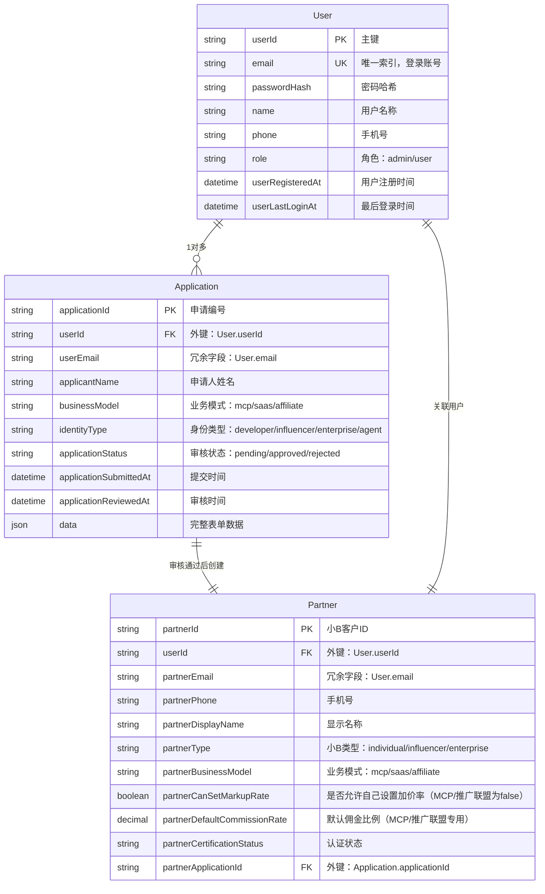
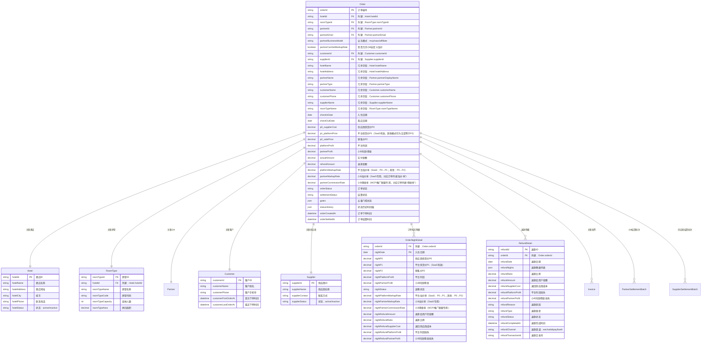
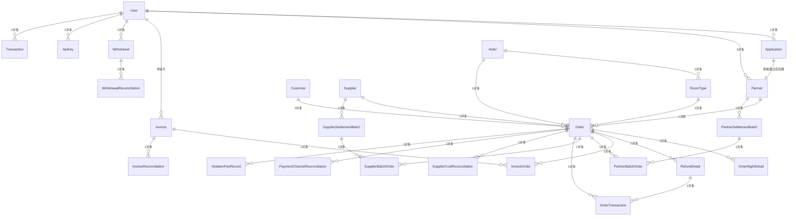

# 数据库设计可视化

本文档提供系统数据库设计的可视化图表，包括实体关系图（ER图）和数据库表结构图。

## 一、核心实体关系图（ER Diagram）

### 1.1 用户与认证流程

### 1.2 订单与关联实体

### 1.3 财务与结算实体

```mermaid
erDiagram
    Invoice ||--o{ InvoiceOrder : "关联订单"
    Invoice ||--|| User : "申请方用户"
    PartnerSettlementBatch ||--o{ PartnerBatchOrder : "关联订单"
    PartnerSettlementBatch ||--|| Partner : "关联小B"
    SupplierSettlementBatch ||--o{ SupplierBatchOrder : "关联订单"
    SupplierSettlementBatch ||--|| Supplier : "关联供应商"
    Withdrawal ||--|| User : "关联用户"
    OrderTransaction ||--|| Order : "关联订单"
    OrderTransaction ||--o| RefundDetail : "关联退款"
    
    Invoice {
        string invoiceId PK "发票ID"
        string applicantUserId FK "外键：User.userId"
        string applicantUserName "申请方用户名"
        string applicantUserContact "用户联系方式"
        string invoiceStatus "发票状态"
        decimal invoiceAmount "开票金额"
        decimal invoiceRefundAmount "退款金额"
        datetime invoiceApplyTime "开票申请时间"
        datetime invoiceSuccessTime "开票成功时间"
        datetime emailSendTime "邮箱发送时间"
        string invoiceContent "发票内容"
        string invoiceCode "发票代码"
        string invoiceNumber "发票号码"
        string invoiceIssuer "开票主体"
        string invoiceType "发票类型"
        string recipientEmail "接收人邮箱"
        string invoiceTitle "发票抬头"
        string taxNumber "发票税号"
        string registeredAddress "注册地址"
        string registeredPhone "注册电话"
        string bankName "开户银行"
        string bankAccount "银行账号"
        string invoiceRemark "备注说明"
        string errorReason "异常原因"
        json trajectory "发票状态时间轴"
    }
    
    InvoiceOrder {
        string invoiceId FK "外键：Invoice.invoiceId"
        string invoiceOrderOrderId FK "外键：Order.orderId"
        string invoiceOrderHotelName "冗余字段：Order.hotelName"
        decimal invoiceOrderAmount "订单金额"
        decimal invoiceOrderRefundAmount "订单退款金额"
        datetime invoiceOrderCreatedAt "订单下单时间"
    }
    
    PartnerSettlementBatch {
        string batchId PK "批次号"
        string partnerId FK "外键：Partner.partnerId"
        string partnerName "冗余字段：Partner.partnerDisplayName"
        string batchStatus "批次状态"
        decimal settlementAmount "结算金额"
        int orderCount "订单数量"
        date settlementPeriodStart "结算周期开始"
        date settlementPeriodEnd "结算周期结束"
        datetime batchCreatedAt "生成时间"
    }
    
    PartnerBatchOrder {
        string batchId FK "外键：PartnerSettlementBatch.batchId"
        string batchOrderOrderId FK "外键：Order.orderId"
        string batchOrderHotelName "冗余字段：Order.hotelName"
        decimal batchOrderPlatformProfit "平台利润"
        decimal batchOrderPartnerProfit "小B利润/佣金"
        int batchOrderSettledNights "已结算晚数"
        int batchOrderRefundedNights "已退款晚数"
        decimal batchOrderPartnerCommissionRate "小B佣金比例"
    }
    
    SupplierSettlementBatch {
        string batchId PK "批次号"
        string supplierId FK "外键：Supplier.supplierId"
        string supplierName "冗余字段：Supplier.supplierName"
        string batchStatus "批次状态"
        decimal settlementAmount "结算金额"
        int orderCount "订单数量"
        date settlementPeriodStart "结算周期开始"
        date settlementPeriodEnd "结算周期结束"
        datetime batchCreatedAt "生成时间"
    }
    
    SupplierBatchOrder {
        string batchId FK "外键：SupplierSettlementBatch.batchId"
        string batchOrderOrderId FK "外键：Order.orderId"
        string batchOrderHotelName "冗余字段：Order.hotelName"
        decimal batchOrderSupplierCost "供应商成本P0"
        int batchOrderSettledNights "已结算晚数"
        int batchOrderRefundedNights "已退款晚数"
    }
    
    Withdrawal {
        string withdrawalId PK "提现ID"
        string userId FK "外键：User.userId"
        string userName "用户名称"
        string businessModel "业务模式：mcp/saas/affiliate"
        decimal withdrawalAmount "提现金额"
        string withdrawalStatus "提现状态"
        datetime withdrawalApplyTime "提现申请时间"
        datetime withdrawalTransferTime "转账汇款时间"
        string phone "提现人电话"
        string account "提现账户"
        string accountName "提现用户名"
        string withdrawalRemark "备注"
        string withdrawalRejectReason "拒绝原因"
        string failureReason "失败原因"
    }
    
    OrderTransaction {
        string transactionId PK "交易ID"
        string orderId FK "外键：Order.orderId"
        string refundId FK "外键：RefundDetail.refundId"
        string transactionType "交易类型：order_payment/order_refund/order_supplement"
        string paymentChannel "支付渠道：wechat/alipay/bank"
        string paymentStatus "支付状态：processing/success/failed/refunded"
        decimal transactionAmount "交易金额"
        string channelTransactionId "渠道交易号"
        string transactionTime "交易时间"
        string transactionOperatorId "操作人ID"
        string transactionOperatorName "操作人姓名"
        string transactionRemark "备注"
        string relatedObjectId "关联对象ID"
        string relatedObjectName "关联对象名称"
        json refundNights "退款晚数列表"
        string refundReason "退款原因"
        string refundType "退款类型：full_refund/partial_refund"
    }
```

### 1.4 系统管理实体

```mermaid
erDiagram
    ApiKey ||--|| User : "关联用户"
    Transaction ||--|| User : "关联用户"
    SupplierCostReconciliation ||--|| Order : "关联订单"
    PaymentChannelReconciliation ||--o{ Order : "关联订单"
    WithdrawalReconciliation ||--o{ Withdrawal : "关联提现"
    InvoiceReconciliation ||--o{ Invoice : "关联发票"
    ViolationFeeRecord ||--|| Order : "关联订单"
    PricingRule ||--o{ Order : "影响定价"
    
    ApiKey {
        string apiKeyId PK "密钥ID"
        string userId FK "外键：User.userId"
        string userType "用户类型：individual/influencer/enterprise"
        string keyName "密钥名称"
        string keyPrefix "密钥前缀"
        string apiKeyStatus "状态：active/suspended/revoked"
        string riskLevel "风险等级：L0/L1/L2/L3/L4"
        datetime apiKeyCreatedAt "创建时间"
        datetime apiKeySuspendedAt "暂停时间"
        string suspendReason "暂停原因"
        string userName "显示名称"
        string userEmail "用户邮箱"
        string userPhone "用户手机号"
        string realName "真实姓名"
        string idNumber "身份证号"
        string platformName "平台名称"
        int followersCount "粉丝数"
        decimal influenceScore "影响力评分"
        string companyName "企业名称"
        string creditCode "统一社会信用代码"
        string legalRepName "法人代表姓名"
        string legalRepIdNumber "法人身份证号"
        string contactName "联系人姓名"
        string contactPhone "联系人手机号"
        string contactEmail "联系人邮箱"
        string accountType "账户类型：bank/alipay"
        string bankName "开户银行"
        string bankBranch "开户支行"
        string accountNumber "账户号码"
        string alipayAccount "支付宝账号"
        string alipayRealName "支付宝实名姓名"
        int totalCalls "总调用次数"
        int callsToday "今日调用次数"
        int callsThisMonth "本月调用次数"
        decimal successRate "成功率"
        int avgResponseTime "平均响应时间"
        datetime lastUsed "最后使用时间"
    }
    
    Transaction {
        string transactionId PK "交易ID"
        string userId FK "外键：User.userId"
        string userEmail "冗余字段：User.email"
        string userName "用户名称"
        string transactionType "交易类型：income/withdraw/refund"
        string transactionDescription "交易描述"
        decimal transactionAmount "交易金额"
        string transactionStatus "交易状态：pending/completed/failed"
        datetime transactionCreatedAt "交易发起时间"
        datetime transactionCompletedAt "完成时间"
        string businessModel "业务模式"
    }
    
    SupplierCostReconciliation {
        string reconciliationId PK "对账ID"
        string orderId FK "外键：Order.orderId"
        string reconciliationStatus "对账状态"
        decimal systemP0 "系统供应商成本金额"
        decimal supplierBillAmount "供应商账单金额"
        decimal difference "差异金额"
        datetime reconciliationCreatedAt "对账生成时间"
    }
    
    ViolationFeeRecord {
        string violationId PK "违约ID"
        string orderId FK "外键：Order.orderId"
        decimal violationAmount "违约金额"
        string violationReason "违约原因"
        datetime violationCreatedAt "创建时间"
    }
    
    PricingRule {
        string pricingRuleId PK "规则ID"
        string ruleName "规则名称"
        string scope "适用范围：global/brand/city/supplier"
        string target "目标对象"
        decimal markupRate "平台利润率"
        int priority "优先级"
        string pricingRuleStatus "状态：active/inactive"
        datetime pricingRuleCreatedAt "创建时间"
        datetime pricingRuleLastModifiedAt "修改时间"
    }
    
    PaymentChannelReconciliation {
        string reconciliationId PK "对账ID"
        string reconciliationType "对账类型：payment_channel"
        date reconciliationDate "对账日期"
        string channel "支付渠道：wechat/alipay/bank"
        int platformOrderCount "平台订单数量"
        decimal platformOrderAmount "平台订单金额"
        int channelOrderCount "渠道订单数量"
        decimal channelOrderAmount "渠道订单金额"
        decimal differenceAmount "差异金额"
        int differenceOrderCount "差异订单数量"
        string reconciliationStatus "对账状态"
        datetime reconciliationCreatedAt "生成时间"
        datetime reconciliationReconciledAt "对账时间"
        datetime reconciliationResolvedAt "处理时间"
        string reconciliationResolvedBy "处理人ID"
    }
    
    WithdrawalReconciliation {
        string reconciliationId PK "对账ID"
        string reconciliationType "对账类型：withdrawal"
        date reconciliationDate "对账日期"
        decimal withdrawalAmount "打款金额"
        decimal accountAmount "账本金额"
        decimal difference "差异金额"
        string reconciliationStatus "对账状态"
        datetime reconciliationCreatedAt "生成时间"
        datetime reconciliationResolvedAt "处理时间"
        string reconciliationResolvedBy "处理人ID"
    }
    
    InvoiceReconciliation {
        string reconciliationId PK "对账ID"
        string reconciliationType "对账类型：invoice"
        date reconciliationDate "对账日期"
        decimal invoiceAmount "开票金额"
        decimal costAmount "成本金额"
        decimal difference "差异金额"
        string reconciliationStatus "对账状态"
        datetime reconciliationCreatedAt "生成时间"
        datetime reconciliationResolvedAt "处理时间"
        string reconciliationResolvedBy "处理人ID"
    }
```

## 二、完整数据库表结构图

### 2.1 表关系总览

## 三、数据库设计原则说明

### 3.1 主键设计
- **自增ID**：使用 `userId`, `orderId`, `invoiceId` 等作为主键
- **业务编号**：部分表使用业务编号作为主键（如 `applicationId`, `batchId`）
- **组合主键**：关联表使用组合主键（如 `OrderNightDetail` 使用 `orderId + nightDate`）

### 3.2 外键设计
- **显式外键**：所有关联关系都通过外键字段明确标识
- **冗余字段**：为了提高查询性能，在订单、结算批次等表中存储了关联对象的常用字段

### 3.3 索引设计
- **主键索引**：所有表都有主键索引
- **唯一索引**：`User.email`, `Application.applicationId` 等
- **外键索引**：所有外键字段都应建立索引以提高关联查询性能
- **复合索引**：对于经常一起查询的字段组合建立复合索引

### 3.4 数据类型建议
- **字符串类型**：ID使用 `VARCHAR(50)` 或 `CHAR(36)`（UUID），名称使用 `VARCHAR(255)`
- **数值类型**：金额使用 `DECIMAL(10,2)`，比例使用 `DECIMAL(5,2)`，数量使用 `INT`
- **日期时间**：使用 `DATETIME` 或 `TIMESTAMP`
- **JSON类型**：复杂结构数据使用 `JSON` 类型（如 `OrderNightDetail` 数组、`RefundDetail` 数组）

### 3.5 字段命名规范
- **主键**：实体名 + `Id`（如 `userId`, `orderId`）
- **外键**：关联实体名 + `Id`（如 `partnerId`, `hotelId`）
- **冗余字段**：使用关联实体名作为前缀（如 `partnerName`, `hotelName`）
- **时间字段**：使用 `实体名 + 动作 + At`（如 `orderCreatedAt`, `applicationReviewedAt`）

## 四、数据库表清单

### 4.1 核心业务表（15张）
1. `users` - 系统用户表
2. `applications` - 申请认证表
3. `partners` - 小B合作伙伴表
4. `orders` - 订单表
5. `order_night_details` - 订单按天明细表
6. `refund_details` - 退款明细表
7. `invoices` - 发票表
8. `invoice_orders` - 发票关联订单表
9. `partner_settlement_batches` - 小B结算批次表
10. `partner_batch_orders` - 小B结算批次关联订单表
11. `supplier_settlement_batches` - 供应商结算批次表
12. `supplier_batch_orders` - 供应商结算批次关联订单表
13. `withdrawals` - 提现表
14. `order_transactions` - 订单交易记录表
15. `api_keys` - API密钥表

### 4.2 关联对象表（5张）
16. `hotels` - 酒店表
17. `room_types` - 房型表
18. `customers` - 客户表
19. `suppliers` - 供应商表

### 4.3 系统管理表（8张）
20. `transactions` - 交易记录表
21. `supplier_cost_reconciliations` - 供应商成本对账表
22. `payment_channel_reconciliations` - 支付渠道对账表
23. `withdrawal_reconciliations` - 提现对账表
24. `invoice_reconciliations` - 开票对账表
25. `violation_fee_records` - 违约扣费记录表
26. `pricing_rules` - 价格规则表

**总计：28张核心表**

## 五、重要关系说明

### 5.1 一对多关系
- `User` → `Application`：一个用户可以有多个申请
- `User` → `Partner`：一个用户只能有一个Partner（审核通过后创建）
- `Partner` → `Order`：一个小B可以有多个订单
- `Order` → `OrderNightDetail`：一个订单有多天的明细
- `Order` → `RefundDetail`：一个订单可以有多次退款

### 5.2 多对多关系（通过中间表）
- `Invoice` ↔ `Order`：通过 `invoice_orders` 表
- `PartnerSettlementBatch` ↔ `Order`：通过 `partner_batch_orders` 表
- `SupplierSettlementBatch` ↔ `Order`：通过 `supplier_batch_orders` 表

### 5.3 一对一关系
- `Application` → `Partner`：审核通过后创建，一对一关系

## 六、数据完整性约束

### 6.1 外键约束
- 所有外键都应设置 `ON DELETE CASCADE` 或 `ON DELETE RESTRICT` 约束
- 关键业务数据（如订单）建议使用 `RESTRICT`，防止误删

### 6.2 唯一性约束
- `User.email`：必须唯一
- `Application.applicationId`：必须唯一
- `Order.orderId`：必须唯一

### 6.3 非空约束
- 所有主键字段必须非空
- 所有外键字段必须非空（除非允许NULL）
- 关键业务字段必须非空（如订单金额、状态等）

### 6.4 检查约束
- 金额字段：必须 >= 0
- 比例字段：必须在合理范围内（如 0-100%）
- 状态字段：必须是指定的枚举值

---

**注意**：本文档中的ER图使用Mermaid语法，可以在支持Mermaid的Markdown编辑器中直接渲染（如VS Code with Mermaid插件、GitHub、GitLab等）。

