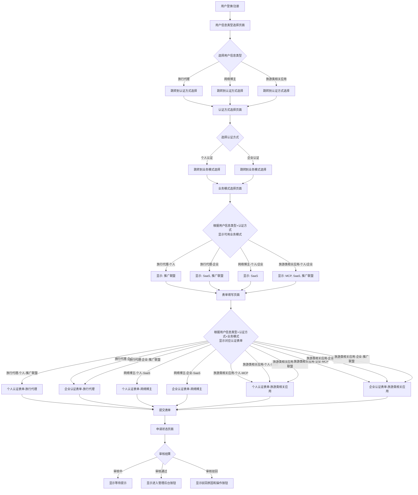
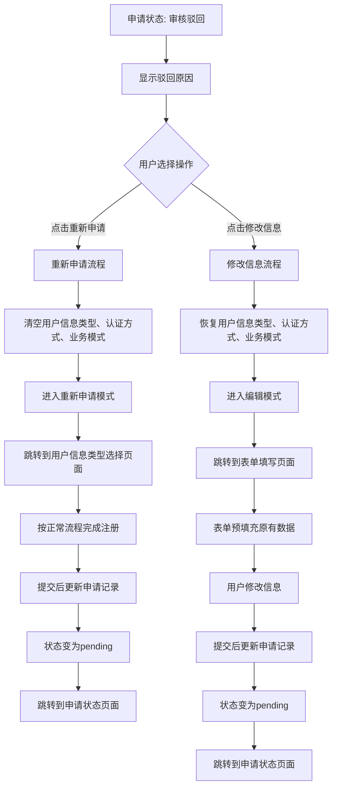
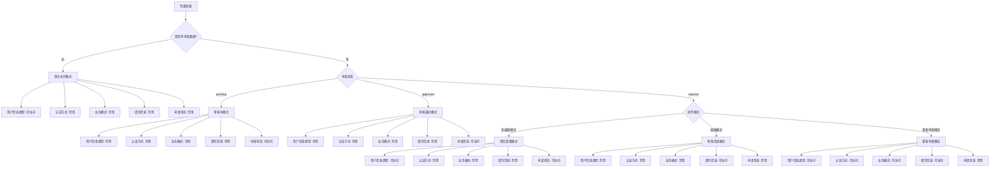
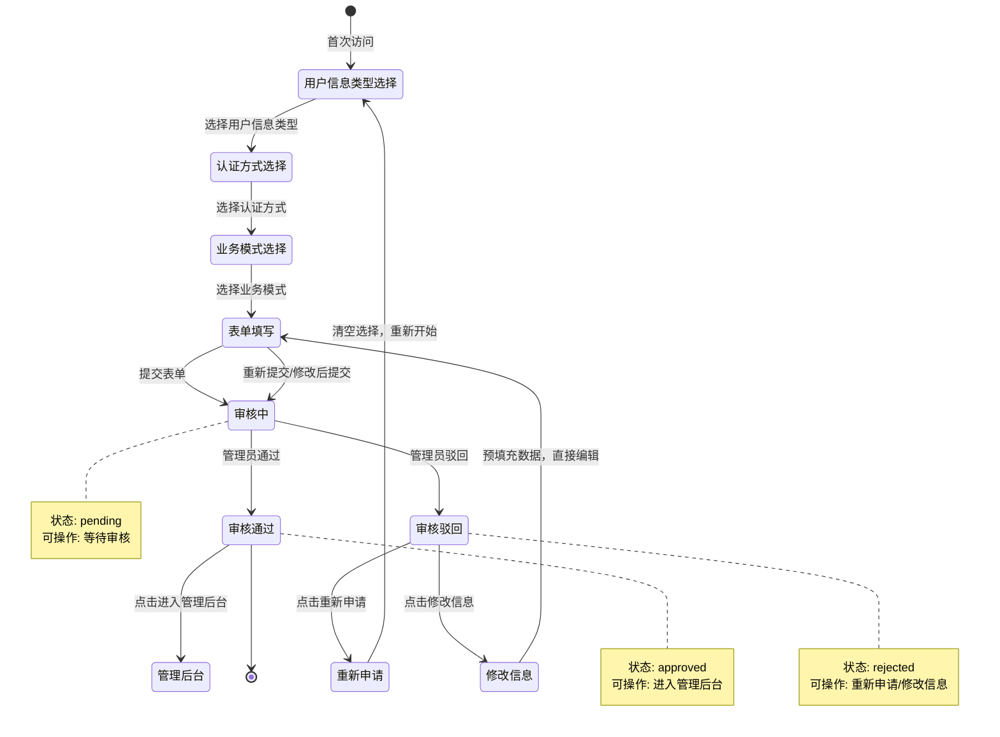
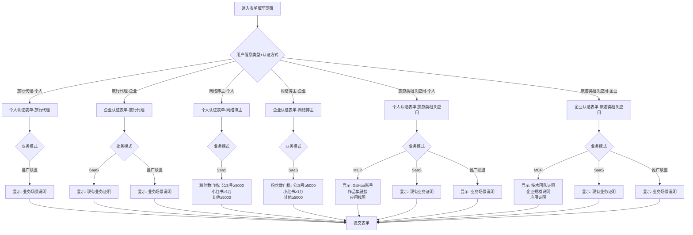

# 用户分类与业务模式逻辑

## 流程结构

```
用户注册登录
    ↓
第一步：选择用户信息类型（3类）
    ↓
第二步：选择认证方式（个人认证/企业认证）
    ↓
第三步：根据用户信息类型+认证方式显示可用的业务模式
    ↓
选择业务模式
    ↓
根据用户信息类型+认证方式+业务模式显示对应的认证表单
    ↓
提交审核
```

## 用户信息类型与业务模式映射规则

### 完整映射表

| 用户信息类型 | 认证方式 | 可选业务模式 | 大B/小B判定 | 挂载关系 | 审核方 |
|------------|---------|------------|-----------|---------|--------|
| 旅行代理 | 个人认证 | 推广联盟 | 小B | 挂载在平台大B下 | 管理员 |
| 旅行代理 | 企业认证 | SaaS / 推广联盟 | 大B（SaaS）或 小B（推广联盟） | 推广联盟时挂载在平台大B下 | 管理员 |
| 网络博主 | 个人认证 | SaaS | 大B | 直接由管理员管理 | 管理员 |
| 网络博主 | 企业认证 | SaaS | 大B | 直接由管理员管理 | 管理员 |
| 旅游类相关应用 | 个人认证 | MCP / SaaS / 推广联盟 | 大B（MCP/SaaS）或 小B（推广联盟） | 推广联盟时挂载在平台大B下 | 管理员 |
| 旅游类相关应用 | 企业认证 | MCP / SaaS / 推广联盟 | 大B（MCP/SaaS）或 小B（推广联盟） | 推广联盟时挂载在平台大B下 | 管理员 |

### 关键规则说明

1. **推广联盟用户都是小B**：所有选择推广联盟的用户都是小B，默认分佣金，挂载在平台大B下
2. **SaaS和MCP用户都是大B**：可以选择加价率，可以管理小B客户
3. **平台大B账户**：用于挂载所有推广联盟小B，由管理员管理

## 页面跳转逻辑

### 正常注册流程

1. **用户信息类型选择页面** (`userType`)
   - 用户选择用户信息类型（旅行代理、网络博主、旅游类相关应用）
   - 选择后自动跳转到认证方式选择页面
   - Tab状态：用户信息类型（当前）、认证方式（禁用）、业务模式（禁用）、填写信息（禁用）、申请状态（禁用）

2. **认证方式选择页面** (`certification`)
   - 所有用户信息类型都可以选择两种认证方式：个人认证、企业认证
   - 选择后自动跳转到业务模式选择页面
   - Tab状态：用户信息类型（可访问）、认证方式（当前）、业务模式（禁用）、填写信息（禁用）、申请状态（禁用）

3. **业务模式选择页面** (`business`)
   - 根据选择的用户信息类型+认证方式，显示可用的业务模式
   - **旅行代理-个人认证**：推广联盟
   - **旅行代理-企业认证**：SaaS、推广联盟
   - **网络博主-个人/企业认证**：SaaS
   - **旅游类相关应用-个人/企业认证**：MCP、SaaS、推广联盟
   - 选择后自动跳转到表单填写页面
   - Tab状态：用户信息类型（可访问）、认证方式（可访问）、业务模式（当前）、填写信息（禁用）、申请状态（禁用）

4. **表单填写页面** (`form`)
   - 根据用户信息类型+认证方式+业务模式，显示对应的认证表单
   - **旅行代理-个人认证** → 个人认证表单（旅行代理）
   - **旅行代理-企业认证** → 企业认证表单（旅行代理）
   - **网络博主-个人认证** → 个人认证表单（网络博主）
   - **网络博主-企业认证** → 企业认证表单（网络博主）
   - **旅游类相关应用-个人认证** → 个人认证表单（旅游类相关应用）
   - **旅游类相关应用-企业认证** → 企业认证表单（旅游类相关应用）
   - 表单字段根据业务模式动态显示
   - 提交后跳转到申请状态页面
   - Tab状态：用户信息类型（可访问）、认证方式（可访问）、业务模式（可访问）、填写信息（当前）、申请状态（禁用）

5. **申请状态页面** (`status`)
   - 显示申请状态：审核中、审核通过、审核驳回
   - 审核中：显示等待提示
   - 审核通过：显示"进入管理后台"按钮
   - 审核驳回：显示驳回原因和两个操作按钮
     - "重新申请"：清空所有选择，从用户信息类型选择重新开始
     - "修改信息"：直接跳转到表单，预填充原有数据
   - Tab状态：用户信息类型（禁用）、认证方式（禁用）、业务模式（禁用）、填写信息（禁用）、申请状态（当前）

### 驳回后的处理流程

#### 重新申请流程
1. 用户点击"重新申请"按钮
2. 清空用户信息类型、认证方式、业务模式选择
3. 进入重新申请模式（`isReapplying = true`）
4. 跳转到用户信息类型选择页面
5. 按照正常流程依次完成：用户信息类型 → 认证方式 → 业务模式 → 表单填写
6. 提交后更新现有申请记录（保留申请ID，更新状态为pending）
7. 退出重新申请模式，跳转到申请状态页面

#### 修改信息流程
1. 用户点击"修改信息"按钮
2. 恢复之前的用户信息类型、认证方式、业务模式选择
3. 进入编辑模式（`isEditMode = true`）
4. 直接跳转到表单填写页面
5. 表单预填充原有数据
6. 用户修改信息后提交
7. 更新现有申请记录（保留申请ID，更新状态为pending）
8. 退出编辑模式，跳转到申请状态页面

### Tab访问控制逻辑

#### 无申请数据（首次访问）
- 用户信息类型：✅ 可访问
- 认证方式：❌ 禁用（需先选择用户信息类型）
- 业务模式：❌ 禁用（需先选择用户信息类型和认证方式）
- 填写信息：❌ 禁用（需先选择用户信息类型、认证方式和业务模式）
- 申请状态：❌ 禁用（需先提交申请）

#### 有申请数据 - 审核中（pending）
- 用户信息类型：❌ 禁用
- 认证方式：❌ 禁用
- 业务模式：❌ 禁用
- 填写信息：❌ 禁用
- 申请状态：✅ 可访问（仅此tab可访问）

#### 有申请数据 - 审核通过（approved）
- 用户信息类型：❌ 禁用
- 认证方式：❌ 禁用
- 业务模式：❌ 禁用
- 填写信息：❌ 禁用
- 申请状态：✅ 可访问（显示"进入管理后台"按钮）

#### 有申请数据 - 审核驳回（rejected）

**非编辑模式：**
- 用户信息类型：✅ 可访问（用于重新申请）
- 认证方式：❌ 禁用
- 业务模式：❌ 禁用
- 填写信息：❌ 禁用
- 申请状态：✅ 可访问（显示驳回原因和操作按钮）

**编辑模式（点击"修改信息"后）：**
- 用户信息类型：❌ 禁用
- 认证方式：❌ 禁用
- 业务模式：❌ 禁用
- 填写信息：✅ 可访问（仅此tab可访问）
- 申请状态：❌ 禁用

**重新申请模式（点击"重新申请"后）：**
- 用户信息类型：✅ 可访问
- 认证方式：✅ 可访问（选择用户信息类型后）
- 业务模式：✅ 可访问（选择认证方式后）
- 填写信息：✅ 可访问（选择业务模式后）
- 申请状态：❌ 禁用（提交前不可访问）

### 状态流转

```
首次申请
  ↓
提交表单
  ↓
状态：pending（审核中）
  ↓
  ├─→ 审核通过 → 状态：approved → 进入管理后台
  │
  └─→ 审核驳回 → 状态：rejected
                    ↓
             用户选择操作
                    ↓
        ┌───────────┴───────────┐
        ↓                       ↓
   重新申请                  修改信息
        ↓                       ↓
   清空选择                恢复选择
        ↓                       ↓
   从用户信息类型开始      直接进入表单
        ↓                       ↓
   完成新流程              修改后提交
        ↓                       ↓
   状态：pending（审核中）  状态：pending（审核中）
```

## 认证表单详细字段

### 个人认证表单 - 旅行代理

**基础身份信息：**
- 真实姓名（必填）
- 身份证号（必填，18位格式验证）
- 身份证有效期（起始日期、结束日期，必填）
- 身份证照片（正面、反面，必填，JPG/PNG，≤5MB）

**业务证明（必填）：**
- 业务证明截图（必填，最多5张，JPG/PNG，≤5MB）：
  - 证明从事酒店代订业务的材料

**联系方式：**
- 联系手机号（必填，11位，需短信验证）
- 电子邮箱（必填，需格式验证）

**结算账户：**
- 账户类型（必填）：银行卡 / 支付宝
- **银行卡：**
  - 开户人姓名（自动填充真实姓名，只读）
  - 开户银行（必填，下拉选择）
  - 开户支行（必填）
  - 银行卡号（必填，需四要素验证）
- **支付宝：**
  - 支付宝账号（必填，手机号或邮箱）
  - 实名认证姓名（必填，需与真实姓名一致）

**业务模式差异：**
- **推广联盟业务：**
  - 业务场景说明（选填，文本描述）
  - 业务证明截图

**验证步骤：**
- 人脸识别验证（必填）
- 手机号短信验证（必填）

---

### 企业认证表单 - 旅行代理

**企业基础信息：**
- 企业名称（必填，需与营业执照一致）
- 统一社会信用代码（必填，18位格式验证）
- 营业执照照片（必填，JPG/PNG，≤5MB）

**法人信息：**
- 法人代表姓名（必填）
- 法人身份证号（必填，18位格式验证）
- 法人身份证照片（正面、反面，必填，JPG/PNG，≤5MB）

**业务证明（必填）：**
- 业务证明材料（必填，最多5张，JPG/PNG，≤5MB）：
  - 旅行社经营许可证
  - 从事旅游订酒店业务的材料

**联系人信息：**
- 联系人姓名（必填）
- 联系人手机号（必填，11位，需短信验证）
- 联系人电子邮箱（必填，需格式验证）

**结算账户（对公账户）：**
- 开户主体名称（自动填充企业名称，只读）
- 开户银行（必填，下拉选择）
- 开户支行（必填）
- 对公银行账号（必填，需企业账户验证）

**业务模式差异：**
- **SaaS业务：**
  - 业务证明材料（必填，经营许可证/业务截图）
  - 现有业务相关链接（选填）
- **推广联盟业务：**
  - 业务场景说明（选填，预订场景描述）
  - 业务证明材料（必填，经营许可证/业务截图）

**验证步骤：**
- 法人人脸识别验证（必填）
- 联系人手机号短信验证（必填）

---

### 个人认证表单 - 网络博主

**基础身份信息：**
- 真实姓名（必填）
- 身份证号（必填，18位格式验证）
- 身份证有效期（起始日期、结束日期，必填）
- 身份证照片（正面、反面，必填，JPG/PNG，≤5MB）

**平台信息：**
- 主营社交平台（必填，下拉选择）：
  - 小红书、抖音、微信公众号、微博、B站、YouTube、Instagram、知乎、快手
- 个人主页链接（必填，需格式验证）
- 粉丝数/订阅数（必填，数字，需≥门槛值）
- 后台数据截图（必填，最多3张，证明粉丝数真实性）

**其他平台信息（选填，可添加多个）：**
- 平台名称（下拉选择）
- 个人主页链接
- 粉丝数
- 数据截图（最多3张）

**联系方式：**
- 联系手机号（必填，11位，需短信验证）
- 电子邮箱（选填，需格式验证）

**结算账户：**
- 账户类型（必填）：银行卡 / 支付宝
- **银行卡：**
  - 开户人姓名（自动填充真实姓名，只读）
  - 开户银行（必填，下拉选择）
  - 开户支行（必填）
  - 银行卡号（必填，需四要素验证）
- **支付宝：**
  - 支付宝账号（必填，手机号或邮箱）
  - 实名认证姓名（必填，需与真实姓名一致）

**业务模式差异：**
- **SaaS业务：**
  - 粉丝数门槛：公众号≥100，小红书≥100，其他平台≥100
  - 需验证平台账号真实性

**验证步骤：**
- 人脸识别验证（必填）
- 手机号短信验证（必填）

---

### 企业认证表单 - 网络博主

**企业基础信息：**
- 企业名称（必填，需与营业执照一致）
- 统一社会信用代码（必填，18位格式验证）
- 营业执照照片（必填，JPG/PNG，≤5MB）

**法人信息：**
- 法人代表姓名（必填）
- 法人身份证号（必填，18位格式验证）
- 法人身份证照片（正面、反面，必填，JPG/PNG，≤5MB）

**平台信息：**
- 主营社交平台（必填，下拉选择）：
  - 小红书、抖音、微信公众号、微博、B站、YouTube、Instagram、知乎、快手
- 个人主页链接（必填，需格式验证）
- 粉丝数/订阅数（必填，数字，需≥门槛值）
- 后台数据截图（必填，最多3张，证明粉丝数真实性）

**其他平台信息（选填，可添加多个）：**
- 平台名称（下拉选择）
- 个人主页链接
- 粉丝数
- 数据截图（最多3张）

**联系人信息：**
- 联系人姓名（必填）
- 联系人手机号（必填，11位，需短信验证）
- 联系人电子邮箱（必填，需格式验证）

**结算账户（对公账户）：**
- 开户主体名称（自动填充企业名称，只读）
- 开户银行（必填，下拉选择）
- 开户支行（必填）
- 对公银行账号（必填，需企业账户验证）

**业务模式差异：**
- **SaaS业务：**
  - 粉丝数门槛：公众号≥100，小红书≥100，其他平台≥100
  - 需验证平台账号真实性

**验证步骤：**
- 法人人脸识别验证（必填）
- 联系人手机号短信验证（必填）

---

### 个人认证表单 - 旅游类相关应用

**基础身份信息：**
- 真实姓名（必填）
- 身份证号（必填，18位格式验证）
- 身份证有效期（起始日期、结束日期，必填）
- 身份证照片（正面、反面，必填，JPG/PNG，≤5MB）

**联系方式：**
- 联系手机号（必填，11位，需短信验证）
- 电子邮箱（选填，需格式验证）

**结算账户：**
- 账户类型（必填）：银行卡 / 支付宝
- **银行卡：**
  - 开户人姓名（自动填充真实姓名，只读）
  - 开户银行（必填，下拉选择）
  - 开户支行（必填）
  - 银行卡号（必填，需四要素验证）
- **支付宝：**
  - 支付宝账号（必填，手机号或邮箱）
  - 实名认证姓名（必填，需与真实姓名一致）

**业务模式差异：**
- **MCP业务：**
  - GitHub账号（选填）
  - 作品集链接（选填，应用/网站/小程序链接）
  - 应用截图（选填，最多3张）
- **SaaS业务：**
  - 现有业务证明（选填，网站、APP链接或截图）
- **推广联盟业务：**
  - 业务场景说明（选填，文本描述）

**验证步骤：**
- 人脸识别验证（必填）
- 手机号短信验证（必填）

---

### 企业认证表单 - 旅游类相关应用

**企业基础信息：**
- 企业名称（必填，需与营业执照一致）
- 统一社会信用代码（必填，18位格式验证）
- 营业执照照片（必填，JPG/PNG，≤5MB）

**法人信息：**
- 法人代表姓名（必填）
- 法人身份证号（必填，18位格式验证）
- 法人身份证照片（正面、反面，必填，JPG/PNG，≤5MB）

**联系人信息：**
- 联系人姓名（必填）
- 联系人手机号（必填，11位，需短信验证）
- 联系人电子邮箱（必填，需格式验证）

**结算账户（对公账户）：**
- 开户主体名称（自动填充企业名称，只读）
- 开户银行（必填，下拉选择）
- 开户支行（必填）
- 对公银行账号（必填，需企业账户验证）

**业务模式差异：**
- **MCP业务额外要求：**
  - 技术团队证明（选填，员工数、技术负责人信息）
  - 企业规模说明（选填）
  - 应用证明（选填，应用截图、官网链接）
- **SaaS业务：**
  - 现有业务证明（选填，网站、APP链接或截图）
- **推广联盟业务：**
  - 业务场景说明（选填，B2B分销场景描述）

**验证步骤：**
- 法人人脸识别验证（必填）
- 联系人手机号短信验证（必填）


## 验证规则与限制

### 身份验证
- **身份证号：** 18位，格式验证（前17位数字+最后1位数字/X）
- **身份证有效期：** 结束日期需晚于当前日期
- **人脸识别：** 个人认证需本人完成，企业认证需法人完成
- **手机号验证：** 所有身份类型需完成短信验证码验证

### 账户验证
- **个人银行卡：** 四要素验证（姓名、身份证号、手机号、银行卡号）
- **个人支付宝：** 实名认证姓名需与身份证姓名一致
- **企业对公账户：** 账户名称需与企业名称一致

## 业务流程图

### 1. 正常注册流程



### 2. 驳回后处理流程



### 3. Tab访问控制流程



### 4. 申请状态流转图



### 5. 表单字段动态显示逻辑



## 大B/小B判定与挂载关系

### 判定规则

1. **大B客户（可设置加价率）**：
   - 业务模式为SaaS或MCP的用户
   - 可以设置加价率
   - 可以管理小B客户（推广联盟用户）

2. **小B客户（只获取链接）**：
   - 业务模式为推广联盟的用户
   - 不能设置加价率
   - 挂载在平台大B下（或由管理员指定的大B下）
   - 默认分佣金

### 挂载关系

- **推广联盟用户（小B）**：所有选择推广联盟的用户都挂载在平台大B下
- **平台大B账户**：由管理员管理，用于挂载所有推广联盟小B
- **审核流程**：推广联盟用户的审核由管理员进行，审核通过后自动挂载到平台大B下

## 业务模式说明

### SaaS模式（大B）
- 可以设置加价率（从P1到P2）
- 可以生成推广链接
- 可以管理小B客户（推广联盟用户）
- 可以查看订单、利润、数据报表

### MCP模式（大B）
- 可以设置加价率（从P1到P2）
- 可以管理MCP KEY密钥和MCP集成
- 可以查看用量监控
- 可以管理小B客户（推广联盟用户）
- 可以查看订单、利润、数据报表

### 推广联盟模式（小B）
- 不能设置加价率
- 只能获取推广链接（由平台大B或管理员分配）
- 可以查看自己的订单
- 可以查看自己的佣金（按佣金比例计算）
- 佣金比例由平台大B或管理员设置
- 挂载在平台大B下

---

**注：** 此文档基于最新的用户分类与业务模式逻辑整理，已包含所有确认的业务规则和审核资料要求。
