# 一、系统架构

## 1.1 三层系统架构

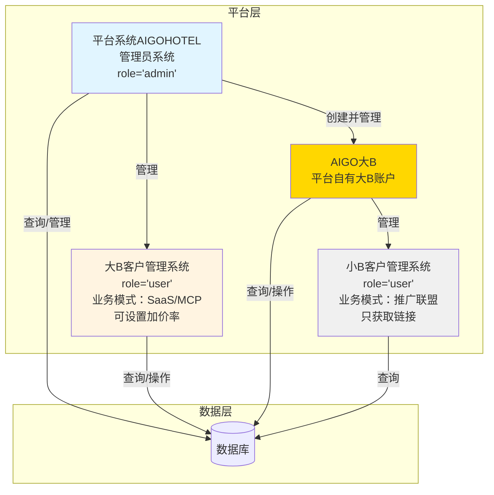

## 1.2 完整业务流程架构

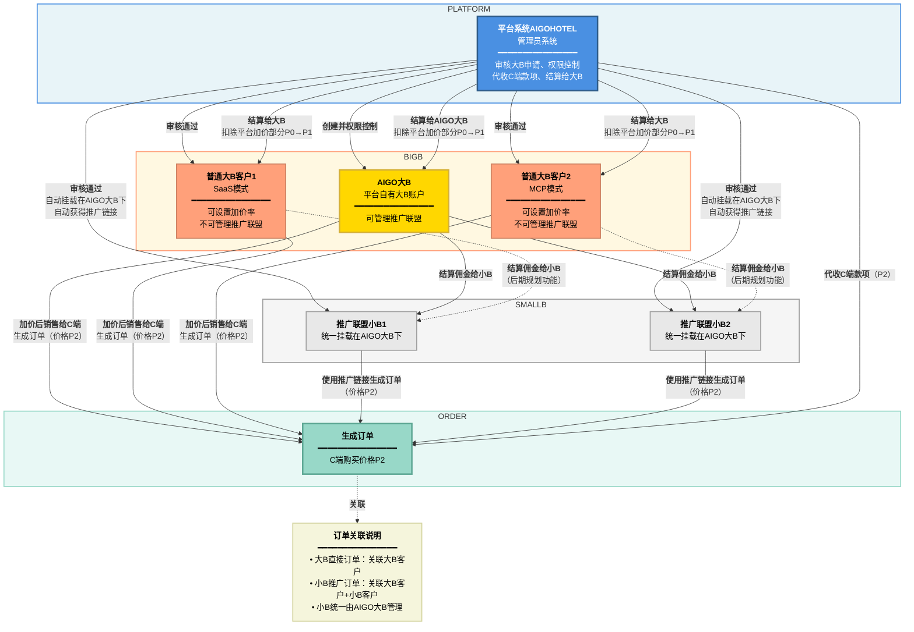

## 1.3 业务流程时序图

#### 1.3.1 下单流程时序图

```mermaid
sequenceDiagram
    participant C as C端用户
    participant SmallB as 小B(推广联盟)
    participant AIGO_BigB as AIGO大B
    participant BigB as 普通大B(SaaS/MCP)
    participant Platform as 平台系统
    participant Supplier as 供应商
    participant Payment as 支付渠道
  
    Note over C,Supplier: 场景1: 小B推广订单(挂载在AIGO大B下)
    C->>SmallB: 1. 在小B页面看到推广链接
    C->>Platform: 2. 点击推广链接<br/>跳转到平台<br/>(链接包含小B ID参数)
    Platform->>Platform: 3. 解析链接参数<br/>识别小B ID
    Platform->>Platform: 4. 根据小B ID查找<br/>关联的AIGO大B<br/>(parent_partner_id)
    Platform->>Supplier: 5. 查询酒店信息和房源
    Supplier-->>Platform: 6. 返回酒店信息和价格P0
    Platform->>Platform: 7. 计算价格(推广联盟模式)<br/>P0(供应商成本)<br/>P2=P0×(1+平台加价率)<br/>总利润=P2-P0
    Platform->>Platform: 8. 计算佣金<br/>小B佣金=订单总金额P2×佣金比例<br/>平台利润=总利润-小B佣金
    Platform->>Platform: 9. 检查优惠活动<br/>计算优惠金额
    Platform->>Platform: 10. 计算实际支付金额<br/>实付金额=P2-优惠金额
    Platform-->>C: 11. 展示酒店和价格<br/>(P2、优惠金额、实付金额)
  
    C->>Platform: 12. 选择酒店并下单<br/>(订单包含小B ID、入住信息)
    Platform->>Platform: 13. 创建订单<br/>状态:待支付<br/>关联AIGO大B+小B<br/>记录价格信息(P0/P2)<br/>记录优惠信息<br/>记录佣金信息<br/>记录平台利润
    Platform->>Supplier: 14. 确认房源和价格<br/>(检查房源可用性)
    alt 房源可用
        Supplier-->>Platform: 15. 确认可用<br/>返回供应商订单号
        Platform->>Platform: 16. 保存供应商订单号
        Platform->>AIGO_BigB: 17. 通知AIGO大B<br/>有新订单(关联小B)<br/>状态:待支付
        Platform->>SmallB: 18. 通知小B有新订单<br/>状态:待支付
        Platform-->>C: 19. 订单创建成功<br/>状态:待支付<br/>显示支付金额
    else 房源不可用
        Supplier-->>Platform: 20. 房源不可用
        Platform->>Platform: 21. 更新订单状态<br/>订单取消(房源不可用)
        Platform-->>C: 22. 订单创建失败<br/>房源不可用
    end
  
    C->>Platform: 23. 选择支付渠道<br/>(微信/支付宝/银行)
    C->>Platform: 24. 发起支付<br/>(实付金额)
    Platform->>Payment: 25. 调用支付渠道API
    alt 支付成功
        Payment-->>Platform: 26. 支付成功<br/>返回支付流水号
        Platform->>Platform: 27. 更新订单状态<br/>待支付→待确认
        Platform->>Platform: 28. 记录交易记录<br/>交易类型:订单支付<br/>支付金额:实付金额<br/>支付渠道:微信/支付宝/银行<br/>支付状态:支付成功
        Platform->>Platform: 29. 更新平台账户<br/>收到P2金额(实付金额)
        Platform->>Supplier: 30. 通知供应商<br/>订单已支付，请确认
        Platform->>AIGO_BigB: 31. 通知订单支付成功<br/>状态:待确认
        Platform->>SmallB: 32. 通知订单支付成功<br/>状态:待确认
        Platform-->>C: 33. 支付成功<br/>状态:待确认
    
        Platform->>Supplier: 34. 供应商确认订单<br/>(占房确认)
        alt 供应商确认成功
            Supplier-->>Platform: 35. 订单确认成功
            Platform->>Platform: 36. 更新订单状态<br/>待确认→已确认/待入住
            Platform->>Platform: 37. 记录操作历史
            Platform->>AIGO_BigB: 38. 通知订单已确认<br/>状态:已确认/待入住
            Platform->>SmallB: 39. 通知订单已确认<br/>状态:已确认/待入住
            Platform-->>C: 40. 订单已确认<br/>状态:已确认/待入住
        else 供应商确认失败
            Supplier-->>Platform: 41. 订单确认失败<br/>(房源问题)
            Platform->>Platform: 42. 更新订单状态<br/>待确认→订单取消
            Platform->>Platform: 43. 触发退款流程
            Platform-->>C: 44. 订单确认失败<br/>已自动退款
        end
    else 支付失败
        Payment-->>Platform: 45. 支付失败
        Platform->>Platform: 46. 记录交易记录<br/>支付状态:支付失败
        Platform->>Platform: 47. 订单状态保持:待支付
        Platform-->>C: 48. 支付失败<br/>请重新支付
    end
  
    Note over C,Supplier: 订单完成流程(离店后)
    C->>Platform: 49. 用户离店(Check-out)
    Platform->>Platform: 50. 检测离店日期<br/>离店日期 < 今日
    Platform->>Platform: 51. 更新订单状态<br/>已确认/待入住→已完成
    Platform->>Platform: 52. 更新账户余额<br/>平台账户:平台利润(冻结)<br/>小B待结算佣金增加(佣金)
    Platform->>AIGO_BigB: 53. 通知订单已完成<br/>状态:已完成
    Platform->>SmallB: 54. 通知订单已完成<br/>状态:已完成
    Platform-->>C: 55. 订单已完成
  
    Note over C,Supplier: 订单可结算流程(冻结期后)
    Platform->>Platform: 56. 定时任务检查<br/>离店日期+冻结期天数 < 今日<br/>订单状态:已完成<br/>无争议
    Platform->>Platform: 57. 更新订单状态<br/>已完成→可结算
    Platform->>Platform: 58. 更新账户余额<br/>平台账户:平台利润(冻结→可用)<br/>小B待结算佣金减少<br/>小B已结算佣金增加<br/>小B可提现余额增加
    Platform->>Platform: 59. 计算结算金额<br/>平台利润=P2-退款-P0-小B佣金-优惠<br/>小B佣金结算金额=小B佣金(平台结算给AIGO大B，<br/>再由AIGO大B结算给小B)<br/>供应商结算金额=P0-退款对应P0部分
    Platform->>Platform: 60. 更新结算记录<br/>状态:可结算
    Platform->>AIGO_BigB: 61. 通知订单可结算
    Platform->>SmallB: 62. 通知订单可结算
  
    Note over C,Supplier: 场景2: 普通大B直接订单
    C->>BigB: 1. 访问大B店铺
    BigB->>Platform: 2. 获取酒店信息和价格(P2)
    Platform->>Supplier: 3. 查询酒店信息和房源
    Supplier-->>Platform: 4. 返回酒店信息和价格P0
    Platform->>Platform: 5. 计算价格<br/>P0(供应商成本)<br/>P1=P0×(1+平台加价率)<br/>P2=P1×(1+大B加价率)
    Platform->>Platform: 6. 检查优惠活动<br/>计算优惠金额
    Platform->>Platform: 7. 计算实际支付金额<br/>实付金额=P2-优惠金额
    Platform-->>BigB: 8. 返回价格信息
    BigB-->>C: 9. 展示酒店和价格<br/>(P2、优惠金额、实付金额)
  
    C->>BigB: 10. 选择酒店并下单
    BigB->>Platform: 11. 提交订单请求<br/>(仅大B ID、入住信息)
    Platform->>Platform: 12. 创建订单<br/>状态:待支付<br/>仅关联大B<br/>记录价格信息(P0/P1/P2)<br/>记录优惠信息
    Platform->>Supplier: 13. 确认房源和价格
    alt 房源可用
        Supplier-->>Platform: 14. 确认可用<br/>返回供应商订单号
        Platform->>Platform: 15. 保存供应商订单号
        Platform-->>BigB: 16. 订单创建成功<br/>状态:待支付
        BigB-->>C: 17. 返回订单信息<br/>显示支付金额
    else 房源不可用
        Supplier-->>Platform: 18. 房源不可用
        Platform->>Platform: 19. 更新订单状态<br/>订单取消(房源不可用)
        Platform-->>BigB: 20. 订单创建失败<br/>房源不可用
        BigB-->>C: 21. 订单创建失败
    end
  
    C->>Platform: 22. 选择支付渠道<br/>(微信/支付宝/银行)
    C->>Platform: 23. 发起支付<br/>(实付金额)
    Platform->>Payment: 24. 调用支付渠道API
    alt 支付成功
        Payment-->>Platform: 25. 支付成功<br/>返回支付流水号
        Platform->>Platform: 26. 更新订单状态<br/>待支付→待确认
        Platform->>Platform: 27. 记录交易记录<br/>交易类型:订单支付<br/>支付金额:实付金额<br/>支付渠道:微信/支付宝/银行<br/>支付状态:支付成功
        Platform->>Platform: 28. 更新平台账户<br/>收到P2金额(实付金额)<br/>记录交易流水
        Platform->>Supplier: 29. 通知供应商<br/>订单已支付，请确认
        Platform->>BigB: 30. 通知订单支付成功<br/>状态:待确认
        Platform-->>C: 31. 支付成功<br/>状态:待确认
    
        Platform->>Supplier: 32. 供应商确认订单
        alt 供应商确认成功
            Supplier-->>Platform: 33. 订单确认成功
            Platform->>Platform: 34. 更新订单状态<br/>待确认→已确认/待入住
            Platform->>Platform: 35. 记录操作历史
            Platform->>BigB: 36. 通知订单已确认<br/>状态:已确认/待入住
            Platform-->>C: 37. 订单已确认<br/>状态:已确认/待入住
        else 供应商确认失败
            Supplier-->>Platform: 38. 订单确认失败
            Platform->>Platform: 39. 更新订单状态<br/>待确认→订单取消
            Platform->>Platform: 40. 触发退款流程
            Platform-->>C: 41. 订单确认失败<br/>已自动退款
        end
    else 支付失败
        Payment-->>Platform: 42. 支付失败
        Platform->>Platform: 43. 记录交易记录<br/>支付状态:支付失败
        Platform->>Platform: 44. 订单状态保持:待支付
        Platform-->>C: 45. 支付失败<br/>请重新支付
    end
  
    Note over C,Supplier: 订单完成流程(离店后)
    C->>Platform: 46. 用户离店(Check-out)
    Platform->>Platform: 47. 检测离店日期<br/>离店日期 < 今日
    Platform->>Platform: 48. 更新订单状态<br/>已确认/待入住→已完成
    Platform->>Platform: 49. 更新账户余额<br/>平台账户:平台利润(冻结)<br/>大B待结算佣金增加(大B利润)
    Platform->>BigB: 50. 通知订单已完成<br/>状态:已完成
    Platform-->>C: 51. 订单已完成
  
    Note over C,Supplier: 订单可结算流程(冻结期后)
    Platform->>Platform: 52. 定时任务检查<br/>离店日期+冻结期天数 < 今日<br/>订单状态:已完成<br/>无争议
    Platform->>Platform: 53. 更新订单状态<br/>已完成→可结算
    Platform->>Platform: 54. 更新账户余额<br/>平台账户:平台利润(冻结→可用)<br/>大B待结算佣金减少<br/>大B已结算佣金增加<br/>大B可提现余额增加(大B利润)
    Platform->>Platform: 55. 计算结算金额<br/>平台利润=P1-P0-优惠(平台出资部分)<br/>大B结算金额=P2-退款-P1-优惠(大B出资部分)<br/>供应商结算金额=P0-退款对应P0部分
    Platform->>Platform: 56. 更新结算记录<br/>状态:可结算
    Platform->>BigB: 57. 通知订单可结算
```

#### 1.3.2 修改订单流程时序图

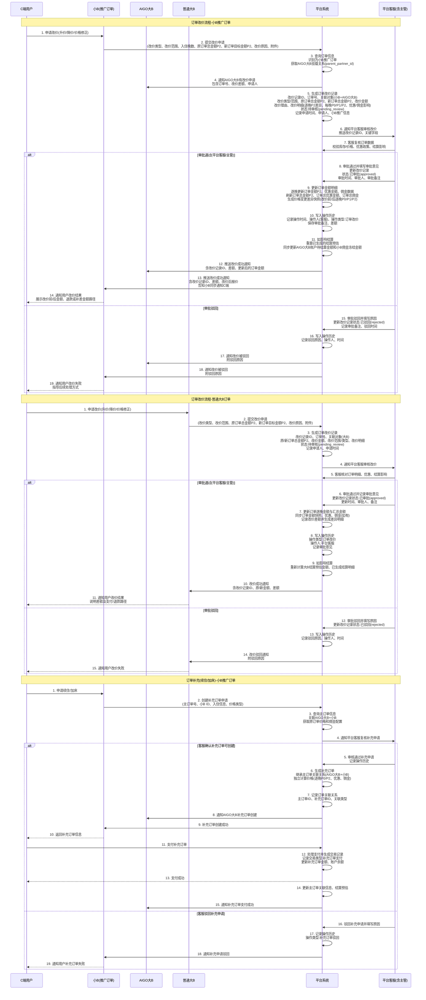

#### 1.3.3 退款流程时序图

```mermaid
sequenceDiagram
    participant C as C端用户
    participant SmallB as 小B(推广订单)
    participant AIGO_BigB as AIGO大B
    participant BigB as 普通大B
    participant Platform as 平台系统
    participant Finance as 财务人员
  
    Note over C,Finance: 退款申请流程-小B推广订单
    C->>SmallB: 1. 申请退款
    SmallB->>Platform: 2. 提交退款申请<br/>(订单号、退款类型、退款金额)
    Platform->>Platform: 3. 查询订单信息<br/>识别为小B推广订单<br/>关联AIGO大B+小B
    Platform->>AIGO_BigB: 4. 通知AIGO大B退款申请
    Platform->>SmallB: 5. 通知小B退款申请
  
    Platform->>Platform: 6. 生成退款记录<br/>状态:退款中
    Platform->>Platform: 7. 计算退款金额<br/>按比例计算P0/P1/P2部分<br/>计算小B佣金部分
  
    Platform->>Finance: 8. 通知财务审核
    Finance->>Platform: 9. 审核退款申请
    alt 审核通过
        Platform->>Platform: 10. 调用支付渠道退款API
        Platform->>Platform: 11. 退款成功
        Platform->>Platform: 12. 更新退款记录<br/>状态:退款成功
        Platform->>Platform: 13. 更新订单状态<br/>记录退款金额
        Platform->>Platform: 14. 更新账户余额<br/>扣减AIGO大B账户金额<br/>扣减小B佣金部分
        Platform->>Platform: 15. 更新结算金额计算<br/>扣除退款部分
        Platform->>Platform: 16. 记录交易记录
        Platform->>AIGO_BigB: 17. 通知AIGO大B退款完成<br/>扣除相应金额
        Platform->>SmallB: 18. 通知小B退款完成<br/>扣除佣金部分
        SmallB-->>C: 19. 通知用户退款结果
    else 审核驳回
        Platform->>Platform: 20. 更新退款记录<br/>状态:退款失败
        Platform->>Platform: 21. 记录驳回原因
        Platform->>AIGO_BigB: 22. 退款驳回通知
        Platform->>SmallB: 23. 退款驳回通知
        SmallB-->>C: 24. 通知用户退款失败
    end
  
    Note over C,Finance: 退款申请流程-普通大B订单
    C->>BigB: 1. 申请退款
    BigB->>Platform: 2. 提交退款申请<br/>(订单号、退款类型、退款金额)
    Platform->>Platform: 3. 生成退款记录<br/>状态:退款中
    Platform->>Platform: 4. 计算退款金额<br/>按比例计算P0/P1/P2部分
  
    Platform->>Finance: 5. 通知财务审核
    Finance->>Platform: 6. 审核退款申请
    alt 审核通过
        Platform->>Platform: 7. 调用支付渠道退款API
        Platform->>Platform: 8. 退款成功
        Platform->>Platform: 9. 更新退款记录<br/>状态:退款成功
        Platform->>Platform: 10. 更新订单状态<br/>记录退款金额
        Platform->>Platform: 11. 更新账户余额<br/>扣减大B账户金额
        Platform->>Platform: 12. 更新结算金额计算<br/>扣除退款部分
        Platform->>Platform: 13. 记录交易记录
        Platform->>BigB: 14. 退款成功通知
        BigB-->>C: 15. 通知用户退款结果
    else 审核驳回
        Platform->>Platform: 16. 更新退款记录<br/>状态:退款失败
        Platform->>Platform: 17. 记录驳回原因
        Platform->>BigB: 18. 退款驳回通知
        BigB-->>C: 19. 通知用户退款失败
    end
  
    Note over C,Finance: 自动退款流程(免费取消)
    C->>Platform: 1. 申请免费取消
    Platform->>Platform: 2. 检查取消政策<br/>识别订单类型
    alt 在免费取消期内
        Platform->>Platform: 3. 自动处理退款
        Platform->>Platform: 4. 全额退款
        Platform->>Platform: 5. 更新订单状态<br/>已取消(免费)
        Platform->>Platform: 6. 记录退款记录
        alt 小B推广订单
            Platform->>AIGO_BigB: 7. 通知AIGO大B退款
            Platform->>SmallB: 8. 通知小B退款
        else 普通大B订单
            Platform->>BigB: 9. 通知大B退款
        end
        Platform-->>C: 10. 退款成功通知
    else 在付费取消期内
        Platform->>Platform: 11. 计算扣损金额
        Platform->>Platform: 12. 部分退款
        Platform->>Platform: 13. 更新订单状态<br/>已取消(付费)
        Platform->>Platform: 14. 记录退款记录
        Platform->>Platform: 15. 触发扣损分账
        alt 小B推广订单
            Platform->>AIGO_BigB: 16. 通知AIGO大B扣损退款
            Platform->>SmallB: 17. 通知小B扣损退款
        else 普通大B订单
            Platform->>BigB: 18. 通知大B扣损退款
        end
        Platform-->>C: 19. 退款成功通知(含扣损)
    end
```

#### 1.3.4 开发票流程时序图

```mermaid
sequenceDiagram
    participant User as 用户(C端/大B/小B)
    participant Platform as 平台系统
    participant Finance as 财务人员
    participant InvoiceSys as 发票系统
    participant EmailSys as 邮件系统
  
    Note over User,EmailSys: 场景1: 发票申请和开票流程
    User->>Platform: 1. 选择订单并申请开发票<br/>(订单号、发票信息)
    Platform->>Platform: 2. 验证订单状态<br/>检查订单是否可开发票<br/>(订单已支付、未全额退款)
    alt 订单可开发票
        User->>Platform: 3. 填写发票信息<br/>发票抬头、发票税号<br/>注册地址、注册电话(企业用户)<br/>开户银行、银行账号(企业用户)<br/>接收人邮箱、备注说明
        Platform->>Platform: 4. 校验发票信息<br/>税号格式校验(企业用户)<br/>邮箱格式校验
        alt 信息校验通过
            Platform->>Platform: 5. 生成发票记录<br/>发票ID、发票申请方(用户名称)<br/>用户类型(C端用户/大B客户/小B客户)<br/>用户联系方式(电话/邮箱)<br/>发票类型(电子发票)<br/>发票内容(住宿费)<br/>发票抬头、发票税号<br/>注册地址、注册电话(企业用户)<br/>开户银行、银行账号(企业用户)<br/>开票主体、接收人邮箱<br/>开票金额(基于订单实际支付金额)<br/>关联订单列表(订单号、订单金额)<br/>备注说明(如有)<br/>状态:待开票<br/>开票申请时间
            Platform->>Platform: 6. 记录发票轨迹<br/>操作类型:申请<br/>操作时间、操作人
            Platform-->>User: 7. 发票申请提交成功<br/>状态:待开票
        
            Platform->>Platform: 8. 自动处理开票请求<br/>状态:待开票→开票中
            Platform->>Platform: 9. 记录发票轨迹<br/>操作类型:开票中<br/>操作时间
            Platform->>InvoiceSys: 10. 调用发票系统API开票<br/>(发票信息、订单信息、开票金额)
            alt 开票成功
                InvoiceSys-->>Platform: 11. 返回发票信息<br/>发票代码、发票号码<br/>发票文件(PDF链接)
                Platform->>Platform: 12. 更新发票记录<br/>状态:开票中→开票成功邮箱未发送<br/>发票代码、发票号码<br/>发票文件路径(PDF链接)<br/>开票成功时间
                Platform->>Platform: 13. 保存发票文件<br/>发票文件路径(PDF链接)
                Platform->>Platform: 14. 记录发票轨迹<br/>操作类型:开票成功<br/>操作时间、操作状态<br/>发票代码、发票号码<br/>操作人(系统)
            
                Platform->>Platform: 15. 自动发送邮件通知<br/>状态:开票成功邮箱未发送
                Platform->>EmailSys: 16. 发送发票邮件<br/>(接收人邮箱、发票信息、发票文件PDF链接)
                alt 邮件发送成功
                    EmailSys-->>Platform: 17. 邮件发送成功
                    Platform->>Platform: 18. 更新发票记录<br/>状态:开票成功邮箱未发送→<br/>开票成功邮箱已发送<br/>邮箱发送时间
                    Platform->>Platform: 19. 记录发票轨迹<br/>操作类型:邮件发送成功<br/>操作时间、操作状态<br/>操作人(系统)
                    Platform->>User: 20. 通知用户发票已开具<br/>(邮件通知:发票信息、发票文件下载链接)
                else 邮件发送失败
                    EmailSys-->>Platform: 21. 邮件发送失败<br/>返回失败原因
                    Platform->>Platform: 22. 更新发票记录<br/>状态:开票成功邮箱未发送→<br/>开票成功邮箱发送失败<br/>异常原因
                    Platform->>Platform: 23. 记录发票轨迹<br/>操作类型:邮件发送失败<br/>操作时间、操作状态<br/>异常原因、操作人(系统)
                    Platform->>Finance: 24. 通知财务人员<br/>邮件发送失败，需人工处理<br/>(站内消息:发票信息、失败原因、查看链接)
                end
            else 开票失败(可重试)
                InvoiceSys-->>Platform: 25. 开票失败(可重试错误)<br/>返回失败原因
                Platform->>Platform: 26. 更新发票记录<br/>状态:开票中→开票重试中<br/>异常原因
                Platform->>Platform: 27. 记录发票轨迹<br/>操作类型:开票重试中<br/>操作时间、操作状态<br/>异常原因、操作人(系统)
                Platform->>Platform: 28. 系统自动重试开票<br/>(可配置重试次数和间隔)
                alt 重试成功
                    InvoiceSys-->>Platform: 29. 开票成功<br/>返回发票代码、发票号码、发票文件
                    Platform->>Platform: 30. 更新发票记录<br/>状态:开票重试中→<br/>开票成功邮箱未发送<br/>发票代码、发票号码<br/>发票文件路径、开票成功时间
                    Platform->>Platform: 31. 记录发票轨迹<br/>操作类型:开票成功<br/>操作时间、操作状态<br/>发票代码、发票号码
                    Platform->>Platform: 32. 继续邮件发送流程
                else 重试失败(达到最大重试次数)
                    Platform->>Platform: 33. 更新发票记录<br/>状态:开票重试中→开票失败<br/>异常原因
                    Platform->>Platform: 34. 记录发票轨迹<br/>操作类型:开票失败<br/>操作时间、操作状态<br/>异常原因、操作人(系统)
                    Platform->>Finance: 35. 通知财务人员<br/>开票失败，需人工处理<br/>(站内消息:发票信息、失败原因、查看链接)
                end
            else 开票失败(不可重试)
                InvoiceSys-->>Platform: 36. 开票失败(不可重试错误)<br/>返回失败原因
                Platform->>Platform: 37. 更新发票记录<br/>状态:开票中→开票失败<br/>异常原因
                Platform->>Platform: 38. 记录发票轨迹<br/>操作类型:开票失败<br/>操作时间、操作状态<br/>异常原因、操作人(系统)
                Platform->>Finance: 39. 通知财务人员<br/>开票失败，需人工处理<br/>(站内消息:发票信息、失败原因、查看链接)
            end
        else 信息校验失败
            Platform-->>User: 40. 发票信息校验失败<br/>返回错误信息(如税号格式错误)
        end
    else 订单不可开发票
        Platform-->>User: 41. 订单状态不符合开票条件<br/>(订单未支付/已全额退款)
    end
  
    Note over User,EmailSys: 场景2: 重发邮件流程
    Finance->>Platform: 1. 查看发票详情<br/>(状态:开票成功邮箱发送失败/<br/>开票成功邮箱未发送/<br/>开票成功邮箱已发送/<br/>退票成功)
    Finance->>Platform: 2. 点击重发邮件按钮<br/>(权限:客服/运营及以上)
    Platform->>Platform: 3. 更新发票记录<br/>状态→邮箱重发中
    Platform->>Platform: 4. 记录发票轨迹<br/>操作类型:重发邮件<br/>操作时间、操作状态<br/>操作人(财务人员/客服人员)
    Platform->>EmailSys: 5. 重新发送发票邮件<br/>(接收人邮箱、发票信息、发票文件PDF链接)
    alt 邮件发送成功
        EmailSys-->>Platform: 6. 邮件发送成功
        Platform->>Platform: 7. 更新发票记录<br/>状态:邮箱重发中→<br/>开票成功邮箱已发送<br/>邮箱发送时间
        Platform->>Platform: 8. 记录发票轨迹<br/>操作类型:邮件发送成功<br/>操作时间、操作状态<br/>操作人(系统)
        Platform->>User: 9. 通知用户发票已发送<br/>(邮件通知:发票信息、发票文件下载链接)
    else 邮件发送失败
        EmailSys-->>Platform: 10. 邮件发送失败<br/>返回失败原因
        Platform->>Platform: 11. 更新发票记录<br/>状态:邮箱重发中→<br/>开票成功邮箱发送失败<br/>异常原因
        Platform->>Platform: 12. 记录发票轨迹<br/>操作类型:邮件发送失败<br/>操作时间、操作状态<br/>异常原因、操作人(系统)
        Platform->>Finance: 13. 通知财务人员<br/>邮件发送失败，需人工处理<br/>(站内消息:发票信息、失败原因、查看链接)
    end
  
    Note over User,EmailSys: 场景3: 退票流程(订单全额退款/部分退款/发票信息错误)
    Finance->>Platform: 1. 查看订单详情<br/>订单已全额退款/部分退款<br/>或发票信息错误
    Finance->>Platform: 2. 查看关联发票<br/>发票状态:开票成功邮箱未发送/<br/>开票成功邮箱已发送/<br/>开票成功邮箱发送失败
    Finance->>Platform: 3. 点击退票按钮<br/>(权限:财务及以上)
    Platform->>Platform: 4. 更新发票记录<br/>状态→申请退票
    Platform->>Platform: 5. 记录发票轨迹<br/>操作类型:申请退票<br/>操作时间、操作状态<br/>操作人(财务人员)<br/>操作备注(退票原因)
    Platform->>Platform: 6. 自动处理退票请求<br/>状态:申请退票→退票中
    Platform->>Platform: 7. 记录发票轨迹<br/>操作类型:退票中<br/>操作时间、操作状态<br/>操作人(系统)
    Platform->>InvoiceSys: 8. 调用发票系统API退票<br/>(发票代码、发票号码、退票原因)<br/>红冲/作废功能
    alt 退票成功
        InvoiceSys-->>Platform: 9. 退票成功
        Platform->>Platform: 10. 更新发票记录<br/>状态:退票中→退票成功
        Platform->>Platform: 11. 记录发票轨迹<br/>操作类型:退票成功<br/>操作时间、操作状态<br/>操作人(系统)
        Platform->>User: 12. 通知用户退票成功<br/>(邮件通知+站内消息:退票信息、查看链接)
        Platform->>Finance: 13. 通知财务人员退票成功<br/>(站内消息:退票信息、查看链接)
        Note over User,EmailSys: 如为订单部分退款，需重新开具发票
        alt 订单部分退款
            Platform->>Platform: 14. 重新开具发票<br/>(根据最终实际消费金额)<br/>状态:待开票
            Platform->>Platform: 15. 继续开票流程
        end
    else 退票失败(可重试)
        InvoiceSys-->>Platform: 16. 退票失败(可重试错误)<br/>返回失败原因
        Platform->>Platform: 17. 更新发票记录<br/>状态:退票中→退票重试中<br/>异常原因
        Platform->>Platform: 18. 记录发票轨迹<br/>操作类型:退票重试中<br/>操作时间、操作状态<br/>异常原因、操作人(系统)
        Platform->>Platform: 19. 系统自动重试退票<br/>(可配置重试次数和间隔)
        alt 重试成功
            InvoiceSys-->>Platform: 20. 退票成功
            Platform->>Platform: 21. 更新发票记录<br/>状态:退票重试中→退票成功
            Platform->>Platform: 22. 记录发票轨迹<br/>操作类型:退票成功<br/>操作时间、操作状态<br/>操作人(系统)
            Platform->>User: 23. 通知用户退票成功<br/>(邮件通知+站内消息)
            Platform->>Finance: 24. 通知财务人员退票成功<br/>(站内消息)
        else 重试失败(达到最大重试次数)
            Platform->>Platform: 25. 更新发票记录<br/>状态:退票重试中→退票失败<br/>异常原因
            Platform->>Platform: 26. 记录发票轨迹<br/>操作类型:退票失败<br/>操作时间、操作状态<br/>异常原因、操作人(系统)
            Platform->>Finance: 27. 通知财务人员<br/>退票失败，需人工处理<br/>(站内消息:发票信息、失败原因、查看链接)
        end
    else 退票失败(不可重试)
        InvoiceSys-->>Platform: 28. 退票失败(不可重试错误)<br/>返回失败原因
        Platform->>Platform: 29. 更新发票记录<br/>状态:退票中→退票失败<br/>异常原因
        Platform->>Platform: 30. 记录发票轨迹<br/>操作类型:退票失败<br/>操作时间、操作状态<br/>异常原因、操作人(系统)
        Platform->>Finance: 31. 通知财务人员<br/>退票失败，需人工处理<br/>(站内消息:发票信息、失败原因、查看链接)
        Note over Finance,InvoiceSys: 高级财务/超级管理员可手动置为退票成功(高风险操作)
        Finance->>Platform: 32. 点击置为退票成功按钮<br/>(权限:高级财务/超级管理员)<br/>状态:退票失败/退票重试中/退票中
        Platform->>Platform: 33. 更新发票记录<br/>状态→退票成功<br/>操作人、操作时间
        Platform->>Platform: 34. 记录发票轨迹<br/>操作类型:置为退票成功<br/>操作时间、操作状态<br/>操作人(高级财务/超级管理员)<br/>操作备注(手动置为退票成功)
        Platform->>User: 35. 通知用户退票成功<br/>(邮件通知+站内消息)
    end
  
    Note over User,EmailSys: 场景4: 发票查看和下载
    User->>Platform: 1. 查看发票列表
    Platform->>Platform: 2. 查询发票记录<br/>根据用户类型筛选<br/>(C端用户/大B客户/小B客户)<br/>根据发票状态筛选<br/>根据开票时间范围筛选
    Platform-->>User: 3. 返回发票列表<br/>发票ID、发票申请方(用户名称)<br/>用户类型、发票状态<br/>发票代码、发票号码<br/>开票金额、开票申请时间<br/>开票成功时间、邮箱发送时间<br/>用户联系方式(电话/邮箱)
    User->>Platform: 4. 查看发票详情
    Platform->>Platform: 5. 查询发票详细信息<br/>用户信息(发票申请方、用户类型、联系方式)<br/>发票信息(发票类型、发票内容、发票抬头、发票税号、注册地址、注册电话、开户银行、银行账号、开票金额、备注说明)<br/>收件邮箱(接收人邮箱、邮箱发送时间、邮箱发送状态)<br/>发票轨迹(操作时间、操作类型、操作状态、操作人、操作备注)<br/>关联订单信息(关联订单数量、订单总金额、订单列表)
    Platform-->>User: 6. 返回发票详情<br/>发票文件(PDF链接)<br/>发票轨迹(操作历史时间轴)<br/>关联订单列表
    User->>Platform: 7. 下载发票文件
    Platform->>Platform: 8. 验证下载权限
    Platform-->>User: 9. 返回发票PDF文件
```

#### 1.3.5 用户提现结算时序图

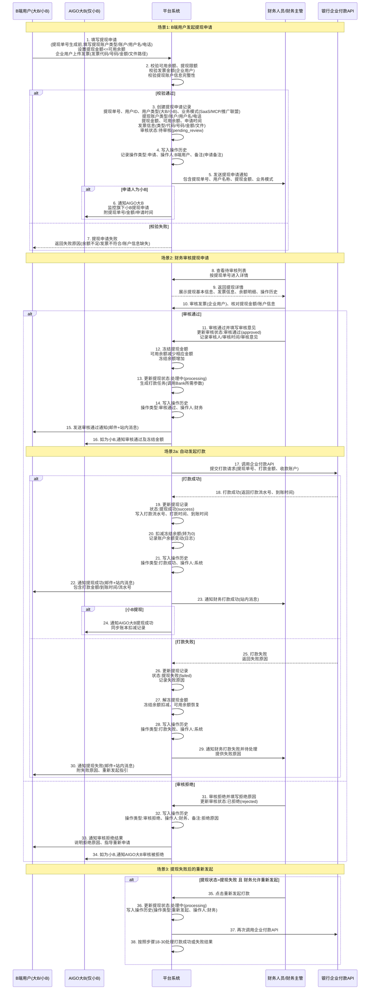

#### 1.3.6 结算流程时序图

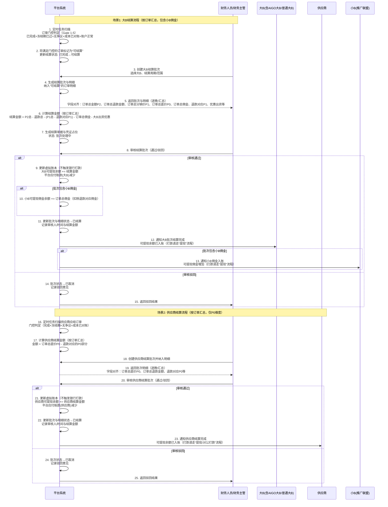

# 二、系统详细架构

## 2.1 平台系统AIGOHOTEL（管理员系统）

**系统说明：**
- 平台系统AIGOHOTEL就是管理员系统
- 负责平台级管理、审核、结算等核心功能


### 2.1.1 资格审核[审核资格.md](审核资格.md)

#### 2.1.1.1 大B客户审核（SaaS/MCP模式）

- 审核大B客户申请
- 审核通过后，大B自动获得大B权限（SaaS/MCP模式对应的权限）
- 查看审核详情、批准/驳回申请

#### 2.1.1.2 小B客户审核（推广联盟模式）

- 审核小B客户申请
- **小B挂载规则**（审核通过时配置）：
  - **默认挂载**：审核通过后，默认挂载在AIGO大B下（`parent_partner_id = AIGO大B的partnerId`）
  - **可选挂载**：管理员在审核时可以选择将小B挂载到其他开放了推广联盟管理权限的大B下
  - **挂载限制**：只有 `can_manage_affiliate = 1` 的大B客户才能被选择作为挂载目标
  - **挂载后行为**：
    - 小B自动获得推广链接
    - 小B的 `parent_partner_id` 设置为所选大B的 `partnerId`
    - 小B的 `managed_by` 设置为 `'aigo'`（由AIGO大B管理）
    - 小B的 `smallb_status` 默认为 `'active'`（启用状态）
- 查看审核详情、批准/驳回申请

#### 2.1.1.3 审核流程说明

- 所有用户（大B和小B）都以用户身份统一申请
- 管理员在审核界面可以看到所有待审核的申请
- 审核大B申请时，只需批准/驳回，系统自动分配对应权限
- 审核小B申请时，需要选择挂载目标大B（默认AIGO大B，可切换为其他有推广联盟权限的大B）
- 审核通过后，系统自动完成权限分配和挂载关系设置

### 2.1.2 用户管理（users）

> 详细交互与字段要求参见《[用户管理 - 用户列表](./用户管理 - 用户列表.md)》。

#### 2.1.2.1 商户列表管理

- 查看所有大B和小B客户列表（统一展示）
- 显示用户基本信息：用户ID、显示名称、用户信息类型（旅行代理/网络博主/旅游类相关应用）
- 显示认证方式：个人认证/企业认证
- 显示业务模式：SaaS/MCP/推广联盟（Affiliate）
- 显示挂载关系：小B客户显示挂载目标大B（`parent_partner_id`）
- 显示风控等级：L0（战略级）到L4（入门级）
- 显示联系方式：邮箱、手机号
- 显示业务数据：订单数、平均加价率（仅大B显示）
- 显示账户状态：正常/冻结/关闭
- 显示最后登录时间

#### 2.1.2.2 搜索和筛选功能

- 搜索：支持按名称、邮箱、手机号、用户ID搜索
- 筛选条件：
  - 用户信息类型：旅行代理/网络博主/旅游类相关应用/全部
  - 认证方式：个人认证/企业认证/全部
  - 业务模式：SaaS/MCP/推广联盟/全部（未来扩展）
  - 账户状态：正常/冻结/关闭/全部
  - 风控等级：L0/L1/L2/L3/L4/全部
- 分页显示：每页10条数据

#### 2.1.2.3 用户详情查看

- 基本信息：用户ID、用户信息类型、认证方式、显示名称、邮箱、手机号、注册时间
- 认证信息：根据用户信息类型和认证方式显示不同的认证信息
  - **旅行代理-个人认证**：真实姓名、身份证号、身份证照片、业务证明截图
  - **旅行代理-企业认证**：企业名称、统一社会信用代码、营业执照、法人信息、业务证明材料
  - **网络博主-个人认证**：真实姓名、身份证号、身份证照片、平台信息（平台名称、主页链接、粉丝数、数据截图）
  - **网络博主-企业认证**：企业名称、统一社会信用代码、营业执照、法人信息、平台信息（平台名称、主页链接、粉丝数、数据截图）
  - **旅游类相关应用-个人认证**：真实姓名、身份证号、身份证照片、业务模式相关证明（MCP/SaaS/推广联盟）
  - **旅游类相关应用-企业认证**：企业名称、统一社会信用代码、营业执照、法人信息、业务模式相关证明（MCP/SaaS/推广联盟）
- 业务模式信息：业务模式类型、是否可设置加价率、佣金率（小B）
- 挂载关系信息：小B显示挂载目标大B、管理方（admin/aigo）
- 业务数据：总订单数、已完成订单数、平均加价率（仅大B）、活跃客户数
- 店铺信息：店铺名称、自定义域名（如有）
- 账户状态：风控等级、账户状态
- 登录信息：注册时间、最后登录时间
- **注意**：财务相关数据（交易额、利润、余额、结算等）在财务中心查看和管理

#### 2.1.2.4 账户状态管理

- 冻结账户：冻结后用户无法登录和交易（需填写操作原因）
- 激活账户：激活后用户可以正常使用系统（需填写操作原因）
- 关闭账户：关闭后用户永久无法使用系统，此操作不可恢复（需填写操作原因）
- **注意**：账户状态变更会影响用户的系统访问权限，但结算相关操作需在财务中心进行

#### 2.1.2.5 风控等级管理

- 修改用户风控等级（L0-L4）
- 等级说明：
  - L0：战略级（最高权限，信任度最高）
  - L1：核心级
  - L2：优质级
  - L3：标准级
  - L4：入门级（基础权限，风控最严格）
- 等级变化提示：提升等级或降低等级的提示
- 需填写修改原因并记录到系统日志

#### 2.1.2.6 挂载关系管理（小B客户，未来扩展）

- 查看小B的挂载目标大B
- 修改小B的挂载目标大B（仅可挂载到有推广联盟管理权限的大B下）
- 查看挂载历史记录

#### 2.1.2.7 推广链接管理

> 详见：[`用户管理 - 推广链接`](./用户管理 - 推广链接.md)

**2.7.1 链接列表**

- 查看所有用户的推广链接（SaaS大B和小B）
- 显示字段：
  - 用户名称（固定左侧显示）
  - 用户信息类型（旅行代理/网络博主/旅游类相关应用，以徽章形式显示）
  - 业务模式（SaaS/推广联盟，以徽章形式显示）
  - 推广ID（系统生成的唯一ID，如：a8x3p7q）
  - 推广代码（用户自定义的个性化代码，如：flywithelsa，全局唯一）
  - 默认链接：`https://aigohotel.com/ref?id=[推广ID]`
  - 主推广链接：`https://aigohotel.com/ref/[推广代码]`（如已设置）
  - 链接状态（以徽章形式显示：启用/禁用）
  - 创建时间、最后修改时间
- 支持按用户名称、推广代码、推广ID、用户信息类型、业务模式、链接状态搜索和筛选
- 分页显示：每页20条数据

**2.7.2 链接详情查看**

- 用户基本信息：用户名称、用户信息类型、业务模式、挂载关系（小B显示挂载目标大B名称）
- 链接信息：
  - 用户ID（`partner_id`，系统内部标识，用于关联用户）
  - 推广ID（系统生成的唯一ID，如：a8x3p7q，用于链接URL参数）
  - 推广代码（用户自定义的个性化代码，如：flywithelsa，全局唯一，用于链接路径）
  - 默认链接：`https://aigohotel.com/ref?id=[推广ID]`（URL中使用推广ID，系统通过推广ID查找对应的partner_id）
  - 主推广链接：`https://aigohotel.com/ref/[推广代码]`（URL中使用推广代码，系统通过推广代码查找对应的partner_id）
  - 链接状态：启用/禁用
  - 价格关联信息（仅小B链接显示）：
    - 挂载大B名称（通过 `parent_partner_id`关联）
    - 挂载大BID（`parent_partner_id`，系统内部标识）
    - 挂载大B加价率（当前使用的加价率）
- 活动链接列表：
  - 显示该用户创建的所有活动链接（带campaign参数）
  - 活动名称、活动参数、完整链接

**2.7.3 链接操作功能**

- 禁用链接：禁用后该链接无法使用，已生成的订单不受影响
- 启用链接：重新启用被禁用的链接
- 重置推广代码：重置用户的推广代码，原代码释放后可被其他用户使用
- 强制修改推广代码：管理员可以强制修改用户的推广代码（需填写操作原因）

**2.7.4 推广代码管理**

- **唯一性规则**：
  - 推广代码全局唯一（包括SaaS大B和小B）
  - 系统自动校验推广代码的唯一性
  - 已使用的推广代码不能被其他用户使用
  - 用户修改推广代码时，原代码释放后可被其他用户使用
- **冲突处理**：
  - 查看推广代码冲突情况
  - 处理推广代码冲突（如发现重复，可强制修改）
- **保留列表**：
  - 设置保留的推广代码（不允许用户使用，如：admin、test、api等）
  - 管理保留代码列表（新增/删除）

**2.7.5 链接生成与价格逻辑**

- **链接生成规则**：
  - 审核通过后，系统自动为用户生成唯一的推广ID和默认链接：`https://aigohotel.com/ref?id=[推广ID]`
  - 用户可以在自己的后台设置推广代码（需通过全局唯一性校验）
  - 推广代码设置后，生成主推广链接：`https://aigohotel.com/ref/[推广代码]`
  - 活动链接：主推广链接 + `?campaign=[活动名称]`（用户可创建多个活动链接）
- **大B链接逻辑**（SaaS/MCP模式）：
  - 链接归属：`partner_id = 大B的partnerId`
  - 价格计算：使用该大B自己设置的加价率（P1 → P2）
  - 订单归属：通过该链接生成的订单，`partner_id`字段为该大B的ID
- **小B链接逻辑**（推广联盟模式）：
    - nightPartnerProfit = nightP2 × partnerCommissionRate（小B佣金，若该晚有nightPartnerCommissionRate则优先使用）
  - 链接归属：`partner_id = 小B的partnerId`，`parent_partner_id = 挂载大B的partnerId`
  - 价格计算：使用挂载大B的加价率（P1 → P2），通过 `parent_partner_id`关联
  - 订单归属：通过该链接生成的订单，`partner_id`字段为该小B的ID，`parent_partner_id`字段为挂载大B的ID
  - 价格变化：小B链接价格会随着挂载大B的加价率变化而变化
- **链接使用规则**：
  - 链接状态为"启用"时，链接可以正常使用
  - 链接状态为"禁用"时，链接无法使用，访问会提示链接已失效
  - 禁用链接不影响已生成的订单
- **价格变化影响**：
  - 大B修改自己的加价率：影响该大B自己的链接价格，以及所有挂载在该大B下的小B链接价格
  - 小B无法修改加价率：小B没有加价率设置权限，链接价格完全由挂载大B控制

### 2.1.3 订单管理（orders）

#### 2.1.3.1 订单列表管理（详见 [`订单管理`](./订单管理.md)）

- 查看订单列表（根据用户类型显示不同范围的订单）
  - 管理员：查看全平台所有订单
  - 大B客户：查看自己生成的订单和挂载在自己下的小B生成的订单
  - 小B客户：仅查看自己生成的订单
- 订单列表显示字段：
  - **订单基本信息**：
    - 订单号（固定左侧显示）
    - 订单状态（以徽章形式显示：待支付/待确认/已确认/待入住/已完成/可结算/已取消(免费)/已取消(付费)/未入住/售后中）
    - 结算状态（以徽章形式显示：待结算/可结算/处理中/已结算）
  - **酒店和入住信息**：
    - 酒店名称（酒店中文名称，如有英文名则显示在下方）
    - 房型（房间类型，如：豪华大床房）
    - 入住日期（YYYY-MM-DD格式）
    - 离店日期（YYYY-MM-DD格式）
    - 入住人姓名（实际入住人姓名，如无则显示客户姓名）
    - 入住人数（成人数量、儿童数量，如：2成人1儿童）
  - **商户信息**：
    - 商户名称（生成订单的商户名称：大B直接订单显示大B名称，小B推广订单显示小B名称）
    - 用户信息类型（以徽章形式显示：旅行代理/网络博主/旅游类相关应用）
    - 认证方式（个人认证/企业认证）
    - 商户电话（商户联系电话）
    - 商户邮箱（商户邮箱）
  - **金额信息**（订单汇总）：
    - 订单总金额（所有晚的P2销售价总和，原始订单总金额）
    - 订单总优惠金额（所有晚的优惠金额总和，如有优惠则显示，无则显示"-"）
    - 订单实付总金额（客户实际支付总金额 = 订单总金额 - 订单总优惠金额）
    - 订单总退款金额（所有晚的退款金额总和，如有退款则显示，无则显示"-"）
    - **说明**：详细每晚价格信息在订单详情中查看
  - **操作**：
    - 操作按钮（固定右侧显示：查看详情、免费取消、部分退款等）

#### 2.1.3.2 订单搜索和筛选功能（详见 [`订单管理`](./订单管理.md)）

- 搜索：支持按订单号、酒店名称、商户名称、客户姓名、入住人姓名搜索
- 筛选条件：
  - 订单状态：待支付/待确认/已确认/待入住/已完成/可结算/已取消(免费)/已取消(付费)/未入住/售后中/全部
  - 结算状态：待结算/可结算/处理中/已结算/全部
  - 用户信息类型：旅行代理/网络博主/旅游类相关应用/全部
  - 认证方式：个人认证/企业认证/全部
  - 酒店名称：文本输入筛选
  - 商户名称/邮箱：文本输入筛选
  - 创建时间范围：开始日期、结束日期
  - 入住日期范围：开始日期、结束日期
  - 订单金额范围：最小金额、最大金额
  - 实际金额范围：最小金额、最大金额
- 分页显示：每页10条数据
- 订单导出：支持导出筛选后的订单数据

#### 2.1.3.3 订单详情查看（详见 [`订单管理`](./订单管理.md)）

- 订单基本信息：订单号、订单状态、结算状态、创建时间、确认时间、完成时间
- 酒店信息：酒店名称、酒店地址、联系方式
- 入住信息：入住日期、离店日期、入住人姓名（如无则显示客户姓名）、入住人数、房间类型、房间数量
- 价格信息（按每晚展示）：
  - **每晚价格明细**：
    - 每晚订单底价（P0，供应商成本）
    - 每晚分销价（P1，平台供货价）
    - 每晚订单金额（P2，销售价，C端购买价格）
    - 每晚加价率：
      - 平台加价率：P0→P1（平台从订单底价P0加价到分销价P1）
      - 大B加价率：P1→P2（大B从分销价P1加价到订单金额P2，SaaS和MCP模式相同）
    - 每晚佣金比例（小B佣金比例，仅小B推广订单显示，基于P2的百分比）
      - **佣金比例限制规则**：为防止大B亏损，佣金比例必须满足：**佣金比例 ≤ 大B加价率**
      - 数学推导：大B利润 = P1 × 大B加价率 - P2 × 佣金比例 ≥ 0，即 P1 × 大B加价率 ≥ P2 × 佣金比例
      - 由于 P2 = P1 × (1 + 大B加价率)，所以 P1 × 大B加价率 ≥ P1 × (1 + 大B加价率) × 佣金比例
      - 简化得：**佣金比例 ≤ 大B加价率 / (1 + 大B加价率)**
    - 每晚佣金（小B佣金金额 = P2 × 佣金比例，仅小B推广订单显示）
    - 每晚订单利润（总利润：P2-P0，平台利润：P1-P0，大B利润：P2-P1-佣金）
    - 每晚优惠金额（优惠活动减免金额，如有则显示）
    - 每晚实付金额（客户实际支付金额 = 每晚订单金额P2 - 每晚优惠金额）
    - 每晚退款金额（已退款金额，如有则显示）
  - **订单汇总信息**：
    - 订单总底价（所有晚的P0总和）
    - 订单总分销价（所有晚的P1总和）
    - 订单总金额（所有晚的P2总和，C端购买价格）
    - 订单总优惠金额（所有晚的优惠金额总和）
    - 优惠金额出资方信息：
      - 平台出资的优惠金额（订单总优惠金额 × 平台出资比例）
      - 大B出资的优惠金额（订单总优惠金额 × 大B出资比例）
      - 出资方类型（配置方出资/按比例出资）
    - 订单实付总金额（客户实际支付总金额 = 订单总金额 - 订单总优惠金额）
    - 订单总退款金额（所有晚的退款金额总和）
    - 订单总利润（所有晚的利润总和）
    - 订单总佣金（所有晚的佣金总和，仅小B推广订单显示）
  - **退款记录**（退款时间、退款金额、退款原因、退款凭证、退款对应的日期等）
- 商户信息：
  - 商户名称（生成订单的商户名称：大B直接订单显示大B名称，小B推广订单显示小B名称）
  - 用户信息类型（旅行代理/网络博主/旅游类相关应用）
  - 认证方式（个人认证/企业认证）
  - 商户电话、商户邮箱、商户ID
  - 业务模式（SaaS/MCP/推广联盟）
  - **管理大B信息**（仅小B推广订单显示）：
    - 管理大B商户名称（挂载目标大B的名称）
    - 管理大B用户信息类型
    - 管理大B业务模式（SaaS/MCP）
- 客户信息：客户姓名（下单人姓名）、客户联系方式（下单人联系电话）
  - **说明**：客户信息为下单人信息，入住人信息为实际入住人信息，两者可能不同（如代订情况）
- 订单状态时间轴：显示订单状态变更历史
- 风控审核信息：风控审核状态、审核时间
- 结算信息：结算状态、结算时间、结算金额

#### 2.1.3.4 订单操作管理（详见 [`订单管理`](./订单管理.md)）

- **免费取消订单（按晚）**：
  - 适用订单状态：已确认/待入住
  - 操作粒度：选择一个或多个日期进行取消
  - 取消原因：酒店同意免费取消/在免费取消时间内/平台承担费用
  - 取消逻辑：选择需要取消的日期，系统按每晚金额计算取消费用
  - 取消结果：全部晚取消则状态变为"已取消(免费)"；部分取消生成退款记录并更新金额
- **部分退款（按晚粒度，每晚独立设置）**：
  - 适用订单状态：已完成/可结算
  - 操作粒度：选择一个或多个日期进行退款，**每晚可独立设置退款金额或比例**
  - 退款方式（每晚独立）：
    - 固定金额模式：为每一晚单独输入固定退款金额（单晚上限为该晚实付金额）
    - 比例模式：为每一晚单独输入退款比例（0-100%）
    - 混合模式：不同晚可以使用不同的退款方式
  - 必填：退款日期（多选）、每晚的退款方式与参数、退款原因、退款凭证
  - UI交互：每晚一行显示日期、实付金额、退款方式选择、退款金额/比例输入、预估退款金额；实时计算总退款金额
  - 结果：生成含每晚明细的退款记录，更新每晚退款金额和状态，更新订单总退款金额
- **订单状态查看**：查看完整状态流转及所有退款/取消记录

#### 2.1.3.5 订单权限说明（详见 [`订单管理`](./订单管理.md)）

- 管理员可以查看和管理所有订单
- 大B客户可以查看自己生成的订单和挂载在自己下的小B生成的订单
- 小B客户仅可以查看自己生成的订单
- 订单操作权限根据订单状态和用户类型进行控制

### 2.1.4 财务中心（finance）

#### 2.1.4.1 平台账户

> 详见：[`财务中心 - 平台账户`](./财务中心%20-%20平台账户.md)

**4.1.1 平台资金看板**

- **订单预收款**（未完结订单，按订单汇总）：
  - 计算公式：SUM(未完结订单的订单总金额P2)
  - 说明：未完结订单的订单总金额P2总和，不扣除退款（订单未完结时退款金额为0）
- **订单实际收款**（已完结订单，按订单汇总）：
  - 计算公式：SUM(订单实付总金额 - 订单总退款金额)
  - 其中：订单实付总金额 = 订单总金额P2 - 订单总优惠金额
  - 说明：已完结订单的实际收款 = 订单实付总金额 - 订单总退款金额
- **优惠金额出资统计**（按订单汇总）：
  - 平台出资的优惠金额：SUM(订单总优惠金额 × 平台出资比例)
  - 大B出资的优惠金额：SUM(订单总优惠金额 × 大B出资比例)
  - 说明：用于统计平台和大B各自承担的优惠成本
- **平台总利润**（所有订单，按订单汇总）：
  - 计算公式：SUM(订单总分销价P1 - 订单总底价P0) - SUM(退款对应的平台利润) - SUM(平台出资的优惠金额)
  - 其中：
    - 退款对应的平台利润 = 退款金额 × (订单总分销价P1 - 订单总底价P0) / 订单总金额P2
    - 平台出资的优惠金额 = 订单总优惠金额 × 平台出资比例（配置方出资时，平台配置的优惠活动由平台全额出资）
  - 说明：平台总利润需扣除退款对应的平台利润部分和平台出资的优惠金额
- **应付账款（大B）**（按订单汇总）：
  - 计算公式：SUM(订单总金额P2 - 订单总退款金额) - SUM(订单总分销价P1 - 退款对应的P1部分) - SUM(订单总佣金) - SUM(大B出资的优惠金额)
  - 其中：
    - 退款对应的P1部分 = 退款金额 × 订单总分销价P1 / 订单总金额P2
    - 订单总佣金仅小B推广订单有
    - 大B出资的优惠金额 = 订单总优惠金额 × 大B出资比例（配置方出资时，大B配置的优惠活动由大B全额出资）
  - 说明：平台只结算给大B，小B的佣金由大B（AIGO大B）结算。结算金额需扣除退款对应的部分和大B出资的优惠金额
- **应付账款（供应商）**（按订单汇总）：
  - 计算公式：SUM(订单总底价P0 - 退款对应的P0部分)
  - 其中：退款对应的P0部分 = 退款金额 × 订单总底价P0 / 订单总金额P2
  - 说明：应结算给供应商的金额需扣除退款对应的成本部分
- **可用资金**：
  - 计算公式：订单实际收款 - 应付账款（大B）- 应付账款（供应商）
  - 说明：平台实际可支配资金，已扣除所有应付账款和退款
- **资金平衡验证**：
  - 验证公式：订单实际收款 = 平台总利润 + 应付账款（大B）+ 应付账款（供应商） + 订单总退款金额 + 平台出资的优惠金额 + 大B出资的优惠金额
  - 说明：用于验证资金计算的准确性，避免资金差额。优惠金额由出资方承担，需在资金平衡中体现

**4.1.2 订单明细**

- 查看所有订单的财务明细（按订单汇总显示）
- **显示字段**：
  - 订单号（固定左侧显示）
  - 大B名称（订单来源大B，小B推广订单显示挂载目标大B名称）
  - 酒店名称（酒店中文名称）
  - 入住日期（YYYY-MM-DD格式）
  - 离店日期（YYYY-MM-DD格式）
  - 结算状态（以徽章形式显示：待结算/可结算/处理中/已结算）
  - **账单金额信息**（订单汇总）：
    - 订单总金额P2（所有晚的P2销售价总和）
    - 订单总优惠金额（所有晚的优惠金额总和，如有优惠则显示，无则显示"-"）
    - 订单实付总金额（客户实际支付总金额 = 订单总金额P2 - 订单总优惠金额）
    - 订单总退款金额（所有晚的退款金额总和，如有退款则显示，无则显示"-"）
    - 订单总分销价P1（所有晚的P1平台供货价总和）
    - 订单总底价P0（所有晚的P0供应商成本总和）
    - 优惠金额出资方信息：
      - 平台出资的优惠金额（订单总优惠金额 × 平台出资比例，如有则显示，无则显示"-"）
      - 大B出资的优惠金额（订单总优惠金额 × 大B出资比例，如有则显示，无则显示"-"）
    - 订单总佣金（所有晚的佣金总和，仅小B推广订单有，需扣除退款对应的佣金部分，如有则显示，无则显示"-"）
      - 退款对应的佣金部分 = 订单总退款金额 × 订单总佣金 / 订单总金额P2（如有退款和佣金则显示）
    - 平台总利润（订单总分销价P1 - 订单总底价P0 - 平台出资的优惠金额）
    - 应付账款（大B）：订单总金额P2 - 订单总退款金额 - (订单总分销价P1 - 退款对应的P1部分) - 订单总佣金 - 大B出资的优惠金额
      - 其中：退款对应的P1部分 = 订单总退款金额 × 订单总分销价P1 / 订单总金额P2（如有退款则显示）
    - 应付账款（供应商）：订单总底价P0 - 退款对应的P0部分
      - 其中：退款对应的P0部分 = 订单总退款金额 × 订单总底价P0 / 订单总金额P2（如有退款则显示）
- **搜索和筛选功能**：
  - 搜索：支持按订单号、大B名称、酒店名称搜索
  - 筛选条件：
    - 结算状态：待结算/可结算/处理中/已结算/全部
    - 大B名称：文本输入筛选
    - 订单完成时间范围：开始日期、结束日期
    - 订单金额范围：最小金额、最大金额
  - 分页显示：每页10条数据
  - 数据导出：支持导出筛选后的订单明细数据（Excel格式）
- **操作功能**：
  - 查看详情：点击后跳转到订单管理中的订单详情页面，展示完整的订单信息。

#### 2.1.4.2 大B账户

> **关联文档**：[`系统架构图`](./系统架构图.md)、[`财务中心 - 大B账户`](./财务中心%20-%20大B账户.md)

**设计目标**：
- 作为管理员视角，帮助监管大B的业务健康度和财务状况
- 快速识别问题账户（资金风险、业务异常、结算逾期等）
- 提供便捷的账户管理和风险控制工具
- 支持批量操作，提高管理效率

**用户价值**：
- ✅ 快速掌握大B业务规模和盈利能力
- ✅ 及时发现资金风险和结算异常
- ✅ 便捷的账户状态管理和风控操作
- ✅ 完整的财务监管和业务监控能力

**4.2.1 大B列表**

- **页面布局**：
  - 顶部：页面标题 + 搜索框 + 筛选按钮 + 导出按钮（一行布局）
  - 中部：大B列表（表格形式）
  - 底部：分页器

- **搜索和筛选**：
  - **搜索**：支持按大B名称、邮箱、手机号、大B用户ID搜索
  - **筛选条件**：
    - 用户信息类型：旅行代理/网络博主/旅游类相关应用/全部
    - 认证方式：个人认证/企业认证/全部
    - 业务模式：SaaS/MCP/平台自营/全部
    - 账户状态：正常/冻结/关闭/全部
    - 是否拥有推广联盟权限：是/否/全部
    - 累计销售金额范围：最小金额-最大金额
    - 账户余额范围：最小金额-最大金额
    - 累计订单数量范围：最小数量-最大数量
    - 退款率范围：最小退款率-最大退款率（如：0%-5%）
    - 月销售额范围：最小金额-最大金额
    - 注册时间范围：开始日期-结束日期
  - **筛选面板**：点击筛选按钮展开/收起，筛选条件以表单形式展示，支持重置和确定操作

- **列表显示字段**：
  - **基本信息**：
    - 大B名称（固定左侧显示，点击可进入详情页）
    - 用户信息类型（以徽章形式显示：旅行代理/网络博主/旅游类相关应用）
    - 认证方式（个人认证/企业认证）
    - 业务模式（SaaS/MCP/平台自营，以徽章形式显示）
    - 是否拥有推广联盟权限（有权限显示绿色对勾，无权限显示灰色叉号）
  - **业务数据**：
    - 累计销售金额（订单总金额P2的总和，展示名称：累计销售额）
    - 已结算金额（已结算给大B的总金额）
    - 待结金额（可结算但未结算的金额）
    - 账户余额（大B账户当前余额，可提现+冻结）
    - 可提现金额（大B可提现的金额）
    - 冻结金额（大B冻结的金额）
    - 累计订单数量（该大B的总订单数，展示名称：累计订单数）
    - 累计客户数量（该大B服务的独立客户数，展示名称：累计客户数）
    - 退款率（累计退款金额/累计销售金额 × 100%，展示名称：退款率）
    - 月均销售额（最近30天销售额，展示名称：月销售额）
    - 注册时长（从注册日期到今天的天数，展示名称：注册天数）
  - **状态信息**：
    - 账户状态（以徽章形式显示：正常/冻结/关闭）
    - 最后登录时间（显示最近一次登录时间）
  - **操作**：
    - 快捷操作按钮（固定右侧显示）：进入详情、冻结账户/解冻账户

- **统计信息**（列表顶部展示）：
  - 总大B数量：当前筛选条件下的大B总数
  - 活跃大B数量：账户状态为正常的数量
  - 冻结大B数量：账户状态为冻结的数量
  - 总累计销售额：所有大B的累计销售金额总和
  - 总账户余额：所有大B的账户余额总和
  - 平均退款率：所有大B的平均退款率
  - 高退款率大B数量：退款率>5%的大B数量
  - 新注册大B数量：注册时间<30天的大B数量

- **分页和导出**：
  - 分页显示：每页10条数据
  - 数据导出：支持导出当前筛选后的大B列表数据（Excel格式），包含所有显示字段

**4.2.2 大B详情**

- **页面布局**：
  - 顶部：面包屑导航（财务中心 > 大B账户 > [大B名称]）
  - 左侧：大B基本信息和业务概览
  - 右侧：操作区（账户管理、风险控制等操作）
  - 中下部：Tab页（订单明细、余额明细、结算记录、小B监管等）

- **基本信息卡**：
  - 大B头像/Logo（默认显示）
  - 大B名称、用户信息类型、认证方式、业务模式
  - 联系方式（邮箱、手机号）、注册时间、最后登录时间
  - 账户状态、风控等级、推广联盟权限状态
  - 操作：编辑信息（弹窗形式）

- **业务概览卡片**（4列网格布局）：
  - 累计销售额（订单总金额P2的总和）
  - 已结算金额（已结算给大B的总金额）
  - 待结金额（可结算但未结算的金额）
  - 账户余额（当前账户余额）

- **结算概览卡片**（4列网格布局，根据结算模式动态显示）：
  - **周期结算模式**：
    - 本期应付（当前周期应结算给大B的金额）
    - 已结算（本周期已结算的金额）
    - 待结算（本周期待结算的金额）
    - 在途提现（申请提现但未完成的金额）
  - **按单结算模式**：
    - 本期应付（当前可结算的订单总金额）
    - 已结算（今日已结算的订单总金额）
    - 待结算（累计待结算的订单总金额）
    - 在途提现（申请提现但未完成的金额）

- **Tab页设计**：

  **订单明细Tab**：
  - 展示该大B的所有订单（包括自己直接生成的订单和挂载小B生成的订单）
  - 列表字段：订单号、订单类型（直接订单/小B推广订单）、订单金额P2、退款金额、结算金额、订单状态、结算状态、订单时间
  - 支持按订单号、订单状态、结算状态、订单时间范围筛选
  - 支持导出功能
  - **按单结算模式特有功能**：
    - 对于状态为"可结算"的订单，显示"立即结算"按钮
    - 支持批量选择可结算订单进行批量结算
    - 结算确认时显示订单明细和结算金额
    - 结算成功后自动更新订单结算状态和账户余额

  **余额明细Tab**：
  - 展示该大B的账户余额变动记录
  - 列表字段：变动时间、变动类型（收入/支出/冻结/解冻）、变动金额、变动前余额、变动后余额、关联订单号、操作人、备注
  - 支持按变动时间范围、变动类型筛选
  - 余额统计：显示当前余额、可提现余额、冻结余额

  **结算批次列表Tab**（仅周期结算模式显示）：
  - 展示该大B的所有结算批次记录
  - 列表字段：结算批次号、结算金额、结算时间、结算状态、操作人、包含订单数量
  - 可展开查看批次详情（包含的订单列表）
  - 支持对"待复核"状态的批次进行复核/驳回操作
  - 结算统计：显示累计结算金额、最近一次结算时间等

  **结算记录Tab**（仅按单结算模式显示）：
  - 展示该大B的所有按单结算记录
  - 列表字段：订单号、结算金额、结算时间、结算状态、操作人
  - 支持按订单号、结算状态、结算时间范围筛选
  - 结算统计：显示累计结算金额、最近一次结算时间等

- **右侧操作区**：
  - **账户管理**：
    - 调整风控等级（选择新等级，填写原因）
    - 冻结/解冻账户（填写操作原因）
    - 关闭账户（高风险操作，需二次确认）
  - **财务操作**：
    - 补录结算（手动增加结算记录）
    - 提现申请审批（快捷入口）
    - 异常备注（记录账户异常情况）
  - **业务操作**：
    - 重置密码（发送密码重置邮件）
    - 发送通知（发送站内消息或邮件）
    - 联系大B（显示联系方式，方便电话/邮件联系）

**4.2.3 小B监管（仅 `can_manage_affiliate = 1` 的大B显示）**

- **小B列表**：
  - 展示该大B管理的所有小B客户
  - 列表字段：小B名称、用户信息类型、认证方式、挂载时间、账户状态、当前佣金比例、累计佣金金额、已结算佣金、待结算佣金
  - 支持按小B名称、账户状态筛选
  - 异常提示：高退款率（>10%）或逾期结算的小B用橙色标签标出

- **佣金概览卡片**（3列布局）：
  - 累计佣金总额（该大B所有小B的佣金总和）
  - 已结算佣金总额（已结算给小B的佣金总和）
  - 待结算佣金总额（待结算给小B的佣金总和）

- **批量操作**：
  - 批量调整佣金率：选择多个小B，设置新的佣金率，填写调整原因
  - 批量停用小B：选择多个小B，停用账户，填写停用原因
  - 批量启用小B：选择多个已停用的小B，启用账户，填写启用原因
  - 批量设置店铺配置权限：控制小B是否可以使用店铺配置功能

- **操作日志**：
  - 记录所有对小B的操作历史
  - 字段：操作时间、操作类型、操作对象（小B名称）、操作内容、操作人、操作原因

**设计原则**：
- **信息密度适中**：核心信息在前，详细信息在详情页，避免信息过载
- **操作便捷**：关键操作在列表中直接提供，复杂操作在详情页集中
- **风险控制**：高风险操作（如关闭账户）需要二次确认和详细原因
- **数据准确**：所有金额显示精确到分，状态实时更新
- **响应式设计**：支持不同屏幕尺寸，移动端可正常使用

**权限说明**：
- 管理员可查看所有大B账户和执行所有操作
- 财务人员可查看大B账户信息，但账户状态管理权限受限
- 客服人员可查看基本信息，但无法执行财务和账户管理操作

#### 2.1.4.3 小B账户

**4.3.1 小B列表**

- 查看所有小B账户信息（用于监管，平台不直接结算给小B）
- **列表显示字段**：
  - 小B名称（固定左侧显示）
  - 用户信息类型（以徽章形式显示：旅行代理/网络博主/旅游类相关应用）
  - 认证方式（个人认证/企业认证）
  - 挂载大B（挂载目标大B名称，例如平台自营）
  - 账户状态（以徽章形式显示：正常/冻结/关闭）
  - **关键业务数据**（订单汇总）：
    - 累计订单总金额P2（所有订单的P2总和）
    - 累计订单总佣金（所有订单的佣金总和，需扣除退款对应的佣金部分）
    - 佣金比例（当前佣金比例）
    - 已结算佣金金额（由挂载大B已结算的佣金总和）
    - 待结算佣金金额（由挂载大B待结算的佣金总和）
  - **操作**：查看详情
- **搜索和筛选功能**：
  - 搜索：支持按小B名称、挂载大B名称、邮箱、手机号搜索
  - 筛选条件：
    - 用户信息类型：旅行代理/网络博主/旅游类相关应用/全部
    - 认证方式：个人认证/企业认证/全部
    - 挂载大B：下拉选择筛选
    - 账户状态：正常/冻结/关闭/全部
  - 分页显示：每页20条数据
- **查看详情**（操作功能）：
  - **基本信息**：小B名称、用户信息类型、认证方式、挂载大B、账户状态、联系方式
  - **业务统计**（订单汇总）：
    - 累计订单总金额P2（所有订单的P2总和）
    - 累计订单总退款金额（所有订单的退款金额总和）
    - 累计订单总利润（所有订单的利润总和）
    - 累计订单总佣金（所有订单的佣金总和，需扣除退款对应的佣金部分）
    - 佣金计算方式：累计订单总佣金 = SUM(订单总佣金 × (1 - 订单总退款金额 / 订单总金额P2))
    - 已结算佣金金额（由挂载大B已结算的佣金总和）
    - 待结算佣金金额（由挂载大B待结算的佣金总和）
    - 佣金比例（当前佣金比例）
  - **余额明细**（按订单汇总）：
    - 订单号、订单总金额、订单总利润、佣金率、订单总佣金、结算状态、结算时间、结算方（挂载大B名称）
    - 支持按订单号、结算状态、日期范围搜索和筛选
  - **佣金结算记录**：
    - 由挂载大B结算的佣金记录（结算批次号、结算金额、结算时间、结算状态）
    - 支持查看结算详情
- **说明**：平台不直接结算给小B，小B的佣金由挂载目标大B（AIGO大B或其他有推广联盟权限的大B）结算。此功能用于管理员监管小B的业务情况，了解挂载大B对小B的结算情况

#### 2.1.4.4 业务单据管理

**4.4.1 订单交易记录**

- **列表显示字段**（按订单汇总）：
  - 交易记录ID、订单号、关联对象（大B/小B客户名称）、关联对象类型（大B客户/小B客户）、业务模式（SaaS/MCP/推广联盟）
  - 交易类型（订单支付/订单退款/订单补款/其他）、交易金额、支付渠道（微信/支付宝/银行转账/其他）、支付状态（支付中/支付成功/支付失败/已退款）
  - 交易时间、交易流水号
  - **订单金额信息**（订单汇总）：
    - 订单总金额P2（所有晚的P2销售价总和）
    - 订单总优惠金额（所有晚的优惠金额总和，如有优惠则显示，无则显示"-"）
    - 订单实付总金额（客户实际支付总金额 = 订单总金额P2 - 订单总优惠金额）
    - 订单总退款金额（所有晚的退款金额总和，如有退款则显示，无则显示"-"）
    - **优惠金额出资方信息**：
      - 平台出资的优惠金额（订单总优惠金额 × 平台出资比例，如有则显示，无则显示"-"）
      - 大B出资的优惠金额（订单总优惠金额 × 大B出资比例，如有则显示，无则显示"-"）
- **筛选条件**：
  - 交易类型、支付渠道、支付状态、关联对象类型（大B客户/小B客户/全部）、业务模式（SaaS/MCP/推广联盟/全部）
  - 订单号、关联对象、交易金额范围、交易时间范围
- **统计信息**：
  - 总交易金额、交易笔数、支付成功金额、支付失败笔数、今日交易金额、总优惠金额、平台出资的优惠金额、大B出资的优惠金额
- **详情查看**：
  - 交易基本信息：交易记录ID、交易类型、交易金额、支付渠道、支付状态、交易时间、交易流水号、备注
  - 关联订单信息：订单号、订单状态、关联对象、关联对象类型、业务模式、管理大B信息（仅小B推广订单显示）
  - 订单金额信息（订单汇总）：订单总金额P2、订单总优惠金额、订单实付总金额、订单总退款金额、优惠金额出资方信息
  - 价格信息（按每晚展示，可展开/收起）：入住日期、每晚订单底价P0、每晚分销价P1、每晚订单金额P2、每晚优惠金额、每晚实付金额
  - 操作历史记录：操作时间、操作人、操作类型、操作备注
- **操作功能**：
  - 查看详情、查看订单详情、导出记录

**4.4.2 订单退款记录**

- **定位与数据来源**：
  - 记录所有从订单管理模块（免费取消、部分退款、整单取消）或渠道回执产生的退款单据，由支付中心/资金中台回写到账务系统。
  - 以订单汇总纬度展示，同时保留每晚拆分数据，支撑结算、利润拆分和对账核查。
- **列表显示字段**（按订单汇总）：
  - 基础信息：退款记录ID、订单号、订单类型（直采订单/小B推广订单）、关联对象（大B/小B客户名称）、关联对象类型（大B客户/小B客户）、业务模式（SaaS/MCP/推广联盟）
  - 退款信息：退款类型（全额退款/部分退款/取消退款）、退款触发方式（系统自动/人工发起）、退款原因、退款状态（退款中/退款成功/退款失败）、退款时间、退款完成时间
  - 金额信息：原订单总金额P2（所有晚的P2销售价总和）、客户实付金额、订单总退款金额（所有晚的退款金额总和）、是否影响结算（是/否）
  - 金额拆分：退款对应的P0部分（订单总退款金额 × 订单总底价P0 / 订单总金额P2，如无数据则显示"-"）、退款对应的P1部分（订单总退款金额 × 订单总分销价P1 / 订单总金额P2，如无数据则显示"-"）、退款对应的佣金部分（订单总退款金额 × 订单总佣金 / 订单总金额P2，仅小B推广订单显示）
  - 支付通道信息：退款渠道（微信/支付宝/银行转账/其他）、退款路径（原路退/线下打款）、退款流水号、退款凭证
  - 操作信息：操作人、操作人角色（客服/财务/系统）、备注
- **筛选条件**：
  - 退款类型、退款状态、退款触发方式、关联对象类型（大B客户/小B客户/全部）、业务模式（SaaS/MCP/推广联盟/全部）、是否影响结算（是/否/全部）
  - 订单号、关联对象、退款金额范围、退款时间范围、退款渠道、操作人
- **统计信息**：
  - 退款总金额、退款笔数、退款成功金额、退款失败笔数、今日退款金额
  - 退款对应的P0部分汇总、退款对应的P1部分汇总、退款对应的佣金部分汇总、影响结算的退款金额汇总
- **详情查看**：
  - 退款基本信息：退款记录ID、退款类型、退款触发方式、订单总退款金额、退款原因、退款状态、退款时间、退款完成时间、退款渠道、退款路径、退款流水号、退款凭证、操作人、操作人角色、备注
  - 关联订单信息：订单号、订单状态、订单来源（直采/小B推广）、原订单总金额P2、订单实付总金额、关联对象、关联对象类型、业务模式、管理大B信息（仅小B推广订单显示）
  - 退款金额拆分（按每晚展示，可展开/收起）：入住日期、每晚订单金额P2、每晚退款金额、退款对应的P0部分、退款对应的P1部分、退款对应的佣金部分（仅小B推广订单显示）
  - 订单汇总信息：订单总金额P2、订单总退款金额、退款对应的金额部分（订单汇总）、是否影响结算及影响说明
  - 操作历史记录：操作时间、操作人、操作人角色、操作类型（发起退款/支付渠道回执/重新发起/撤销/备注）、操作备注
- **操作功能**：
  - 查看详情、重新发起退款（仅限退款失败且有权限）、查看订单详情、导出记录、复制退款流水号

**4.4.3 结算明细**

**4.4.5.1 大B结算明细**

- **列表显示字段**（按订单汇总）：
  - 结算记录ID、结算批次号（如已纳入结算批次，则显示批次号，否则显示"-"）、订单号
  - 大B名称、用户信息类型（旅行代理/网络博主/旅游类相关应用）、认证方式（个人认证/企业认证）、业务模式（SaaS/MCP）
  - **金额信息**（订单汇总）：
    - 订单总金额P2（所有晚的P2销售价总和）、订单总退款金额（所有晚的退款金额总和，如有退款则显示，无则显示"-"）
    - 订单总分销价P1（所有晚的P1平台供货价总和）、订单总底价P0（所有晚的P0供应商成本总和）
    - 订单总优惠金额（所有晚的优惠金额总和，如有优惠则显示，无则显示"-"）
    - 大B出资的优惠金额（订单总优惠金额 × 大B出资比例，如有则显示，无则显示"-"）
    - 订单总佣金（所有晚的佣金总和，仅小B推广订单有，需扣除退款对应的佣金部分，如有则显示，无则显示"-"）
    - 退款对应的P1部分（订单总退款金额 × 订单总分销价P1 / 订单总金额P2，如有退款则显示，无则显示"-"）
    - 退款对应的佣金部分（订单总退款金额 × 订单总佣金 / 订单总金额P2，如有退款和佣金则显示，无则显示"-"）
    - 平台总利润（订单总分销价P1 - 订单总底价P0 - 平台出资的优惠金额）
    - 大B利润（订单总金额P2 - 订单总退款金额 - 订单总分销价P1 - 订单总佣金 - 大B出资的优惠金额）
    - 结算金额（应结算给大B的金额，计算公式见下方）
  - 结算状态（待结算/可结算/处理中/已结算/已取消）、结算时间
- **结算金额计算方式**（按订单汇总）：
  - **计算公式**：结算金额 = 订单总金额P2 - 订单总退款金额 - (订单总分销价P1 - 退款对应的P1部分) - 订单总佣金 - 大B出资的优惠金额
  - **计算明细**：
    - 订单总金额P2：所有晚的P2销售价总和（C端购买价格）
    - 订单总退款金额：所有晚的退款金额总和
    - 退款对应的P1部分 = 订单总退款金额 × 订单总分销价P1 / 订单总金额P2
    - 订单总佣金：仅小B推广订单有，需扣除退款对应的佣金部分
      - 退款对应的佣金部分 = 订单总退款金额 × 订单总佣金 / 订单总金额P2
    - 大B出资的优惠金额 = 订单总优惠金额 × 大B出资比例
      - 配置方出资模式：大B配置的优惠活动由大B全额出资（大B出资比例 = 100%）
      - 按比例出资模式：按设定的出资比例计算
  - **说明**：
    - 结算金额需扣除退款对应的部分和大B出资的优惠金额
    - 结算金额包含小B佣金部分，由大B（AIGO大B）自行结算给小B
    - 平台只结算给大B，不直接结算给小B
- **筛选条件**：
  - 结算状态（待结算/可结算/处理中/已结算/已取消/全部）
  - 用户信息类型（旅行代理/网络博主/旅游类相关应用/全部）、认证方式（个人认证/企业认证/全部）、业务模式（SaaS/MCP/全部）
  - 结算批次号、订单号、大B名称、结算金额范围、结算时间范围、订单完成时间范围
  - 是否包含小B佣金（是/否/全部，筛选是否包含小B推广订单）
- **统计信息**：
  - 结算总金额、结算笔数、待结算金额、已结算金额、今日结算金额、大B利润总额、订单总佣金总额（仅小B推广订单）
- **详情查看**：
  - 结算基本信息：结算记录ID、结算批次号、结算状态、结算时间、结算金额
  - 大B信息：大B名称、用户信息类型、认证方式、业务模式、大B邮箱、大B电话
  - 订单信息：订单号、订单状态、酒店名称、入住日期、离店日期、订单创建时间、订单完成时间
  - 价格信息（按每晚展示，可展开/收起）：入住日期、每晚订单底价P0、每晚分销价P1、每晚订单金额P2、每晚优惠金额、大B出资的优惠金额、每晚退款金额、退款对应的P1部分、每晚佣金（仅小B推广订单显示）、退款对应的佣金部分、每晚平台利润、每晚大B利润、每晚结算金额
  - 订单汇总信息：订单总底价、订单总分销价、订单总金额、订单总优惠金额、大B出资的优惠金额、订单总退款金额、退款对应的P1部分、订单总佣金、退款对应的佣金部分、平台总利润、大B利润、结算金额
  - 结算记录：结算状态变更历史、结算批次信息、结算凭证（如有）
  - 操作历史记录：操作时间、操作人、操作类型、操作备注
- **操作功能**：
  - 查看详情、纳入结算批次（如状态为可结算且有权限）、查看订单详情、导出结算单、导出记录
- **查看权限**：
  - 管理员：查看全平台所有大B的结算记录
  - 大B客户：仅查看自己的结算记录

**4.4.5.2 供应商结算明细**

- **列表显示字段**（按订单汇总）：
  - 结算记录ID、结算批次号（如已纳入结算批次，则显示批次号，否则显示"-"）、订单号
  - 供应商名称、供应商联系方式（供应商联系电话、邮箱）
  - **金额信息**（订单汇总）：
    - 订单总底价P0（所有晚的P0供应商成本总和）
    - 订单总退款金额（所有晚的退款金额总和，如有退款则显示，无则显示"-"）
    - 退款对应的P0部分（订单总退款金额 × 订单总底价P0 / 订单总金额P2，如有退款则显示，无则显示"-"）
    - 结算金额（应结算给供应商的金额，计算公式见下方）
  - 结算状态（待结算/可结算/处理中/已结算/已取消）、结算时间
- **结算金额计算方式**（按订单汇总）：
  - **计算公式**：结算金额 = 订单总底价P0 - 退款对应的P0部分
  - **计算明细**：
    - 订单总底价P0：所有晚的P0供应商成本总和
    - 订单总退款金额：所有晚的退款金额总和
    - 退款对应的P0部分 = 订单总退款金额 × 订单总底价P0 / 订单总金额P2
  - **说明**：
    - 结算金额需扣除退款对应的成本部分
    - 供应商结算金额为订单底价P0，不包含平台加价部分
- **筛选条件**：
  - 结算状态（待结算/可结算/处理中/已结算/已取消/全部）
  - 结算批次号、订单号、供应商名称、结算金额范围、结算时间范围、订单完成时间范围
- **统计信息**：
  - 结算总金额、结算笔数、待结算金额、已结算金额、今日结算金额
- **详情查看**：
  - 结算基本信息：结算记录ID、结算批次号、结算状态、结算时间、结算金额
  - 供应商信息：供应商名称、供应商联系方式（电话、邮箱）
  - 订单信息：订单号、订单状态、酒店名称、入住日期、离店日期、订单创建时间、订单完成时间
  - 价格信息（按每晚展示，可展开/收起）：入住日期、每晚订单底价P0、每晚退款金额、退款对应的P0部分、每晚结算金额
  - 订单汇总信息：订单总底价、订单总退款金额、退款对应的P0部分、结算金额
  - 结算记录：结算状态变更历史、结算批次信息、结算凭证（如有）
  - 操作历史记录：操作时间、操作人、操作类型、操作备注
- **操作功能**：
  - 查看详情、纳入结算批次（如状态为可结算且有权限）、查看订单详情、导出结算单、导出记录
- **查看权限**：
  - 管理员：查看全平台所有供应商的结算记录

**说明**：平台只结算给大B和供应商，小B佣金由大B系统结算。业务单据管理用于统一管理和查询平台运营过程中产生的各类财务数据记录，支持数据追溯和问题排查

#### 2.1.4.5 结算管理

**4.5.1 大B结算管理**

- **结算模式选择**：
  - 支持按单结算和周期结算两种模式
  - 按单结算：订单满足结算条件后直接结算，无需生成批次
  - 周期结算：按设定周期生成结算批次，批量处理结算

- **按单结算流程**：
  - 订单状态变为"可结算"时，系统自动或手动触发结算
  - 直接将结算金额计入大B账户，无需审核流程
  - 适用于需要快速结算的场景

- **周期结算流程**：
  - 按设定周期（周/月）自动生成结算批次
  - 财务人员审核结算批次
  - 审核通过后批量计入大B账户

**4.5.2 供应商结算批次**

- 供应商结算仅支持周期结算模式（按月）
- 按月生成结算批次，财务审核后批量打款

**4.5.3 大B结算明细**

- **查看权限**：
  - 管理员：查看全平台所有大B的结算记录
  - 大B客户：仅查看自己的结算记录
- **结算明细列表显示字段**：
  - **基本信息**：
    - 结算记录ID（固定左侧显示）
    - 结算批次号（如已纳入结算批次，则显示批次号，否则显示"-"）
    - 订单号（订单唯一标识）
    - 结算状态（以徽章形式显示：待结算/可结算/处理中/已结算/已取消）
  - **大B信息**：
    - 大B名称（大B商户名称）
    - 用户信息类型（以徽章形式显示：旅行代理/网络博主/旅游类相关应用）
    - 认证方式（个人认证/企业认证）
    - 业务模式（SaaS/MCP，以徽章形式显示）
    - 大B邮箱（大B联系邮箱）
    - 大B电话（大B联系电话）
  - **订单信息**：
    - 酒店名称（酒店中文名称）
    - 入住日期（YYYY-MM-DD格式）
    - 离店日期（YYYY-MM-DD格式）
    - 订单状态（以徽章形式显示：已完成/可结算/售后中等）
  - **金额信息**（订单汇总）：
    - 订单总金额P2（所有晚的P2销售价总和）
    - 订单总退款金额（所有晚的退款金额总和，如有退款则显示，无则显示"-"）
    - 订单总分销价P1（所有晚的P1平台供货价总和）
    - 订单总底价P0（所有晚的P0供应商成本总和）
    - 订单总优惠金额（所有晚的优惠金额总和，如有优惠则显示，无则显示"-"）
    - 大B出资的优惠金额（订单总优惠金额 × 大B出资比例，如有则显示，无则显示"-"）
    - 订单总佣金（所有晚的佣金总和，仅小B推广订单显示，无则显示"-"）
    - 平台总利润（订单总分销价P1 - 订单总底价P0 - 平台出资的优惠金额）
    - 大B利润（订单总金额P2 - 订单总退款金额 - 订单总分销价P1 - 订单总佣金 - 大B出资的优惠金额）
    - 结算金额（应结算给大B的金额，计算公式见下方）
    - **说明**：详细每晚价格信息在结算明细详情中查看
  - **结算信息**：
    - 结算状态（以徽章形式显示：待结算/可结算/处理中/已结算/已取消）
    - 结算时间（如已结算，显示结算时间，格式：YYYY-MM-DD HH:mm:ss）
    - 结算批次号（如已纳入结算批次，显示批次号，否则显示"-"）
    - 结算凭证（结算单/结算凭证链接，如已结算则显示）
  - **时间信息**：
    - 订单创建时间（订单创建时间，格式：YYYY-MM-DD HH:mm:ss）
    - 订单完成时间（订单完成时间，格式：YYYY-MM-DD HH:mm:ss）
  - **操作**：
    - 操作按钮（固定右侧显示：查看详情、纳入结算批次、导出结算单等）
- **结算金额计算方式**（按订单汇总）：
  - **计算公式**：结算金额 = 订单总金额P2 - 订单总退款金额 - (订单总分销价P1 - 退款对应的P1部分) - 订单总佣金 - 大B出资的优惠金额
  - **计算明细**：
    - 订单总金额P2：所有晚的P2销售价总和（C端购买价格）
    - 订单总退款金额：所有晚的退款金额总和
    - 退款对应的P1部分 = 订单总退款金额 × 订单总分销价P1 / 订单总金额P2
    - 订单总佣金：仅小B推广订单有，需扣除退款对应的佣金部分
      - 退款对应的佣金部分 = 订单总退款金额 × 订单总佣金 / 订单总金额P2
    - 大B出资的优惠金额 = 订单总优惠金额 × 大B出资比例
      - 配置方出资模式：大B配置的优惠活动由大B全额出资（大B出资比例 = 100%）
      - 按比例出资模式：按设定的出资比例计算
  - **说明**：
    - 结算金额需扣除退款对应的部分和大B出资的优惠金额
    - 结算金额包含小B佣金部分，由大B（AIGO大B）自行结算给小B
    - 平台只结算给大B，不直接结算给小B
- **结算明细详情查看**：
  - 基本信息：结算记录ID、订单号、结算批次号、结算状态、结算时间
  - 大B信息：大B名称、用户信息类型、认证方式、业务模式、联系方式
  - 订单信息：酒店信息、入住信息、订单状态
  - 价格信息（按每晚展示）：
    - **每晚价格明细**：
      - 每晚订单底价（P0，供应商成本）
      - 每晚分销价（P1，平台供货价）
      - 每晚订单金额（P2，销售价，C端购买价格）
      - 每晚优惠金额（优惠活动减免金额，如有则显示）
      - 大B出资的优惠金额（每晚优惠金额 × 大B出资比例，如有则显示）
      - 每晚退款金额（已退款金额，如有则显示）
      - 退款对应的P1部分（每晚退款金额 × 每晚分销价P1 / 每晚订单金额P2，如有退款则显示）
      - 每晚佣金（小B佣金金额，仅小B推广订单显示，如有则显示）
      - 退款对应的佣金部分（每晚退款金额 × 每晚佣金 / 每晚订单金额P2，如有退款和佣金则显示）
      - 每晚平台利润（每晚分销价P1 - 每晚订单底价P0 - 平台出资的优惠金额）
      - 每晚大B利润（每晚订单金额P2 - 每晚退款金额 - 每晚分销价P1 - 每晚佣金 - 大B出资的优惠金额）
      - 每晚结算金额（每晚订单金额P2 - 每晚退款金额 - (每晚分销价P1 - 退款对应的P1部分) - 每晚佣金 - 大B出资的优惠金额）
    - **订单汇总信息**：
      - 订单总底价（所有晚的P0总和）
      - 订单总分销价（所有晚的P1总和）
      - 订单总金额（所有晚的P2总和）
      - 订单总优惠金额（所有晚的优惠金额总和）
      - 大B出资的优惠金额（订单总优惠金额 × 大B出资比例）
      - 订单总退款金额（所有晚的退款金额总和）
      - 退款对应的P1部分（订单总退款金额 × 订单总分销价P1 / 订单总金额P2）
      - 订单总佣金（所有晚的佣金总和，仅小B推广订单显示）
      - 退款对应的佣金部分（订单总退款金额 × 订单总佣金 / 订单总金额P2，如有佣金则显示）
      - 平台总利润（订单总分销价P1 - 订单总底价P0 - 平台出资的优惠金额）
      - 大B利润（订单总金额P2 - 订单总退款金额 - 订单总分销价P1 - 订单总佣金 - 大B出资的优惠金额）
      - **结算金额**（订单总金额P2 - 订单总退款金额 - (订单总分销价P1 - 退款对应的P1部分) - 订单总佣金 - 大B出资的优惠金额）
  - 结算记录：结算状态变更历史、结算批次信息、结算凭证
- **搜索和筛选功能**：
  - 搜索：支持按结算记录ID、订单号、结算批次号、大B名称、酒店名称搜索
  - 筛选条件：
    - 结算状态：待结算/可结算/处理中/已结算/已取消/全部
    - 大B名称：文本输入筛选
    - 用户信息类型：旅行代理/网络博主/旅游类相关应用/全部
    - 认证方式：个人认证/企业认证/全部
    - 业务模式：SaaS/MCP/全部
    - 订单状态：已完成/可结算/售后中/全部
    - 订单完成时间范围：开始日期、结束日期
    - 结算时间范围：开始日期、结束日期
    - 结算金额范围：最小金额、最大金额
    - 是否包含小B佣金：是/否/全部（筛选是否包含小B推广订单）
  - 分页显示：每页20条数据
  - 数据导出：支持导出筛选后的结算明细数据（Excel格式）
- **操作功能**：
  - 查看详情：查看结算明细的完整信息（包括每晚价格明细）
  - 纳入结算批次：将选中的结算记录纳入新的或已有的结算批次
  - 导出结算单：导出单个结算记录的结算单（PDF格式）
  - 批量导出结算单：批量导出选中结算记录的结算单（PDF格式，支持打包下载）
  - 批量纳入结算批次：批量将选中的结算记录纳入结算批次
- **结算状态说明**：
  - **待结算**：订单已完成，但尚未满足结算条件（如订单状态为"已完成"但未到结算时间）
  - **可结算**：订单满足结算条件，可以纳入结算批次进行结算
  - **处理中**：已纳入结算批次，正在处理中
  - **已结算**：已完成结算，结算金额已支付给大B
  - **已取消**：结算记录已取消（如订单被取消或退款导致结算金额为0）
- **结算规则说明**：
  - 订单状态需为"已完成"或"可结算"才能纳入结算
  - 结算金额需大于0才能纳入结算批次
  - 已纳入结算批次的记录不能重复纳入其他批次
  - 已结算的记录不能再次结算
  - 结算时间通常为订单完成后的T+1或T+7（根据结算规则配置）

**4.5.4 供应商结算明细**

- **查看权限**：
  - 管理员：查看全平台所有供应商的结算记录
- **结算明细列表显示字段**：
  - **基本信息**：
    - 结算记录ID（固定左侧显示）
    - 结算批次号（如已纳入结算批次，则显示批次号，否则显示"-"）
    - 订单号（订单唯一标识）
    - 结算状态（以徽章形式显示：待结算/可结算/处理中/已结算/已取消）
  - **供应商信息**：
    - 供应商名称（供应商名称）
    - 供应商联系方式（供应商联系电话、邮箱）
  - **订单信息**：
    - 酒店名称（酒店中文名称）
    - 入住日期（YYYY-MM-DD格式）
    - 离店日期（YYYY-MM-DD格式）
    - 订单状态（以徽章形式显示：已完成/可结算/售后中等）
  - **金额信息**（订单汇总）：
    - 订单总底价P0（所有晚的P0供应商成本总和）
    - 订单总退款金额（所有晚的退款金额总和，如有退款则显示，无则显示"-"）
    - 退款对应的P0部分（订单总退款金额 × 订单总底价P0 / 订单总金额P2，如有退款则显示）
    - 结算金额（应结算给供应商的金额，计算公式见下方）
    - **说明**：详细每晚价格信息在结算明细详情中查看
  - **结算信息**：
    - 结算状态（以徽章形式显示：待结算/可结算/处理中/已结算/已取消）
    - 结算时间（如已结算，显示结算时间，格式：YYYY-MM-DD HH:mm:ss）
    - 结算批次号（如已纳入结算批次，显示批次号，否则显示"-"）
    - 结算凭证（结算单/结算凭证链接，如已结算则显示）
  - **时间信息**：
    - 订单创建时间（订单创建时间，格式：YYYY-MM-DD HH:mm:ss）
    - 订单完成时间（订单完成时间，格式：YYYY-MM-DD HH:mm:ss）
  - **操作**：
    - 操作按钮（固定右侧显示：查看详情、纳入结算批次、导出结算单等）
- **结算金额计算方式**（按订单汇总）：
  - **计算公式**：结算金额 = 订单总底价P0 - 退款对应的P0部分
  - **计算明细**：
    - 订单总底价P0：所有晚的P0供应商成本总和
    - 订单总退款金额：所有晚的退款金额总和
    - 退款对应的P0部分 = 订单总退款金额 × 订单总底价P0 / 订单总金额P2
  - **说明**：
    - 结算金额需扣除退款对应的成本部分
    - 供应商结算金额为订单底价P0，不包含平台加价部分
- **结算明细详情查看**：
  - 基本信息：结算记录ID、订单号、结算批次号、结算状态、结算时间
  - 供应商信息：供应商名称、联系方式
  - 订单信息：酒店信息、入住信息、订单状态
  - 价格信息（按每晚展示）：
    - **每晚价格明细**：
      - 每晚订单底价（P0，供应商成本）
      - 每晚退款金额（已退款金额，如有则显示）
      - 退款对应的P0部分（每晚退款金额 × 每晚订单底价P0 / 每晚订单金额P2，如有退款则显示）
      - 每晚结算金额（每晚订单底价P0 - 退款对应的P0部分）
    - **订单汇总信息**：
      - 订单总底价（所有晚的P0总和）
      - 订单总退款金额（所有晚的退款金额总和）
      - 退款对应的P0部分（订单总退款金额 × 订单总底价P0 / 订单总金额P2）
      - **结算金额**（订单总底价P0 - 退款对应的P0部分）
  - 结算记录：结算状态变更历史、结算批次信息、结算凭证
- **搜索和筛选功能**：
  - 搜索：支持按结算记录ID、订单号、结算批次号、供应商名称、酒店名称搜索
  - 筛选条件：
    - 结算状态：待结算/可结算/处理中/已结算/已取消/全部
    - 供应商名称：文本输入筛选
    - 订单状态：已完成/可结算/售后中/全部
    - 订单完成时间范围：开始日期、结束日期
    - 结算时间范围：开始日期、结束日期
    - 结算金额范围：最小金额、最大金额
  - 分页显示：每页20条数据
  - 数据导出：支持导出筛选后的结算明细数据（Excel格式）
- **操作功能**：
  - 查看详情：查看结算明细的完整信息（包括每晚价格明细）
  - 纳入结算批次：将选中的结算记录纳入新的或已有的结算批次
  - 导出结算单：导出单个结算记录的结算单（PDF格式）
  - 批量导出结算单：批量导出选中结算记录的结算单（PDF格式，支持打包下载）
  - 批量纳入结算批次：批量将选中的结算记录纳入结算批次
- **结算状态说明**：
  - **待结算**：订单已完成，但尚未满足结算条件（如订单状态为"已完成"但未到结算时间）
  - **可结算**：订单满足结算条件，可以纳入结算批次进行结算
  - **处理中**：已纳入结算批次，正在处理中
  - **已结算**：已完成结算，结算金额已支付给供应商
  - **已取消**：结算记录已取消（如订单被取消或退款导致结算金额为0）
- **结算规则说明**：
  - 订单状态需为"已完成"或"可结算"才能纳入结算
  - 结算金额需大于0才能纳入结算批次
  - 已纳入结算批次的记录不能重复纳入其他批次
  - 已结算的记录不能再次结算
  - 结算时间通常为订单完成后的T+1或T+7（根据结算规则配置）

**4.5.5 结算配置**

**页面功能**：
- 配置大B结算规则和供应商结算规则
- 支持按周期结算和按单结算两种模式
- 配置自动化结算流程（自动生成批次、自动审批、自动打款/计入账户）
- 记录所有配置修改历史

**配置项说明**：

**一、大B结算配置**

1. **结算模式**（单选）
   - 按周期结算：根据设定的结算周期定期生成结算批次
   - 按单结算：订单完成后立即结算，不等待周期

2. **周期结算配置**（仅在选择"按周期结算"时显示）
   - **结算周期类型**：每周/每月/自定义
     - 每周：选择具体星期几（周一~周日）
     - 每月：输入具体日期（1-31号）
     - 自定义：自定义结算周期规则
   - **结算冻结期天数**：订单完成后需等待的天数（1-30天），用于应对退款、客诉等风险
     - 默认值：7天
     - 说明：订单完成后需等待冻结期结束才能纳入结算

3. **自动化配置**
   - **自动生成批次**：开启后系统将在结算周期到达时自动生成结算批次
   - **自动审批**：开启后系统将自动审批生成的结算批次（需谨慎开启）
   - **自动计入账户**：开启后审批通过的结算将自动计入大B账户余额

**二、供应商结算配置**

1. **结算模式**（单选）
   - 按周期结算：根据设定的结算周期定期生成结算批次

2. **周期结算配置**（仅在选择"按周期结算"时显示）
   - **结算周期类型**：每月/每季度/自定义
     - 每月：输入具体日期（1-31号）
     - 每季度：输入季度首月日期
     - 自定义：自定义结算周期规则
   - **结算冻结期天数**：订单完成后需等待的天数（1-60天）
     - 默认值：15天
     - 说明：订单完成后需等待冻结期结束才能纳入结算

3. **自动化配置**
   - **自动生成批次**：开启后系统将在结算周期到达时自动生成结算批次
   - **自动审批**：开启后系统将自动审批生成的结算批次（需谨慎开启）
   - **自动打款**：开启后审批通过的结算将自动发起打款流程

**三、配置修改记录**

- **列表显示字段**：
  - 修改时间、修改人、配置类型（大B结算/供应商结算）
  - 修改项（结算模式/结算周期类型/结算冻结期天数/自动生成批次/自动审批/自动计入账户或自动打款）
  - 修改前值、修改后值
- **筛选条件**：
  - 配置类型（大B结算/供应商结算/全部）
  - 修改时间范围
  - 修改人
- **分页显示**：每页10条记录

**四、操作功能**

- **保存配置**：保存当前配置修改，并记录到配置修改历史
- **重置为默认值**：恢复系统默认配置
  - 大B默认：按周期结算，每周一结算，冻结期7天，自动生成批次开启，自动审批和自动计入账户关闭
  - 供应商默认：按周期结算，每月1号结算，冻结期15天，自动生成批次开启，自动审批和自动打款关闭

**五、按单结算说明**

当选择"按单结算"模式时：
- 订单完成后，系统将在冻结期结束后立即为该订单生成独立的结算记录
- 不再等待结算周期，每个订单单独结算
- 适用于对资金周转要求较高的场景
- 仍需满足五重门控条件才能结算
- 自动化配置仍然生效（自动审批、自动打款/计入账户）

**六、配置权限**

- 查看配置：所有财务人员
- 修改配置：财务管理员
- 查看配置修改记录：所有财务人员

#### 2.1.4.6 对账

**4.6.1 对账管理**

- **列表显示**（所有对账类型）：
  - 对账类型筛选（供应商成本对账/支付渠道对账/提现对账/开票对账）
  - 对账状态筛选
  - 时间范围筛选（对账日期/月份）
  - 搜索功能（按订单ID、供应商名称、用户名称等）
  - 分页显示：每页10条数据
  - 批量操作：批量导出对账报告、批量标记为已处理
- **供应商成本对账**（订单级对账，按每晚）：
  - **对账对象**：平台订单的每晚订单底价P0 vs 供应商提供的月度账单（包含每晚的账单金额）
  - **对账频率**：每月对账（供应商提供月度账单后，手动导入账单文件）
  - **对账状态**：未对账/对账中/已对账/对账差异/已处理
  - **列表显示字段**：
    - 对账记录ID、订单号、入住日期（每晚对应一个对账记录）、供应商名称、供应商账单编号（如有）
    - 每晚订单底价P0（系统记录）、供应商账单金额（对应每晚的账单金额）、差异金额（供应商账单金额 - 系统P0）
    - 对账日期、对账人、对账状态
  - **筛选条件**：
    - 对账状态：未对账/对账中/已对账/对账差异/已处理/全部
    - 供应商名称：文本输入筛选
    - 订单号：文本输入筛选
    - 对账日期范围：开始日期、结束日期
    - 差异金额范围：最小金额、最大金额
  - **详情页面**：
    - 订单基本信息（订单ID、酒店名称、入住/离店日期）
    - 供应商信息（供应商名称、供应商账单编号）
    - 价格信息（系统P0、供应商账单金额、差异金额）
    - 对账状态和时间（对账人、对账时间）
    - 差异原因（如有差异）
    - 处理结果（如已处理）
  - **操作功能**：
    - 标记为已对账（无差异时）
    - 标记为对账差异（有差异时，需填写差异原因）
    - 处理差异（填写处理结果）
    - 批量对账：导入供应商账单（Excel/CSV），系统自动匹配订单并比对（按订单ID + 入住日期匹配），显示匹配结果和差异列表
  - **对账逻辑**：
    - 匹配规则：优先按订单ID + 入住日期精确匹配（按每晚匹配），辅助匹配规则：酒店名称 + 入住日期、供应商名称 + 入住日期 + 订单金额
    - 差异判定：如果 |差异金额| < 0.01元（分币精度），则认为已对平；如果 |差异金额| >= 0.01元，则认为有差异
    - 对账结果分类：已匹配且金额一致（自动标记为已对账）、已匹配但金额不一致（标记为对账差异，需人工处理）、未匹配的订单（标记为未对账，需人工核对）、未匹配的账单记录（标记为待核实，需财务人员核实）
- **支付渠道对账**（日度对账）：
  - **对账对象**：平台订单收款流水（订单实付总金额）vs 支付渠道实际收款流水（微信/支付宝/银行）
  - **对账频率**：每日自动对账（凌晨低峰期执行，可手动触发）
  - **对账状态**：对账中/已对平/平台多/渠道多/已处理
  - **列表显示字段**：
    - 对账记录ID、对账日期（YYYY-MM-DD）、支付渠道（微信/支付宝/银行）
    - 平台订单总数、平台订单总金额（订单实付总金额）、渠道订单总数、渠道实际总金额
    - 差异金额、差异订单数、对账状态
  - **筛选条件**：
    - 对账状态：对账中/已对平/平台多/渠道多/已处理/全部
    - 支付渠道：微信/支付宝/银行/全部
    - 对账日期范围：开始日期、结束日期
    - 差异金额范围：最小金额、最大金额
  - **详情页面**：
    - 对账汇总（对账日期、支付渠道、平台订单总数和总金额、渠道实际收款总数和总金额、差异金额和差异订单数）
    - 差异明细：
      - 平台多记录（平台有但渠道没有的订单）
      - 渠道多记录（渠道有但平台没有的订单）
      - 金额差异订单（双方都有但金额不一致的订单）
    - 差异订单明细列表：订单ID、平台金额、渠道金额、差异金额、差异类型
  - **操作功能**：
    - 导出对账报告（Excel/PDF格式）
    - 标记为已处理
    - 重新对账（手动触发对账）
  - **对账逻辑**：
    - 匹配规则：按订单号匹配，允许±0.01元误差（处理分币精度问题），支付时间在对账日期范围内
    - 差异类型分类：平台独有订单（平台有但渠道无）、渠道独有订单（渠道有但平台无）、金额差异订单（双方都有但金额不一致）
    - 差异判定：如果差异金额 = 0 且差异订单数 = 0，则状态 = "已对平"；如果差异金额 != 0 或差异订单数 != 0，则状态 = "对账差异"，生成差异订单明细列表
- **提现对账**（月度对账）：
  - **对账对象**：B端提现打款总流水（实际打款记录）vs B端虚拟账本扣减总额（账本记录）
  - **对账频率**：每月自动对账（每月1日自动执行上月对账，可手动触发）
  - **对账状态**：已对平/打款多/账本多/已处理
  - **列表显示字段**：
    - 对账记录ID、对账月份（YYYY-MM）、B端用户ID、B端用户名称
    - 打款总金额（实际打款总额）、账本扣减总金额、差异金额（打款总金额 - 账本扣减总金额）、对账状态
  - **筛选条件**：
    - 对账状态：已对平/打款多/账本多/已处理/全部
    - B端用户名称：文本输入筛选
    - 对账月份范围：开始月份、结束月份
    - 差异金额范围：最小金额、最大金额
  - **详情页面**：
    - 对账汇总（对账月份、B端用户信息、打款总金额、账本扣减总金额、差异金额）
    - 明细列表：
      - 打款记录（打款时间、金额、状态、提现ID）
      - 账本扣减记录（扣减时间、金额、对应订单ID、订单状态）
  - **操作功能**：
    - 查看差异明细
    - 标记为已处理
  - **对账逻辑**：
    - 对账计算：提现打款总额 = SUM(提现打款记录中的打款金额)，账本扣减总额 = SUM(账本扣减记录中的扣减金额)，差异金额 = 提现打款总额 - 账本扣减总额
    - 差异判定：如果 |差异金额| < 0.01元，则认为已对平；如果差异金额 > 0.01元，则打款多；如果差异金额 < -0.01元，则账本多
    - 差异类型说明：打款多（实际打款金额 > 账本扣减金额）、账本多（账本扣减金额 > 实际打款金额）
- **开票对账**（月度对账）：
  - **对账对象**：C端开票总额 vs 供应商成本总额（订单总底价P0）+ B端利润总额 + 平台利润总额（订单总分销价P1 - 订单总底价P0）
  - **对账频率**：每月自动对账（每月1日自动执行上月对账，可手动触发）
  - **对账状态**：已对平/开票多/成本多/已处理
  - **列表显示字段**：
    - 对账记录ID、对账月份（YYYY-MM）
    - C端开票总额、供应商成本总额（订单总底价P0）、B端利润总额、平台利润总额（订单总分销价P1 - 订单总底价P0）
    - 成本+利润总额（供应商成本总额 + B端利润总额 + 平台利润总额）、差异金额（C端开票总额 - 成本+利润总额）、对账状态
  - **筛选条件**：
    - 对账状态：已对平/开票多/成本多/已处理/全部
    - 对账月份范围：开始月份、结束月份
    - 差异金额范围：最小金额、最大金额
  - **详情页面**：
    - 对账汇总（对账月份、C端开票总额、供应商成本总额、B端利润总额、平台利润总额、差异金额）
    - 明细列表：
      - C端开票明细（发票ID、金额、开票时间、发票状态）
      - 成本/利润明细（订单ID、金额、类型（供应商成本/B端利润/平台利润）、订单时间）
  - **操作功能**：
    - 导出对账报告（Excel/PDF格式）
    - 标记为已处理
  - **对账逻辑**：
    - 对账计算：C端开票总额 = SUM(发票管理系统中C端开票金额)，供应商成本总额 = SUM(订单P0)，B端利润总额 = SUM(订单B端利润)，平台利润总额 = SUM(订单平台利润)，成本+利润总额 = 供应商成本总额 + B端利润总额 + 平台利润总额，差异金额 = C端开票总额 - 成本+利润总额
    - 差异判定：如果 |差异金额| < 0.01元，则认为已对平；如果差异金额 > 0.01元，则开票多；如果差异金额 < -0.01元，则成本多
    - 差异类型说明：开票多（C端开票总额 > 成本+利润总额）、成本多（成本+利润总额 > C端开票总额）

**4.6.2 对账差异汇总**

- **统计卡片**：
  - 差异总数：显示所有有差异的对账记录数量（笔）
  - 差异总金额：显示所有差异金额的绝对值总和（元）
  - 待处理数：显示未处理的差异记录数量（笔）
  - 已处理数：显示已处理的差异记录数量（笔）
- **按类型汇总**：
  - 按四种对账类型分别统计差异情况（供应商成本对账、支付渠道对账、提现对账、开票对账）
  - 每个类型显示两个指标：差异数量（笔）、差异金额（元，红色高亮）
- **筛选和搜索**：
  - 搜索功能：支持按订单ID、供应商名称、用户名称等关键词搜索
  - 筛选条件：对账类型筛选（全部/供应商成本对账/支付渠道对账/提现对账/开票对账）、时间范围筛选（开始日期/结束日期）
  - 导出功能：导出差异报告（Excel/PDF格式），包含所有筛选后的差异记录明细
- **差异记录列表**：
  - 显示规则：仅显示存在差异的对账记录
  - 差异判定标准：
    - 供应商成本对账：状态为 `对账差异`
    - 支付渠道对账：状态为 `平台多` 或 `渠道多`
    - 提现对账：状态为 `打款多` 或 `账本多`
    - 开票对账：状态为 `开票多` 或 `成本多`
  - 列表字段：
    - 对账类型（供应商成本对账/支付渠道对账/提现对账/开票对账）
    - 对账对象（订单ID/日期/月份/B端用户，根据类型显示）
    - 对账日期/月份（供应商成本和支付渠道显示 YYYY-MM-DD，提现和开票显示 YYYY-MM）
    - 状态（显示具体的差异状态，如"对账差异"、"平台多"、"渠道多"等）
    - 差异金额（显示差异金额，正数显示"+"，负数显示"-"，红色高亮）
    - 操作（查看详情按钮）
  - 交互功能：点击"查看详情"跳转到对账详情页面，支持分页显示（每页10条）
- **与对账管理页面的关系**：
  - 对账管理页面：显示所有对账记录（包括已对平、有差异、已处理等所有状态）
  - 对账差异汇总页面：仅显示有差异的记录，便于财务人员重点关注和处理差异
  - 两个页面可以相互跳转，从汇总页面可以查看详情，详情页面支持返回汇总页面

**详细PRD文档**：`<a href="财务中心 - 对账管理.md">`财务中心 - 对账管理.md `</a>`

#### 2.1.4.7 提现管理

**4.7.1 提现申请审核**

- **列表显示字段**：
  - 提现单号、用户ID、用户名称、用户类型（大B客户/小B客户）、业务模式（SaaS/MCP/推广联盟）
  - 提现金额、可用余额、申请时间
  - 审核状态（待审核/审核中/已通过/已拒绝）、审核时间、审核人
  - 提现账户类型（银行账户/支付宝/微信）、操作（查看详情/审核/查看余额明细）
- **筛选条件**：
  - 审核状态：待审核/审核中/已通过/已拒绝/全部
  - 用户类型：大B客户/小B客户/全部
  - 业务模式：SaaS/MCP/推广联盟/全部
  - 用户名称：文本输入筛选
  - 提现单号：文本输入筛选
  - 申请时间范围：开始日期、结束日期
  - 提现金额范围：最小金额、最大金额
- **统计信息**：
  - 待审核提现总金额、待审核提现笔数
  - 今日审核通过金额、今日审核通过笔数
  - 今日审核拒绝金额、今日审核拒绝笔数
  - 本月累计提现金额、本月累计提现笔数
- **详情页面**：
  - 提现基本信息：提现单号、用户ID、用户名称、用户类型（大B客户/小B客户）、业务模式、提现金额、可用余额、申请时间、审核状态、审核时间、审核人、提现账户类型、提现账户、提现用户名、提现人电话、备注（申请人填写）
  - 发票信息（仅企业用户）：发票类型（增值税专用发票/增值税普通发票）、发票代码、发票号码、开票日期、发票金额、发票状态（已上传/待上传/审核通过/审核拒绝）、发票图片/文件（支持查看和下载）、发票审核意见（如有）
  - 余额明细：可用余额、冻结余额、累计收益、累计提现金额、余额明细列表（收入记录、支出记录、冻结记录）
  - 操作历史记录：操作时间、操作人、操作类型（申请/审核通过/审核拒绝/打款/失败）、操作备注
- **操作功能**：
  - 审核通过：审核条件（发票信息完整且合规（企业用户需上传发票）、提现金额不超过可用余额），审核通过后系统自动发起打款流程，状态更新为"审核通过"，进入打款流程
  - 审核拒绝：需填写拒绝原因（如：发票信息错误、金额不符、账户信息错误等），状态更新为"已拒绝"，通知申请人（邮件/站内消息）
  - 查看详情：查看完整的提现申请信息
  - 查看余额明细：查看用户的账户余额和明细记录
  - 批量操作：批量审核通过（需选择多个待审核的提现申请）、批量审核拒绝（需填写拒绝原因）、批量导出（导出选中的提现申请记录）
- **审核流程**：
  1. B端用户发起提现申请（企业用户需上传发票）
  2. 系统校验提现金额是否超过可用余额
  3. 财务人员审核提现申请（重点审核发票信息和金额）
  4. 审核通过后，系统自动发起打款流程
  5. 打款成功后，状态更新为"提现成功"，扣减可用余额
  6. 打款失败后，状态更新为"提现失败"，通知财务人员和申请人

**4.7.2 提现记录管理**

- **列表显示字段**：
  - 提现单号、用户ID、用户名称、用户类型（大B客户/小B客户）、业务模式（SaaS/MCP/推广联盟）
  - 提现金额、提现状态、申请时间、转账汇款时间（到账时间）
  - 流水号（打款流水号）、提现账户、提现用户名、提现人电话、审核人、操作（查看详情）
- **筛选条件**：
  - 提现状态：待审核/审核中/审核通过/已拒绝/处理中/提现成功/提现失败/提现关闭/全部
  - 用户类型：大B客户/小B客户/全部
  - 业务模式：SaaS/MCP/推广联盟/全部
  - 用户名称：文本输入筛选
  - 提现单号：文本输入筛选
  - 流水号：文本输入筛选
  - 申请时间范围：开始日期、结束日期
  - 转账汇款时间范围：开始日期、结束日期
  - 提现金额范围：最小金额、最大金额
- **统计信息**：
  - 提现总金额、提现总笔数
  - 提现成功金额、提现成功笔数
  - 提现失败金额、提现失败笔数
  - 今日提现金额、今日提现笔数
  - 本月累计提现金额、本月累计提现笔数
- **详情页面**：
  - 提现基本信息：提现单号、用户ID、用户名称、用户类型（大B客户/小B客户）、业务模式、提现金额、提现状态、申请时间、转账汇款时间（到账时间）、流水号（打款流水号）、提现账户类型、提现账户、提现用户名、提现人电话、审核人、审核时间、审核意见、备注（申请人填写）
  - 发票信息（仅企业用户）：发票类型、发票代码、发票号码、开票日期、发票金额、发票状态、发票图片/文件（支持查看和下载）、发票审核意见（如有）
  - 打款信息（如已打款）：打款时间、打款金额、打款账户、收款账户、打款状态、打款凭证（如有）、打款失败原因（如打款失败）
  - 操作历史记录：操作时间、操作人、操作类型（申请/审核通过/审核拒绝/打款/失败/关闭）、操作备注
- **操作功能**：
  - 查看详情：查看完整的提现记录信息
  - 重新发起（如提现失败）：仅支持状态为"提现失败"的记录，重新发起打款流程，状态更新为"处理中"
  - 关闭提现（如申请人取消）：仅支持状态为"待审核"或"审核中"的记录，关闭提现申请，状态更新为"提现关闭"，通知申请人
  - 批量操作：批量重新发起（需选择多个提现失败的记录）、批量关闭（需选择多个待审核或审核中的记录）、批量导出（导出筛选后的提现记录，Excel格式）
- **提现状态说明**：
  - 待审核：用户已提交提现申请，等待财务审核
  - 审核中：财务人员正在审核中
  - 审核通过：审核通过，等待打款
  - 已拒绝：审核被拒绝，需填写拒绝原因
  - 处理中：系统正在处理打款流程
  - 提现成功：打款成功，资金已到账
  - 提现失败：打款失败，需重新发起或人工处理
  - 提现关闭：提现申请被关闭（申请人取消或管理员关闭）
- **业务规则**：
  - 提现申请规则：提现金额不能超过可用余额，企业用户必须上传发票（发票金额需等于或大于提现金额），个人用户（旅行代理/网络博主）不需要上传发票，提现账户信息必须完整且正确，每日/每月提现限额根据用户等级和风控规则设置
  - 审核规则：财务人员审核重点（发票信息（企业用户）、提现金额、账户信息），发票审核（建议对接发票验真API，验证发票真实性），审核时效（建议在1-3个工作日内完成审核），审核拒绝（需填写详细的拒绝原因，通知申请人）
  - 打款规则：审核通过后系统自动发起打款流程，打款方式（银行企业付款API（公对公转账）），打款时间（审核通过后1-3个工作日内完成打款），打款成功后系统自动扣减可用余额，打款失败后系统通知财务人员和申请人，支持重新发起
  - 余额扣减规则：提现申请时不扣减余额（状态为"待审核"），审核通过后冻结提现金额（状态为"审核通过"或"处理中"），打款成功后扣减可用余额（状态为"提现成功"），审核拒绝后不扣减余额（状态为"已拒绝"），提现关闭后不扣减余额（状态为"提现关闭"）

**详细PRD文档**：`<a href="财务中心 - 提现管理.md">`财务中心 - 提现管理.md `</a>`

#### 2.1.4.8 发票管理

**4.8.1 发票记录管理（电子发票）**

- **页面标签（Tab）**：
  - 全部：显示所有发票记录
  - 开票失败：显示开票失败的发票记录
  - 邮箱发送失败：显示邮箱发送失败的发票记录
- **列表显示字段**：
  - 发票ID、发票申请方（用户名称）、用户类型（C端用户/大B客户/小B客户）
  - 开票申请时间、开票成功时间、邮箱发送时间
  - 用户联系方式（电话/邮箱）、发票内容（住宿费）、发票代码、发票号码
  - 开票主体、接收人邮箱、发票抬头、开票金额
  - 发票状态（待开票/开票中/开票成功邮箱未发送/开票成功邮箱已发送/开票成功邮箱发送失败/邮箱重发中/开票重试中/开票失败/申请退票/退票中/退票成功/退票重试中/退票失败）
  - 异常原因（如有）、操作（查看详情/退票/重发邮件/置为退票成功）
- **筛选条件**：
  - 发票状态：待开票/开票中/开票成功邮箱未发送/开票成功邮箱已发送/开票成功邮箱发送失败/邮箱重发中/开票重试中/开票失败/申请退票/退票中/退票成功/退票重试中/退票失败/全部
  - 用户类型：C端用户/大B客户/小B客户/全部
  - 开票主体：下拉选择筛选
  - 发票申请方：文本输入筛选
  - 发票ID：文本输入筛选
  - 开票申请时间范围：开始日期、结束日期
  - 开票成功时间范围：开始日期、结束日期
  - 开票金额范围：最小金额、最大金额
- **搜索功能**：
  - 支持按发票ID、发票申请方、发票代码、发票号码、接收人邮箱等关键词搜索
- **统计信息**：
  - 发票总金额、发票总笔数
  - 开票成功金额、开票成功笔数
  - 开票失败金额、开票失败笔数
  - 待开票金额、待开票笔数
  - 今日开票金额、今日开票笔数
  - 本月累计开票金额、本月累计开票笔数
- **详情页面**：
  - 用户信息：发票申请方（用户名称）、用户类型（C端用户/大B客户/小B客户）、用户联系方式（电话/邮箱）
  - 发票信息：发票类型（电子发票）、发票抬头（个人姓名/公司名称）、发票税号（纳税人识别号，个人用户为"--"）、发票内容（住宿费）、发票金额、注册地址（企业用户）、注册电话（企业用户）、开户银行（企业用户）、银行账号（企业用户）、备注说明（如有）
  - 收件邮箱：接收人邮箱、邮箱发送时间、邮箱发送状态
  - 发票轨迹：时间节点-状态（显示发票从申请到当前状态的所有操作历史，包括申请时间、开票时间、邮箱发送时间、退票时间等）
  - 订单信息：关联订单数量、订单总金额、订单列表（订单号、订单金额、订单状态、订单时间）
- **操作功能**：
  - 查看详情：查看完整的发票信息（所有状态可用）
  - 退票（申请退票）：可用状态（开票成功邮箱未发送/开票成功邮箱已发送/开票成功邮箱发送失败），权限（财务及以上），操作（人工触发，系统创建退票任务，状态更新为"申请退票"，进入退票流程）
  - 重发邮件：可用状态（开票成功邮箱未发送/开票成功邮箱已发送/开票成功邮箱发送失败/退票成功），权限（客服/运营及以上），操作（再次向用户发送发票（或退票成功）的通知邮件，状态更新为"邮箱重发中"）
  - 置为退票成功：可用状态（退票中/退票重试中/退票失败），权限（高级财务/超级管理员），操作（高风险操作，手动强制将发票状态更新为"退票成功"，用于修正系统与事实不一致的状态）
- **发票状态说明**：
  - 待开票：用户已提交开票申请，等待系统处理
  - 开票中：系统正在处理开票请求
  - 开票成功邮箱未发送：开票成功，但邮件尚未发送
  - 开票成功邮箱已发送：开票成功，邮件已成功发送（最终成功状态）
  - 开票成功邮箱发送失败：开票成功，但邮件发送失败
  - 邮箱重发中：系统正在重新发送邮件
  - 开票重试中：系统正在重试开票请求
  - 开票失败：开票失败，需人工处理
  - 申请退票：已申请退票，等待系统处理
  - 退票中：系统正在处理退票请求
  - 退票成功：退票成功（最终退票成功状态）
  - 退票重试中：系统正在重试退票请求
  - 退票失败：退票失败，需人工处理
- **状态转换规则**：
  - 待开票 → 开票中：系统自动处理开票申请
  - 开票中 → 开票成功邮箱未发送/开票失败/开票重试中：系统处理结果
  - 开票成功邮箱未发送 → 开票成功邮箱已发送/开票成功邮箱发送失败：邮件发送结果
  - 开票成功邮箱发送失败 → 邮箱重发中：人工触发重发邮件
  - 邮箱重发中 → 开票成功邮箱已发送/开票成功邮箱发送失败：邮件重发结果
  - 开票重试中 → 开票成功邮箱未发送/开票失败：开票重试结果
  - 开票失败 → 待开票：经人工处理后重新开票
  - 开票成功邮箱未发送/开票成功邮箱已发送/开票成功邮箱发送失败 → 申请退票：人工触发退票
  - 申请退票 → 退票中：系统自动处理退票申请
  - 退票中 → 退票成功/退票失败/退票重试中：退票处理结果
  - 退票重试中 → 退票成功/退票失败：退票重试结果
  - 退票失败 → 退票成功：人工触发置为退票成功（高风险操作）
- **业务规则**：
  - 发票申请规则：C端用户、大B客户、小B客户均可申请发票，发票类型（电子发票），发票内容（住宿费），发票金额（基于订单实际支付金额，扣除退款后），个人用户（发票税号为"--"），企业用户（需提供完整的发票信息：发票抬头、税号、注册地址、注册电话、开户银行、银行账号）
  - 开票规则：开票申请提交后系统自动校验申请信息（如税号格式），开票成功后系统自动保存发票文件（PDF链接），开票成功后系统自动发送邮件通知用户，开票失败后系统记录失败原因需人工处理，开票重试（系统自动重试，可配置重试次数，重试失败后需人工处理）
  - 邮件发送规则：开票成功后系统自动发送邮件通知用户，邮件发送失败后系统记录失败原因需人工处理，支持人工触发重发邮件，重发邮件后状态更新为"邮箱重发中"，发送成功后更新为"开票成功邮箱已发送"
  - 退票规则：触发退票的场景（订单全额退款、订单部分退款、发票信息错误），退票流程（人工触发退票，系统创建退票任务，状态更新为"申请退票"，系统自动处理退票请求，调用发票服务商的"红冲/作废"功能，退票成功后状态更新为"退票成功"，退票失败后状态更新为"退票失败"需人工处理，退票重试（系统自动重试，可配置重试次数，重试失败后需人工处理））
  - 权限规则：查看详情（基础查看权限，所有状态可用），退票（财务及以上权限，仅部分状态可用），重发邮件（客服/运营及以上权限，仅部分状态可用），置为退票成功（高级财务/超级管理员权限，高风险操作，仅部分状态可用）
- **状态/操作权限矩阵**：
  - 待开票/开票中/申请退票：仅查看详情可用
  - 开票成功邮箱未发送/开票成功邮箱已发送/开票成功邮箱发送失败：查看详情、退票、重发邮件可用
  - 邮箱重发中/开票重试中/开票失败：仅查看详情可用
  - 退票中/退票重试中/退票失败：查看详情、置为退票成功可用
  - 退票成功：查看详情、重发邮件可用

**详细PRD文档**：`<a href="财务中心 - 发票管理.md">`财务中心 - 发票管理.md `</a>`

### 2.1.5 密钥管理（apikeys）

**功能概述：**
密钥管理用于管理MCP业务模式用户的API密钥，包括密钥列表查看、状态管理、权限配置等。管理员只需管理密钥本身，不关心API调用的具体响应内容和统计信息。

**5.1 密钥列表管理**

- **列表显示字段**：
  - 密钥ID、密钥名称、密钥前缀（部分显示，如：sk_live_4f3a2b1c...d0e9f8a7）
  - 用户信息：用户名称、用户邮箱、用户信息类型（旅行代理/网络博主/旅游类相关应用）、业务模式（MCP）
  - 密钥状态（活跃/已暂停/已吊销）、风险等级（L0/L1/L2/L3/L4）
  - 创建时间、最后使用时间、暂停时间（如已暂停）、暂停原因（如已暂停）
  - 操作（查看详情/暂停/恢复/吊销）
- **筛选条件**：
  - 密钥状态：活跃/已暂停/已吊销/全部
  - 用户信息类型：旅行代理/网络博主/旅游类相关应用/全部
  - 风险等级：L0/L1/L2/L3/L4/全部
  - 用户名称：文本输入筛选
  - 用户邮箱：文本输入筛选
  - 密钥名称：文本输入筛选
  - 创建时间范围：开始日期、结束日期
  - 最后使用时间范围：开始日期、结束日期
- **搜索功能**：
  - 支持按用户名称、用户邮箱、密钥名称、密钥前缀等关键词搜索
- **统计信息**：
  - 密钥总数、活跃密钥数、已暂停密钥数、已吊销密钥数
  - 高风险密钥数（L3/L4）、中风险密钥数（L1/L2）、低风险密钥数（L0）
- **详情页面**：
  - 密钥基本信息：密钥ID、密钥名称、密钥完整值（默认部分屏蔽，可点击查看完整）、密钥状态、风险等级、创建时间、最后使用时间
  - 用户信息：用户名称、用户邮箱、用户电话、用户信息类型（旅行代理/网络博主/旅游类相关应用）、业务模式（MCP）、认证状态
  - 状态变更历史：操作时间、操作人、操作类型（创建/暂停/恢复/吊销）、操作原因
  - 暂停信息（如已暂停）：暂停时间、暂停原因、暂停人
- **操作功能**：
  - 查看详情：查看完整的密钥信息
  - 暂停密钥：暂停密钥使用，需填写暂停原因（如：异常使用、安全风险等），状态更新为"已暂停"
  - 恢复密钥：恢复已暂停的密钥，状态更新为"活跃"
  - 吊销密钥：永久吊销密钥，需填写吊销原因，状态更新为"已吊销"，吊销后无法恢复
  - 批量操作：批量暂停（需选择多个密钥，填写暂停原因）、批量恢复（需选择多个已暂停的密钥）、批量导出（导出筛选后的密钥列表，Excel格式）

**5.2 密钥权限配置**

- **权限设置**：
  - 密钥权限范围：全部功能/部分功能（可配置具体功能权限）
  - 调用频率限制：每日最大调用次数、每分钟最大调用次数（可配置）
  - IP白名单：限制密钥只能在指定IP地址使用（可选，可配置多个IP）
  - 有效期设置：密钥有效期（可选，可设置过期时间）
- **权限管理**：
  - 查看密钥权限配置
  - 修改密钥权限配置（需有权限）
  - 查看权限变更历史

**5.3 业务规则**

- **密钥生成规则**：
  - 仅MCP业务模式的用户可以使用API密钥
  - 每个用户可创建多个密钥（用于不同项目）
  - 密钥格式：sk_live_前缀 + 随机字符串
  - 密钥创建后立即生效
- **密钥状态规则**：
  - 活跃：密钥正常使用中
  - 已暂停：密钥被暂停，无法使用，可恢复
  - 已吊销：密钥被永久吊销，无法使用，无法恢复
- **权限规则**：
  - 查看密钥列表：管理员、财务人员
  - 查看密钥详情：管理员、财务人员
  - 暂停/恢复密钥：管理员
  - 吊销密钥：管理员（需确认）
  - 配置密钥权限：管理员
- **安全规则**：
  - 密钥默认部分屏蔽显示（只显示前缀和后缀）
  - 查看完整密钥需要权限确认
  - 密钥创建后仅显示一次完整密钥，之后需权限确认才能查看
  - 密钥暂停/吊销后立即生效，无法继续使用

### 2.1.6 价格配置（pricing）

#### 2.1.6.1 平台级价格规则配置（P0到P1的加价率）

**6.1.1 加价规则管理**

- **列表显示字段**：
  - 规则ID、规则名称、规则类型（国家/城市/具体酒店）
  - 适用范围：国家名称（国家规则）、国家名称+城市名称（城市规则）、国家名称+城市名称+酒店名称（具体酒店规则）
  - 加价率（百分比，如：5%）、优先级（数字，数字越小优先级越高）
  - 规则状态（启用/禁用）、生效时间、失效时间（如有）
  - 创建时间、最后修改时间、创建人、修改人
  - 操作（查看详情/编辑/启用/禁用/删除）
- **筛选条件**：
  - 规则类型：国家/城市/具体酒店/全部
  - 规则状态：启用/禁用/全部
  - 国家名称：下拉选择筛选
  - 城市名称：下拉选择筛选（需先选择国家）
  - 酒店名称：文本输入筛选（需先选择国家+城市）
  - 加价率范围：最小加价率、最大加价率
  - 创建时间范围：开始日期、结束日期
  - 生效时间范围：开始日期、结束日期
- **搜索功能**：
  - 支持按规则名称、国家名称、城市名称、酒店名称等关键词搜索
- **统计信息**：
  - 规则总数、启用规则数、禁用规则数
  - 国家规则数、城市规则数、具体酒店规则数
  - 平均加价率、最高加价率、最低加价率
- **详情页面**：
  - 规则基本信息：规则ID、规则名称、规则类型、适用范围（国家/城市/酒店）、加价率、优先级、规则状态、生效时间、失效时间（如有）
  - 规则信息：创建时间、创建人、最后修改时间、修改人
  - 规则修改历史：操作时间、操作人、操作类型（创建/编辑/启用/禁用/删除）、操作内容、操作原因
- **操作功能**：
  - 新增加价规则：选择规则类型（国家/城市/具体酒店），设置适用范围，设置加价率（输入加价率百分比，0-100%），设置优先级（当多个规则同时适用时，优先级高的规则生效），设置规则状态（启用/禁用），设置规则生效时间（生效时间和失效时间，可选）
  - 编辑加价规则：修改规则的适用范围、加价率、优先级、状态、生效时间等，查看规则修改历史
  - 启用/禁用规则：启用或禁用规则，状态更新后立即生效
  - 删除规则：删除不需要的规则（需确认），删除前检查是否有订单正在使用该规则
  - 批量操作：批量启用（需选择多个禁用的规则）、批量禁用（需选择多个启用的规则）、批量导出（导出筛选后的规则列表，Excel格式）
- **规则优先级说明**：
  - 当订单同时匹配多个规则时，按优先级生效
  - 同一类型的规则，优先级数字越小，优先级越高
  - 系统自动计算订单适用的加价率
  - 规则应用示例：国家规则（中国，加价率5%）→ 城市规则（中国-北京，加价率8%，优先级高于国家规则）→ 具体酒店规则（中国-北京-XX酒店，加价率10%，优先级最高）
  - 结果：北京XX酒店的订单使用10%加价率，北京其他酒店使用8%加价率，中国其他城市使用5%加价率

#### 2.1.6.2 大B加价率管控（P1到P2的加价率）

**6.2.1 大B加价率列表**

- **列表显示字段**：
  - 用户信息类型：旅行代理/网络博主/旅游类相关应用/全部
  - 加价率状态：正常/超出范围/待审批/已拒绝/全部
  - 加价率设置方式：自动生效/待审批/全部
  - 大B名称：文本输入筛选
  - 当前加价率范围：最小加价率、最大加价率
  - 最后修改时间范围：开始日期、结束日期
- **搜索功能**：
  - 支持按大B名称、大B用户ID等关键词搜索
- **统计信息**：
  - 大B总数、已设置加价率的大B数、未设置加价率的大B数
  - 平均加价率、最高加价率、最低加价率
  - 待审批加价率申请数、超出范围加价率数
  - 按业务模式统计：SaaS模式平均加价率、MCP模式平均加价率、平台自营模式平均加价率
- **详情页面**：
  - 大B基本信息：大B用户ID、大B名称、用户信息类型（旅行代理/网络博主/旅游类相关应用）、业务模式（SaaS/MCP）、认证方式（个人认证/企业认证）
  - 加价率信息：当前加价率、加价率范围（下限/上限）、加价率设置方式（自动生效/待审批）、加价率状态（正常/超出范围/待审批/已拒绝）
  - 加价率历史记录：修改时间、修改前加价率、修改后加价率、修改人（大B名称/管理员）、审批时间（如启用审批模式）、审批人（如启用审批模式）、审批状态（如启用审批模式）、审批意见（如启用审批模式）
  - 加价率管控规则：全局加价率上下限、业务模式加价率上下限（SaaS/MCP/平台自营）、审批模式设置（启用/禁用）
- **操作功能**：
  - 查看详情：查看完整的大B加价率信息和历史记录
  - 编辑加价率：管理员可以修改大B的加价率（需在管控范围内），修改后根据审批模式设置决定是否需要审批
  - 审批加价率（如启用审批模式）：查看待审批的大B加价率设置申请，审批/驳回大B的加价率设置，填写审批意见
  - 查看历史：查看大B加价率的完整修改历史
  - 批量操作：批量审批（需选择多个待审批的加价率申请）、批量导出（导出筛选后的大B加价率列表，Excel格式）
- **加价率管控规则**：
  - 设置大B加价率的上下限（全局或按业务模式设置）
  - 加价率审批模式：大B设置加价率后需管理员审批（可选），启用后大B设置的加价率需管理员审批才能生效
  - 加价率自动生效模式：大B设置加价率后自动生效，但需在管控范围内（默认），大B设置的加价率需在设置的上下限范围内才能生效
  - 加价率范围设置：可以设置全局加价率上下限，也可以按业务模式（SaaS/MCP/平台自营）设置不同的加价率上下限
  - 加价率修改记录：系统记录所有大B加价率的修改历史，包括修改时间、修改前加价率、修改后加价率、修改人、审批信息等

#### 2.1.6.3 小B佣金比例管控

**6.3.1 小B佣金比例列表**

- **列表显示字段**：
  - 小B用户ID、小B名称、用户信息类型（旅行代理/网络博主/旅游类相关应用）、业务模式（推广联盟）
  - 挂载大B名称、挂载大B用户ID、管理大B用户信息类型（旅行代理/网络博主/旅游类相关应用）
  - 当前佣金比例（百分比，如：5%）、佣金比例范围（下限/上限，如：1%/10%）
  - 佣金比例设置方式（自动生效/待审批）、佣金比例状态（正常/超出范围/待审批/已拒绝）
  - 设置人（大B名称）、最后修改时间、最后审批时间（如启用审批模式）、审批人（如启用审批模式）
  - 操作（查看详情/编辑佣金比例/审批/查看历史）
- **筛选条件**：
  - 用户信息类型：旅行代理/网络博主/旅游类相关应用/全部
  - 挂载大B名称：文本输入筛选
  - 佣金比例状态：正常/超出范围/待审批/已拒绝/全部
  - 佣金比例设置方式：自动生效/待审批/全部
  - 小B名称：文本输入筛选
  - 当前佣金比例范围：最小佣金比例、最大佣金比例
  - 最后修改时间范围：开始日期、结束日期
- **搜索功能**：
  - 支持按小B名称、小B用户ID、挂载大B名称等关键词搜索
- **统计信息**：
  - 小B总数、已设置佣金率的小B数、未设置佣金率的小B数
  - 平均佣金率、最高佣金率、最低佣金率
  - 待审批佣金率申请数、超出范围佣金率数
  - 按挂载大B统计：各挂载大B下的平均佣金率
- **详情页面**：
  - 小B基本信息：小B用户ID、小B名称、用户信息类型（旅行代理/网络博主/旅游类相关应用）、业务模式（推广联盟）、认证方式（个人认证/企业认证）
  - 挂载关系信息：挂载大B名称、挂载大B用户ID、管理大B用户信息类型、挂载时间、管理方式（admin/aigo）
  - 佣金率信息：当前佣金率、佣金率范围（下限/上限）、佣金率设置方式（自动生效/待审批）、佣金率状态（正常/超出范围/待审批/已拒绝）
  - 佣金率历史记录：修改时间、修改前佣金率、修改后佣金率、设置人（大B名称）、审批时间（如启用审批模式）、审批人（如启用审批模式）、审批状态（如启用审批模式）、审批意见（如启用审批模式）
  - 佣金率管控规则：全局佣金率上下限、按挂载大B设置的佣金率上下限、审批模式设置（启用/禁用）
- **操作功能**：
  - 查看详情：查看完整的小B佣金比例信息和历史记录
  - 编辑佣金比例：管理员可以修改小B的佣金比例（需在管控范围内），修改后根据审批模式设置决定是否需要审批
  - 审批佣金比例（如启用审批模式）：查看待审批的小B佣金比例设置申请（由大B提交），审批/驳回大B设置的小B佣金比例，填写审批意见
  - 查看历史：查看小B佣金率的完整修改历史（包括设置人大B）
  - 批量操作：批量审批（需选择多个待审批的佣金率申请）、批量导出（导出筛选后的小B佣金率列表，Excel格式）
- **佣金率管控规则**：
  - 设置小B佣金率的上下限（全局或按挂载大B设置）
  - 佣金率审批模式：大B设置小B佣金率后需管理员审批（可选），启用后大B设置的小B佣金率需管理员审批才能生效
  - 佣金率自动生效模式：大B设置小B佣金率后自动生效，但需在管控范围内（默认），大B设置的小B佣金率需在设置的上下限范围内才能生效
  - 佣金率范围设置：可以设置全局佣金率上下限，也可以按挂载大B设置不同的佣金率上下限
  - 佣金率修改记录：系统记录所有小B佣金率的修改历史，包括修改时间、修改前佣金率、修改后佣金率、设置人（大B名称）、审批信息等

### 2.1.7 优惠活动管理（promotions）

#### 2.1.7.1 模块概述

- 面向对象：所有 C 端订单价格 P2，活动最终受益者为 C 端客户。
- 出资角色：平台、大B 作为活动的配置方和出资方，通过各自的营销账户承担优惠成本，营销账户与真实交易账户分离。
- 支持能力：
  - 多种优惠形式：满减、折扣、立减、优惠券等。
  - 多出资模式：配置方全额出资、平台+大B 按比例出资。
  - 券体系：自动发放、手动领取，支持多种形态与时间限制。
  - 营销账户：平台/大B 营销账户支持预充值、实时或预扣减，避免仅虚拟记账的资金池模型。
- 设计原则：
  - C 端视角：适用范围从渠道、商品、人群、订单属性定义，不从大B账号本身定义。
  - 与订单/结算模型对齐：优惠金额在订单、每晚明细中落库，参与结算公式。
  - 可扩展：活动类型、出资模式、适用范围、人群标签均可配置扩展/收缩。

#### 2.1.7.2 核心概念与模型

- **优惠活动（Promotion）**：
  - 对一类 C 端订单集合提供价格减免的规则。
  - 关键字段：活动类型、活动所有者（平台级/大B级）、出资模式、C 端适用范围、时间、状态等。
- **优惠券（Coupon）**：
  - 挂在活动上的权益载体，代表一次可用于订单的优惠资格。
  - 获取方式：自动发放 / 手动领取。
  - 使用方式：下单时系统自动选择最优可用券，用户不可手动选不可用的券。
  - **出资方（Funding Party）**：
  - 平台、大B，或平台+大B 按比例出资。
  - 与活动所有者（Owner）解耦：
    - 平台级活动：由平台配置，可作用于多个大B渠道。
    - 大B级活动：由大B配置，仅作用于自身渠道。
  - **营销账户（Marketing Account）**：
  - 按出资方维度（平台、大B）建立真实金额账户，用于承载其营销出资预算。
  - 平台营销账户：记录平台自有营销预算的充值、消耗、余额；可只在账务系统中体现，无需单独银行账户。
  - 大B营销账户：记录每个大B预充值的联合营销资金（预付款），支持充值、消耗、余额查询。
  - 活动预算：在活动维度配置每个出资方的预算上限，用于控制该活动最大可消耗的营销金额（逻辑限制，而非单独资金池账户）。
- **C 端适用范围**：
  - 渠道/入口：自营（官网/小程序）、指定大B店铺、指定大B名下小B推广链接。
  - 商品维度：国家、城市/区域、品牌、酒店、房型。
  - 订单属性：连住晚数门槛、订单金额门槛、是否支持补充订单。
  - 人群维度：全部用户、自定义圈选。
  - 叠加与互斥：是否可叠加、互斥活动、活动优先级。

##### 2.1.7.2.1 活动类型与优惠规则

**活动类型（Activity Type）**

- **满减活动**：订单满足门槛金额时，立减固定金额，生效方式为自动生效（auto）。
- **立减活动**：下单即减固定金额，一般无门槛，生效方式为自动生效（auto）。
- **折扣活动**：按原价打折，折扣为百分比（例如 20 表示 8 折），生效方式为自动生效（auto）。
- **优惠券活动**：活动配置的是“券模板”，用户先领取，再在下单时选择使用，生效方式为手动领取（manual_claim）。

> 约束：
> - 当活动类型 = 优惠券 时，生效方式固定为手动领取（manual_claim）；
> - 当活动类型 = 满减 / 立减 / 折扣 时，生效方式固定为自动生效（auto）。

**优惠券内部形态（券类型）**

当活动类型选择「优惠券」时，在优惠规则区块增加「券类型」字段：

- 满减券：满 X 减 Y；
- 直减券（无门槛券）：减 Y 元，无门槛；
- 折扣券：打 Z 折（按订单金额比例减免）。

**优惠规则字段矩阵**

| 维度                 | 满减活动 | 立减活动 | 折扣活动 | 优惠券-满减券 | 优惠券-直减券 | 优惠券-折扣券 |
|----------------------|----------|----------|----------|--------------|--------------|--------------|
| 门槛金额             | 必填     | 不展示   | 不展示   | 必填         | 不展示       | 不展示       |
| 立减金额             | 必填     | 必填     | 不展示   | 必填         | 必填         | 不展示       |
| 折扣百分比（%）      | 不展示   | 不展示   | 必填     | 不展示       | 不展示       | 必填         |
| 单笔优惠上限（金额） | 建议必填 | 建议必填 | 建议必填 | 建议必填     | 建议必填     | 建议必填     |

说明：

- 「单笔优惠上限」用于控制单个订单的最大优惠金额，所有形态均建议配置，尤其是折扣类活动/券，防止高客单订单减免过多。

**生效方式与时间字段**

| 维度                         | 满减 / 立减 / 折扣活动       | 优惠券（所有券类型）                    |
|------------------------------|------------------------------|-----------------------------------------|
| 生效方式                     | 自动生效（auto），不可编辑   | 手动领取（manual_claim），不可编辑     |
| 活动时间（start/end）        | 必填：决定活动对订单生效时间 | 可选：仅用于活动统计或展示             |
| 领取时间（claimStart/End）   | 不展示                       | 必填：券可领取时间窗口                  |
| 券生效时间（effectStart/End）| 可选：仅在券类场景下使用     | 必填：领取后券实际可用时间范围         |

交互约束（表单层面）：

- 当活动类型 ≠ 优惠券：
  - 表单只保留「活动时间」；
  - 生效方式区域显示文案为「自动生效（满足条件自动享受）」，不提供切换；
  - 不展示领取时间和券生效时间。
- 当活动类型 = 优惠券：
  - 生效方式固定为「手动领取」，不可切换；
  - 展示领取时间（券可被领取的时间范围）；
  - 展示券生效时间（券可用时间范围，例如 2025-01-01 ~ 2025-01-31）。

**详情页展示规则（概述）**

- 公共展示：活动类型、生效方式；若为优惠券，额外展示券类型。
- 规则摘要示例：
  - 满减活动：`满 ¥1000 立减 ¥150，单笔优惠上限 ¥150`；
  - 直减活动：`下单立减 ¥50，单笔优惠上限 ¥50`；
  - 折扣活动：`8 折，单笔优惠上限 ¥100`；
  - 满减券：`优惠券（满减券）：满 ¥1000 立减 ¥150，单笔优惠上限 ¥200`；
  - 折扣券：`优惠券（折扣券）：8 折，单笔优惠上限 ¥100`。
- 对于优惠券，还展示领取时间和券生效时间（如 `2025-01-01 ~ 2025-01-15` / `2025-01-01 ~ 2025-01-31`）。

#### 2.1.7.3 活动配置与生命周期

- **活动创建（平台端）**：
  - 基础信息：活动名称、标签（新客专享等）、活动类型（满减/折扣/立减/优惠券型）、活动说明。
  - 时间设置：活动开始时间、结束时间。
  - C 端适用范围：
    - 渠道：自营 / 指定大B店铺 / 指定大B名下小B推广链接。
    - 商品：国家/城市/品牌/酒店/房型（多选）。
    - 订单属性：连住晚数门槛、订单金额门槛。
    - 人群：全部用户 / 新客 / 老客 / 会员等级 / 指定国家/地区。
    - 叠加规则：是否可与其他活动叠加、互斥组 ID、活动优先级。
  - 优惠规则：
    - 满减：满 X 减 Y，可配置多档，支持封顶减免。
    - 折扣：折扣比例，支持最低价限制和封顶减免。
    - 立减：固定减免金额。
    - 优惠券型：是否需要券才能享受、券形态（满减券/折扣券/立减券）。
  - 出资配置：
    - 出资模式：配置方出资（平台/大B）、平台+大B 按比例出资。
    - 出资比例（按比例出资模式）：平台出资比例、大B出资比例，和为 100%。
    - 营销账户预算：为每个出资方设置该活动的总预算金额。
  - 审核与确认：
    - 平台审核：运营/财务确认活动规则与预算。
    - 大B确认：对“平台按比例出资”的活动，指定大B可以接受/拒绝；拒绝后该大B渠道不生效。

- **活动创建（大B端）**：
  - 创建入口：大B后台“营销管理 > 优惠活动”。
  - 适用范围：仅限于自身店铺及挂载的小B推广渠道。
  - 出资模式：默认大B出资，营销成本从大B营销账户余额中扣减；如需要平台参与，需要走平台审核流程（可迭代）。

  - **活动状态与流转**：
  - 状态：草稿 draft / 待大B确认 pending_partner_confirm / 待生效 pending_effective / 进行中 active / 已结束 finished / 关闭 closed / 风控中 risk_control。
  - 典型流转（按活动类型区分）：
    - 平台活动（平台全资、由平台端创建）：
      - 草稿 → 配置完成后直接上线：
        - 若当前时间 < 活动开始时间：进入 待生效 pending_effective；
        - 若当前时间 ≥ 活动开始时间：直接进入 进行中 active；
      - 待生效 → 到达开始时间 → 进行中；
      - 进行中 → 已结束（时间到或预算用完） / 关闭（人工停用） / 风控中（风控系统触发）。
    - 大B活动（大B全资、由大B端创建）：
      - 草稿 → 提交大B审核 → 待大B确认 pending_partner_confirm → 大B通过：
        - 若当前时间 < 活动开始时间：进入 待生效 pending_effective；
        - 若当前时间 ≥ 活动开始时间：直接进入 进行中 active；
      - 待大B确认 → 大B拒绝：活动不生效，可标记为 关闭 closed。
    - 联合活动（平台+大B按比例出资）：
      - 平台创建联合活动后，对每个目标大B生成一条“待大B确认”记录；
      - 对单个大B：
        - 待大B确认 → 大B通过：根据开始时间进入 待生效 或 直接进入 进行中；
        - 待大B确认 → 大B拒绝：该大B渠道不生效；
      - 如果所有大B都未通过（全部拒绝或超时未确认），则该联合活动整体视为不生效（不会进入 进行中）。

#### 2.1.7.4 优惠券机制（发放与自动用券）

- **券获取方式**：
  - 自动发放：
    - 由系统根据活动配置的圈选人群与触发条件（如新注册、首单完成）自动发给用户。
    - 用户无手动操作，系统直接在用户券包生成券记录，状态=已领取未使用。
  - 手动领取：
    - 页面加载时，系统先按人群/时间/发行数量判断用户是否有资格领取，仅对有资格的用户展示可领取的券。
    - 用户点击“领取”时，系统再次校验后生成券记录；不符合条件的用户看不到券或领取失败。

- **券时间与数量限制**：
  - 发放有效期（可领取时间）：必须在活动时间范围内。
  - 使用有效期：
    - 固定时间段；或
    - 领取后 N 天有效。
  - 数量与限次：
    - 券总发行数量（可为无限）；
    - 每用户可领取数量；
    - 每用户可使用数量。

- **券状态（简化状态机）**：
  - 已领取未使用：在用户券包中，可用于后续订单。
  - 已锁定：在某个订单中被系统选中使用，订单未完成前不可用于其他订单。
  - 已使用：订单支付成功，优惠实质生效。
  - 已过期/已作废：超过使用有效期或被运营手动作废。

- **下单自动用券逻辑**：
  - 步骤：
    1. 用户在某渠道提交订单，平台计算基础价格 P0/P1/P2；
    2. 系统查询该用户“已领取未使用”的券列表；
    3. 根据订单上下文过滤掉不符合适用范围的券（渠道/商品/人群/订单属性/时间等）；
    4. 在可用券中按“优惠金额最大、活动优先级”选择最优券；
    5. 将该券标记为已锁定并绑定订单；
    6. 重新计算优惠金额和实付金额。
  - 支付结果：
    - 支付成功：券状态从已锁定 → 已使用，触发营销账户扣减与记录（见 2.1.7.5）。
    - 支付失败：券状态从已锁定 → 已领取未使用（解锁）。

#### 2.1.7.5 营销账户与活动预算（平台/大B预充值）

- **营销账户模型**：
  - 出资方维度：为平台及每个大B分别建立营销账户，用于承载其真实营销预算（预付营销款）。
  - 平台营销账户：
    - 记录平台自有营销预算的内部调拨、消耗和余额；
    - 可只在平台账务系统内存在，不必对应独立银行账户。
  - 大B营销账户：
    - 记录大B预充值到平台的联合营销资金（预付款），余额不得为负；
    - 支持充值、调整、冻结/解冻（可选）、余额查询与对账。
  - 关键字段（示例）：
    - current_balance：当前可用营销余额；
    - frozen_marketing_amount（可选）：因订单未最终确认而暂时冻结的营销金额；
    - used_marketing_amount：累积已消费的营销金额（可由流水汇总）。

- **营销账户充值与调整**：
  - 大B营销账户充值：
    - 大B在线发起充值申请（或通过线下打款录入）；
    - 财务确认到账后，增加大B营销账户的 current_balance；
    - 可配置是否在充值时开具营销服务相关发票。
  - 平台营销账户调拨：
    - 由财务/运营在内部预算系统中为平台营销账户增加或减少预算；
    - 用于记录平台自有营销投放成本。

- **活动预算配置（逻辑上限）**：
  - 在活动配置时，为每个出资方配置该活动的“预算上限”（activity_budget_limit），用于控制该活动最大可消耗的营销金额；
  - 活动预算上限不等于单独的资金池账户，而是约束：
    - 累计本活动已消耗的营销金额（used_for_activity）不得超过预算上限；
    - 如将要超限，可按策略暂停活动、只使用平台出资、或拒绝本次优惠。

- **用券成功 → 扣减营销账户**：
  - 事件：订单支付成功，券已使用（或非券类活动的优惠生效）。
  - 步骤：
    1. 按活动出资比例拆分本单优惠金额，得到平台出资优惠和大B出资优惠；
    2. 对平台营销账户：
       - 校验 current_balance 是否足够支撑平台出资优惠（可允许平台账户为负，作为平台补贴策略，视财务规则决定）；
       - 根据实现方式选择：
         - 直接扣减：current_balance -= 平台出资优惠，used_marketing_amount += 平台出资优惠；
         - 或预扣+确认：frozen_marketing_amount += 平台出资优惠，在订单最终确认后再转入 used_marketing_amount；
    3. 对大B营销账户：
       - 必须校验 current_balance ≥ 本单大B出资优惠，否则视为“营销余额不足”场景；
       - 余额充足时：
         - 直接扣减：current_balance -= 大B出资优惠，used_marketing_amount += 大B出资优惠；
         - 或采取预扣模式：frozen_marketing_amount += 大B出资优惠，后续再确认；
       - 余额不足时：按配置策略处理，例如：
         - 停用该大B出资部分，仅保留平台出资（对 C 端保持已展示优惠或给出预警）；
         - 或直接判定活动在该大B维度预算不足，本单不适用该活动优惠。
    4. 同时累计本活动维度的已用金额 used_for_activity，用于对比 activity_budget_limit，控制活动级预算风险。

- **订单完成 & 营销成本确认**：
  - 如采用预扣模式：
    - 事件：订单从“已完成”进入“可结算”（与结算模块的冻结期逻辑一致）。
    - 对每个出资方：
      - frozen_marketing_amount -= 本单预扣金额；
      - used_marketing_amount += 本单营销成本；
  - 如采用即时扣减模式：
    - 在支付成功时已经直接记入 used_marketing_amount，此处仅做对账与风控校验。

- **退款/取消订单 → 营销账户调整**：
  - 计算退款对应的优惠成本：
    - 先按订单退款金额占原订单金额 P2 的比例，计算“退款对应的优惠金额”；
    - 再按活动出资比例拆分为平台和大B各自的退款对应营销成本；
  - 若订单营销成本仍处于预扣状态：
    - 对应出资方的 frozen_marketing_amount -= 退款对应营销成本；
    - current_balance += 退款对应营销成本（释放预扣，使余额可再次使用）；
  - 若订单营销成本已确认（已计入 used_marketing_amount）：
    - 可配置两种策略：
      - 保守策略：仅减少 used_marketing_amount，不增加 current_balance（营销预算视为已消耗，不可复用）；
      - 灵活策略：同时减少 used_marketing_amount 并增加 current_balance，相当于预算回流，可继续用于后续活动；
    - 具体选择由财务和运营共同确定，并在系统配置中统一生效。

#### 2.1.7.5.1 营销账户总览页（平台视角 PRD）

- **页面定位与入口**
  - 页面名称：营销账户总览（平台视角）。
  - 入口：
    - 平台端：财务中心/营销中心 → 「营销账户」。
  - 视角说明：
    - 默认展示平台营销账户的整体情况（平台唯一营销账户），作为主视角；
    - 大B营销账户作为次要信息，通过页面内的子 Tab「大B营销账户」查看列表和简要明细。
  - 目标：
    - 从平台运营视角，整体把握平台营销预算的当前结构（总额/可用/冻结/已用）及使用去向；
    - 支持从平台营销账户反查资金流向：关联订单、活动、充值/退款、余额退回等；
    - 同屏了解各大B营销账户的余额与消耗情况，但不以大B列表作为首页主体；
    - 提供围绕平台营销账户的预算调拨、余额退回（如有）、风控配置等操作入口，并具备完整审计轨迹。

- **适用角色与权限（示例）**
  - 平台财务/运营：
    - 可查看所有营销账户详情；
    - 可对平台营销账户做预算调拨；
    - 可审核大B营销账户的充值/余额退回申请。
  - 大B财务/运营（如开放）：
    - 仅可查看本大B名下营销账户详情；
    - 可发起充值申请、余额退回申请；
    - 仅可查看自身相关流水与活动，不可调整平台账户预算规则。
  - 只读角色：仅查看余额结构、资金流水与关联活动，不可发起任何资金类操作。

- **页面整体结构**
  - 顶部：平台营销账户概要区（基本信息 + 快捷操作按钮）。
  - 中部：平台营销账户四个核心金额卡片（营销总金额、当前可用金额、冻结金额、累计已使用金额）。
  - 下部：内容区按 Tab 划分：
    - 「平台账户明细」Tab：围绕平台营销账户展开，包含资金流水、关联活动与预算、充值与余额退回记录、操作与审批记录（即下文四个子模块）；
    - 「大B营销账户」Tab（次要）：展示各大B营销账户列表及简要余额结构，可从列表行进入单个大B营销账户的明细视图（可复用平台账户明细结构，V1 可仅实现列表+简单弹窗）。

- **账户概要区字段**
  - 账户基本信息：
    - 账户名称：如“平台营销账户”“大B A 联合营销账户”。
    - 账户ID：marketing_account_id（如 MA-PLATFORM、MA-BIGB-001）。
    - 出资方类型：平台 / 大B（徽章展示）。
    - 出资方名称：平台名称 / 大B公司全称。
    - 币种：例如 CNY。
    - 账户状态：正常 / 余额预警 / 已冻结 / 停用（以不同颜色徽章展示）。
  - 快捷操作按钮（按角色和账户类型控制是否可见）：
    - 平台营销账户：
      - 「增加预算」（内部调拨增加 current_balance，形成一条“内部调拨增加”资金流水）。
      - 「减少预算」（内部调拨减少 current_balance，形成一条“内部调拨减少”资金流水，需校验余额不可小于 0）。
    - 大B营销账户：
      - 「充值申请」（大B发起，对应生成充值单，需平台审核后入账）。
      - 「余额退回申请」（大B发起，将未用营销预算退回到自身结算账户或线下，生成提现单）。
    - 通用：
      - 「导出流水」（导出当前账户的资金流水，支持按筛选条件导出）。
      - 「账户风控设置」（仅平台财务/风控可见：配置余额预警阈值、是否允许平台账户透支等）。

- **核心金额卡片说明**
  - 卡片一：营销总金额（累计预算）
    - 含义：自账户开立以来，所有“预算注入方向”的累计金额总和。
    - 示例字段：total_topup_amount（可由充值 + 内部调拨增加等累计）。
  - 卡片二：当前可用金额
    - 对应字段：current_balance。
    - 含义：当前可立即用于新活动或新订单营销扣减的余额。
    - 可在 tooltip 中展示公式（示例）：
      - 可用金额 ≈ 累计注入预算 - 冻结金额 - 已使用金额 - 已退回金额（具体以实现为准）。
  - 卡片三：冻结金额
    - 对应字段：frozen_marketing_amount。
    - 含义：因订单未最终确认/活动预留而暂时冻结的营销金额（如订单支付成功后的营销成本预扣）。
  - 卡片四：累计已使用金额
    - 对应字段：used_marketing_amount。
    - 含义：已最终确认计入成本的营销支出累计（通常在订单进入“可结算”后从冻结转入已用）。
  - 可选补充指标（可放在卡片下方或详情弹窗）：
    - 已退回金额：已从本营销账户退回到大B/平台其他资金账户的累计金额。
    - 在账金额：current_balance + frozen_marketing_amount，用于与总账核对。
  - 交互：点击每张卡片右上角「查看明细」，可自动跳转到“资金流水” Tab，并带上对应类型的默认筛选。

- **Tab 一：资金流水（Account Ledger）**
  - 功能：以单条资金变动为粒度展示营销账户的所有进出明细，支持按条件筛选与导出。
  - 列表字段：
    - 基本信息：流水ID、发生时间、交易类型（充值入账 / 内部调拨增加 / 内部调拨减少 / 订单预扣 / 订单确认扣减 / 订单退款释放 / 余额退回 / 手工调整等）。
    - 金额信息：方向（收入 IN / 支出 OUT）、变动金额、变动前/后可用余额（before_current_balance / after_current_balance）、变动前/后冻结金额（before_frozen_amount / after_frozen_amount，可选）。
    - 业务关联：业务单据类型（订单 / 活动 / 充值单 / 提现单 / 调账单等）、业务单据号（订单号、活动ID、充值单号、提现单号等）、活动名称与出资信息（如有）。
    - 操作信息：操作来源（系统 / 平台财务 / 大B用户）、操作人、备注。
  - 筛选条件：时间范围、交易类型、业务单据类型、业务单据号、操作来源、金额区间。
  - 统计信息（当前筛选范围内）：总收入金额、总支出金额、净变动金额。

- **Tab 二：关联活动与预算**
  - 功能：从“活动视角”汇总展示本营销账户的钱主要被哪些活动消耗，用于运营/财务快速识别高消耗活动。
  - 列表字段：
    - 活动ID、活动名称、活动类型（平台活动 / 大B活动 / 联合活动）、活动状态（草稿 / 待确认 / 待生效 / 进行中 / 已结束 / 关闭 / 风控中）。
    - 出资角色：平台出资 / 大B出资 / 平台+大B按比例出资。
    - 本账户在该活动上的：活动预算上限 activity_budget_limit（如有配置）、累计已使用金额 used_for_activity、预算占用率（used_for_activity / activity_budget_limit，若无上限可显示为"--"）。
  - 交互：
    - 点击某活动行，可在右侧打开活动详情侧边栏，展示：活动基本信息、本账户在该活动上的每日消耗趋势（V1 可用表格实现）、最近若干条与该活动相关的资金流水。

- **Tab 三：充值与余额退回记录**
  - 目的：将与“资金注入/退回”相关的业务单据抽象出来，与单条流水区分，便于审批和追踪。
  - 充值记录（大B营销账户为主）：
    - 列表字段：充值单号、充值主体（大B/平台）、充值方式（线下打款录入 / 在线支付 / 内部调拨）、充值金额、状态（待审核 / 审核通过待入账 / 已入账 / 审核驳回）、申请时间/申请人、审核时间/审核人、打款凭证（可预览）。
    - 流程概要：大B提交充值申请 → 平台财务审核 → 审核通过后生成“充值入账”资金流水并增加 current_balance，或驳回并记录原因。
  - 余额退回/提现记录（营销预算退回）：
    - 列表字段：提现单号、提现主体（大B）、目标账户摘要、申请提现金额、状态（待审核 / 审核通过待打款 / 打款成功 / 审核驳回 / 打款失败）、申请时间、审核时间、打款时间、审核人、打款人、备注。
    - 流程概要：大B发起余额退回申请（金额 ≤ current_balance）→ 平台财务审核 → 审核通过后执行打款并生成“余额退回”资金流水；如打款失败或驳回则回滚冻结额度并记录原因。

- **Tab 四：操作与审批记录（审计）**
  - 功能：记录所有针对该营销账户的关键配置与高风险操作，支撑财务审计与问题追溯。
  - 记录范围（示例）：充值申请及审核、余额退回申请及审核/打款、内部调拨（增加/减少预算）、手工调账、风险阈值调整（预警阈值、是否允许透支）、账户状态变更（正常 / 余额预警 / 已冻结 / 停用）。
  - 列表字段：操作时间、操作人（含角色）、操作类型、关键字段变更前值/变更后值、操作来源（平台系统 / 大B端 / 后台任务）、操作备注。

- **风控与预警规则（与详情页联动）**
  - 余额预警：
    - 支持为每个营销账户配置余额预警阈值（绝对值或百分比），当 current_balance 低于阈值时：
      - 在营销账户总览页和相关账户详情区域顶部展示“余额预警”提示；
      - 可触发通知（站内信/邮件）给相关运营/财务和大B联系人；
      - 引导大B发起充值申请或调整活动出资方案。
  - 透支控制：
    - 平台营销账户可在“账户风控设置”中配置是否允许透支：
      - 不允许透支：current_balance 不得为负，订单扣减前必须做额度校验；
      - 允许透支：可出现负数余额，但需在详情页显著展示“已透支金额”，并纳入风险报表。
    - 大B营销账户默认不允许透支，如需特批透支需通过单独风险配置和审批流程（可在后续迭代细化）。

- **「大B营销账户」Tab 设计**
  - 目标与定位：
    - 作为营销账户总览页中的次级视图，汇总展示各大B营销账户的余额结构与风险状态；
    - 支持平台运营/财务从平台视角快速了解哪些大B预算充足/紧张，并进入单个大B账户进行深度排查。
  - 列表字段（大B营销账户列表）：
    - 基本信息：
      - 大B名称；
      - 大B ID / 账户ID（如 BIGB-0001，与大B主体一一对应）；
      - 业务模式：SaaS / MCP（徽章显示）；
      - 账户状态：正常 / 余额预警 / 已冻结 / 停用（与营销账户状态模型一致）。
    - 金额结构（营销账户维度）：
      - 当前可用营销余额（current_balance）；
      - 冻结金额（frozen_marketing_amount，如无可显示为"-"）；
      - 累计已使用营销金额（used_marketing_amount）；
      - 最近更新时间（用于判断数据新鲜度）。
    - 风险与提示：
      - 余额预警标识（当 current_balance 低于为该大B配置的预警阈值时，高亮显示，例如红色图标或徽章）。
    - 操作列：
      - 「查看明细」：进入该大B营销账户的明细视图（可采用右侧抽屉或新页面，V1 至少提供弹窗方式）。
  - 搜索与筛选：
    - 搜索：支持按大B名称、大B ID 模糊搜索；
    - 筛选条件：
      - 业务模式：SaaS / MCP / 全部；
      - 账户状态：正常 / 余额预警 / 已冻结 / 停用 / 全部；
      - 余额区间：按照当前可用营销余额区间筛选（例如输入最小值、最大值）；
      - 是否预警：仅看有余额预警的大B（勾选开关）。
  - 查看明细交互（大B营销账户维度）：
    - 入口：点击列表行的「查看明细」。
    - 展示方式：
      - 推荐使用右侧抽屉或全屏弹窗，避免跳出营销账户总览页；
      - 明细内容可复用“平台账户明细”的结构，但数据限定为该大B营销账户：
        - 顶部：该大B营销账户的基本信息与四个核心金额卡片；
        - Tab：资金流水、关联活动与预算、充值与余额退回记录、操作与审批记录（仅该大B相关记录）。
    - 返回方式：
      - 抽屉/弹窗关闭后返回“大B营销账户”列表原位置，保留原有筛选条件与滚动位置。
  - 权限与数据口径：
    - 仅平台角色可看到整个「大B营销账户」Tab；
    - 大B 自己在大B后台看到的营销账户详情仅限本大B账户，不通过该平台总览页暴露其他大B数据；
    - 大B营销账户列表中的金额字段与结算/营销账户模块使用同一数据源，口径需与 2.1.7.5 的营销账户模型保持一致。

#### 2.1.7.6 活动应用与订单联动

  - **下单阶段价格计算**：
  - 先按业务模式计算基础价格：P0（供应商底价）、P1（平台供货价）、P2（C 端售价）。
  - 调用活动引擎：
    - 根据订单上下文匹配可用活动和可用券；
    - 计算每个候选活动的优惠金额；
    - 考虑互斥组和优先级，确定实际生效的活动组合（V1 简化为单券+单活动，叠加逻辑可在后续扩展）。
  - 计算订单总优惠金额、每晚优惠金额及平台/大B 出资拆分，得到最终实付金额（P2 - 优惠金额）。

- **关键变量命名与含义**：
  - 金额维度：
    - `P0`：供应商底价（不含任何优惠）；
    - `P1`：平台给大B（或内部自营）的供货价；
    - `P2`：订单原始 C 端售价（未扣除优惠前）；
    - `pay_amount`：C 端实付金额，`pay_amount = max(0, P2 - discount_total)`；
    - `refund_amount`：订单退款给 C 端的金额（可为多次退款累计）。
  - 优惠与出资维度：
    - `discount_total`：订单总优惠金额（包含活动直减 + 券等所有优惠）；
    - `discount_platform`：平台承担的优惠金额；
    - `discount_bigB`：大B承担的优惠金额，满足 `discount_total = discount_platform + discount_bigB`；
    - `activity_budget_limit`：某出资方在本活动上的预算上限；
    - `used_for_activity`：某出资方在本活动上累计已消耗的营销金额。
  - 营销账户维度（按出资方记录）：
    - `current_balance`：当前可用营销余额；
    - `frozen_marketing_amount`（可选）：因订单未最终确认而预扣的营销金额；
    - `used_marketing_amount`：已确认入账的营销成本累计。
  - 结算维度（与结算模块一致）：
    - `refund_P1_component`：退款中对应 P1 维度的金额部分（由结算模块计算）；
    - `refund_P0_component`：退款中对应 P0 维度的金额部分（由结算模块计算）；
    - `payable_supplier`：应付供应商金额；
    - `payable_bigB`：应付大B金额（不含其营销预充值部分）；
    - `profit_platform`：平台订单层利润（扣除平台营销成本后）。

- **核心计算逻辑（订单级）**：
  - C 端实付金额：
    - `pay_amount = max(0, P2 - discount_total)`。
  - 平台利润（不含其他费用，仅与活动相关部分）：
    - 毛利基线：`gross_margin_base = P1 - P0`；
    - 退款对应利润：`refund_profit_platform`（由结算模块按 P1/P0 拆分，可近似为与 `refund_P1_component`、`refund_P0_component` 对应的利润差）；
    - 平台营销成本：`mkt_cost_platform = discount_platform`；
    - 平台利润：`profit_platform = gross_margin_base - refund_profit_platform - mkt_cost_platform`。
  - 大B结算金额（原则上不为负）：
    - 大B基准收益：`gross_bigB = (P2 - refund_amount) - (P1 - refund_P1_component)`；
    - 大B营销成本：`mkt_cost_bigB = discount_bigB`；
    - 原始应付：`payable_bigB_raw = gross_bigB - mkt_cost_bigB`；
    - 实际应付：`payable_bigB = max(0, payable_bigB_raw)`，如出现截断需记录“大B出资超限”日志，以便风控与后续策略调整。
  - 供应商结算金额：
    - `payable_supplier = P0 - refund_P0_component`，不允许为负数，如计算结果小于 0 则按 0 截断并记录异常。

- **营销账户更新逻辑（概览）**：
  - 支付成功（订单创建或补充单）：
    - 平台出资部分：从平台营销账户扣减或预扣 `discount_platform`；
    - 大B出资部分：从大B营销账户扣减或预扣 `discount_bigB`，`current_balance` 不得为负；
    - 同步更新本活动维度的 `used_for_activity`，用于与 `activity_budget_limit` 对比控制风险。
  - 订单进入可结算（如采用预扣模式）：
    - 将对应金额从 `frozen_marketing_amount` 转入 `used_marketing_amount`，形成最终营销成本；
  - 退款：
    - 按 `refund_amount / P2` 比例计算退款对应优惠金额，再按出资比例拆分平台/大B 的退款对应营销成本；
    - 对对应出资方的 `frozen_marketing_amount`、`current_balance`、`used_marketing_amount` 做增减调整，具体回流策略（保守/灵活）在 2.1.7.5 中统一配置。

- **订单与明细落库字段**：
  - 订单层：
    - 订单总优惠金额；
    - 平台出资的优惠金额；
    - 大B出资的优惠金额；
    - 参与的活动列表（活动 ID、类型、所有者、出资配置摘要）；
    - 使用的券信息（券 ID、券类型、获取方式）。
  - 每晚明细层：
    - 每晚优惠金额；
    - 每晚平台出资优惠金额；
    - 每晚大B出资优惠金额。

- **与改价/补充订单/退款联动**：
  - 改价：改价后重新计算优惠金额与出资拆分，生成改价前后快照，更新预估结算与营销账户扣减/预扣记录。
  - 补充订单（续住/加床）：补充订单独立计算优惠，继承主订单的关联关系（大B/小B），在结算和报表中可按主订单聚合。
  - 退款：按退款金额占比重新分摊订单优惠与各出资方成本，更新订单字段与营销账户流水；与结算模块中的“平台出资优惠金额 / 大B出资优惠金额”计算保持一致。

#### 2.1.7.7 数据统计与报表

- 活动维度统计：参与订单数、优惠总金额、平台出资金额、大B出资金额、转化率、活动 ROI 等。
- 出资方维度统计：按平台/大B 汇总查看其在各活动上的优惠成本，与结算账单对齐。
- 品牌/国家/渠道维度统计：分析不同品牌、国家、渠道在活动下的表现，指导精细化运营。
- 券维度统计：发放数量、领取率、使用率、使用后转化效果。
- 小B推广订单维度统计：识别吸引新客的高效小B及其活动效果。

#### 2.1.7.8 权限与审计

- 平台 Admin：
  - 管理所有活动（创建/编辑/审核/启用/停用/关闭）。
  - 配置平台及大B的出资模式和营销账户/活动预算。
  - 查看所有活动与营销账户消耗报表。
- 运营/财务角色：
  - 创建/编辑活动，提交审核。
  - 审核活动、查看资金使用与结算数据。
  - 大B：
  - 管理自建活动和查看平台下发活动。
  - 对平台按比例出资活动作“接受/拒绝”确认。
  - 查看自身作为出资方的营销账户余额与成本报表。
- 审计与日志：
  - 记录所有关键操作（创建/修改/启用/停用/关闭活动，出资比例调整，营销账户/活动预算调整，大B 接受/拒绝活动等）。
  - 日志字段包括：操作人、操作时间、操作类型、关键字段变更前后值，用于财务和风控审计。

#### 2.1.7.9 人群圈选与人群包（预留）

- **V1：活动内人群圈选（当前实现）**
  - 配置入口：活动配置页中的「C 端适用范围 > 人群维度」。
  - 支持字段（示例，可扩展）：
    - 注册时间（如：注册≤30天 / 注册≥180天）。
    - 下单次数（如：历史下单≥N 次、=0 次表示新客）。
    - 最近下单时间（如：过去 90 天未下单用户）。
    - 用户类型/会员等级（普通/银卡/金卡等）。
    - 客户国家/地区（例如：居住国家为中国、日本等）。
    - 业务模式（SaaS / MCP / 推广联盟等）。
    - 渠道/来源（自营、某大B店铺、某推广链接等）。
  - 条件组合：
    - 支持多条件 AND 组合（满足所有条件才进入人群）。
    - 支持常用 OR 组合场景（如「新客 OR 最近 90 天未下单」），其他复杂逻辑通过后续人群包能力承接。
  - 应用场景：
    - 券自动发放：仅对满足圈选条件的用户发放券。
    - 券手动领取：仅对满足圈选条件的用户展示券或领取入口。
    - 下单匹配活动/券：仅当用户满足人群条件时，活动或券才参与本次订单价格计算。
  - 实现方式：
    - 人群条件作为活动规则的一部分，由统一活动引擎在上述三个关键节点（发放、展示、下单）进行实时校验。

- **V2：独立人群包 / 人群管理（预留能力）**
  - 基本概念：
    - 人群包：由一组标签条件和行为条件组成的用户集合，可命名、保存和复用。
    - 支持预估人数与实际人数统计，支持定时刷新（如每日重算）。
  - 基础能力（规划）：
    - 新建/编辑/复制/停用人群包。
    - 在人群包内配置与 V1 类似的条件（注册时间、下单次数、最近行为、国家/地区、会员等级、业务模式等），并支持更复杂的 AND/OR 逻辑。
    - 人群包结果可用于：优惠活动、人群消息推送、运营看板等多个模块。
  - 与优惠活动的关系：
    - 活动可选择：仅使用「活动内人群圈选」；或引用一个/多个已有的人群包；或两者叠加（引用人群包 + 额外活动内条件作为进一步过滤）。
  - 与其他模块的关系：
    - 人群包作为「用户标签与人群管理」模块的一部分，与营销中心、消息中心等共用。
  - 当前状态：
    - 本文档在优惠活动部分仅定义人群包的概念与对接方式，具体人群管理功能将在独立章节（用户标签与人群管理）中详细设计，并可视迭代计划逐步落地。

### 2.1.8 业务模式配置（business-model-config）

- 配置用户类型与业务模式的对应关系
- 配置认证方式与业务模式的对应关系
- 业务模式启用/禁用控制

### 2.1.9 功能权限管理（feature-permissions）

- 功能权限配置
- 权限规则设置（所有人/仅大B/仅小B/仅SaaS/仅MCP/仅分销/白名单）
- 业务模式限制配置
- 用户类型限制配置
- 白名单/黑名单管理
- Beta测试功能标记

**权限说明：**

- 可以查看和管理所有大B和小B客户
- 可以审核所有用户申请（大B和小B都以用户身份申请）
- 审核通过后，大B自动获得大B权限（SaaS/MCP模式）
- 审核通过后，小B自动挂载在AIGO大B下，自动获得推广链接（推广联盟模式）
- 可以查看和管理所有订单
- 可以配置平台级价格规则（P0→P1）
- 可以管理平台财务、结算、对账等财务相关功能
- 可以配置业务模式和功能权限
- 可以创建和管理AIGO大B账户并控制其权限

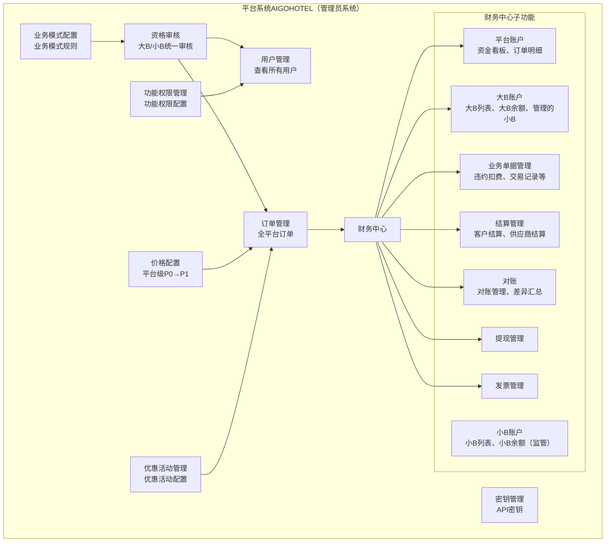

## 2.2 大B客户管理系统

### 2.2.1 AIGO大B（平台自有大B账户）

**功能范围：**

- **推广联盟管理**（仅AIGO大B开放，普通大B不开放）
  - 查看所有小B客户的列表
  - 修改小B客户的佣金比例
  - 停用/启用小B客户
  - 控制小B的店铺配置权限
- 订单管理（自己的订单 + 所有小B的订单）
- 加价策略配置（可自定义加价率）
- 利润钱包（查看利润、提现）
- 数据报表
- 推广链接管理（SaaS模式）
- MCP配置（MCP模式：API密钥、集成协议、用量监控）

**权限说明：**

- ✅ 可以管理推广联盟用户（小B客户）
- ✅ 可以设置自己的加价率（partnerCanSetMarkupRate=true）
- ✅ 可以查看自己的订单和所有小B的订单
- ✅ 可以修改小B客户的佣金比例
- ✅ 可以停用/启用小B客户
- ✅ 可以控制小B的店铺配置权限
- ✅ SaaS模式：可以生成推广链接，设置加价策略
- ✅ MCP模式：可以管理API密钥，配置MCP集成，查看用量
- ❌ **不可审核小B申请**（审核由平台系统AIGOHOTEL完成）

**特征：**

- 业务模式：SaaS / MCP
- 可以设置加价率：是
- 可以管理推广联盟：是（仅AIGO大B，由管理员权限控制）
- 所有推广联盟用户统一挂载在AIGO大B下

### 2.2.2 普通大B客户

**功能范围：**

- 订单管理（自己的订单）
- 加价策略配置（可自定义加价率，从P1到P2）
- 利润钱包（查看利润、提现）
- 数据报表
- 推广链接管理（SaaS模式）
- MCP配置（MCP模式：API密钥、集成协议、用量监控）

**权限说明：**

- ❌ **不可管理推广联盟**（此功能仅AIGO大B开放）
- ✅ 可以设置自己的加价率（partnerCanSetMarkupRate=true）
- ✅ 可以查看自己的订单
- ✅ SaaS模式：可以生成推广链接，设置加价策略
- ✅ MCP模式：可以管理API密钥，配置MCP集成，查看用量

**特征：**

- 业务模式：SaaS / MCP
- 可以设置加价率：是
- 可以管理推广联盟：否（由管理员权限控制，目前不开放）

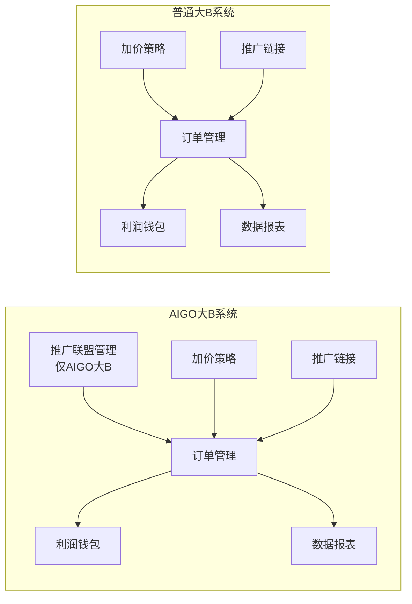

## 2.3 小B客户管理系统

**功能范围：**

- 推广链接（审核通过后自动获得，只读）
- 订单查看（自己的订单）
- 佣金明细查看（推广联盟模式，按佣金比例计算）
  - 查看佣金比例（由AIGO大B设置）
  - 查看佣金明细
  - 查看佣金统计
- 提现申请
- 数据报表（只读）
- **店铺配置**（由AIGO大B权限控制，需授权后可见）

**权限说明：**

- 审核通过后自动获得推广链接，无法修改价格比例
- 可以查看自己的订单
- 可以查看自己的佣金明细和佣金比例
- 可以申请提现
- 无法设置加价率（partnerCanSetMarkupRate=false）
- 佣金比例由AIGO大B设置（AIGO大B可修改）
- **店铺配置功能**：由AIGO大B在推广联盟管理中控制是否开放给该小B客户

**特征：**

- 业务模式：推广联盟（Affiliate）
- 可以设置加价率：否
- 由AIGO大B管理：是（统一挂载在AIGO大B下）
- 以用户身份申请，选择推广联盟模式
- 平台系统AIGOHOTEL审核通过后，自动挂载在AIGO大B下，自动获得推广链接
- 不需要单独申请推广链接

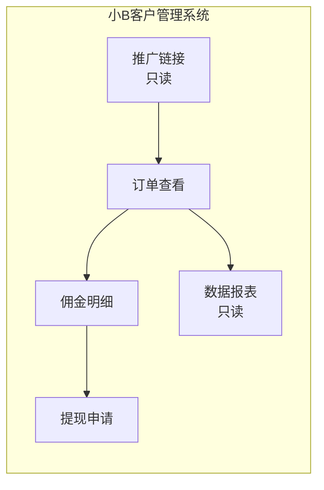

# 三、权限矩阵

| 功能模块         | 平台系统AIGOHOTEL``（管理员系统）                                                   | AIGO大B                                | 普通大B客户（SaaS/MCP）         | 小B客户（推广联盟）        |
| ---------------- | ----------------------------------------------------------------------------------- | -------------------------------------- | ------------------------------- | -------------------------- |
| 大B客户管理      | ✅ 全部                                                                             | ❌                                     | ❌                              | ❌                         |
| 推广联盟管理     | ✅ 全部                                                                             | ✅ 管理/停用启用/设置佣金/店铺配置权限 | ❌**不开放**              | ❌                         |
| 用户审核         | ✅ 审核所有用户申请 ``（大B/小B都以用户身份申请）``审核通过后自动获得权限和推广链接 | ❌                                     | ❌                              | ❌                         |
| 订单管理         | ✅ 全部                                                                             | ✅ 自己的+所有小B的                    | ✅ 仅自己的                     | ✅ 查看自己的              |
| 加价策略设置     | ✅ 平台级（P0→P1）                                                                 | ✅ 自己的（P1→P2）                    | ✅ 自己的（P1→P2）             | ❌                         |
| 结算管理         | ✅ 全部                                                                             | ✅ 自己的                              | ✅ 自己的                       | ✅ 查看自己的              |
| 推广链接生成     | ❌                                                                                  | ✅（SaaS模式）                         | ✅（SaaS模式，仅自己）          | ✅ 获取（只读）            |
| MCP配置          | ❌                                                                                  | ✅（MCP模式）                          | ✅（MCP模式）                   | ❌                         |
| 价格比例修改     | ✅ 平台级                                                                           | ✅ 自己的                              | ✅ 自己的                       | ❌                         |
| 佣金率设置       | ✅                                                                                  | ✅ 设置/修改小B的佣金率                | ❌**不开放**              | ✅ 查看（只读）            |
| 佣金明细查看     | ✅                                                                                  | ✅ 查看所有小B的                       | ❌                              | ✅ 查看自己的              |
| 提现申请         | ❌                                                                                  | ✅ 自己的                              | ✅ 自己的                       | ✅ 自己的                  |
| 数据报表         | ✅ 全部                                                                             | ✅ 自己的+所有小B的                    | ✅ 仅自己的                     | ✅ 查看自己的              |
| 停用/启用小B     | ✅                                                                                  | ✅ 可以停用/启用                       | ❌**不开放**              | ❌                         |
| 店铺配置         | ✅ 查看                                                                             | ✅ 自己的（SaaS模式）                  | ✅ 自己的（SaaS模式，默认开放） | ✅ 由AIGO大B控制（需授权） |
| 店铺配置权限控制 | ✅                                                                                  | ✅ 控制小B的店铺配置权限               | ❌                              | ❌                         |
# 四、系统入口与路由

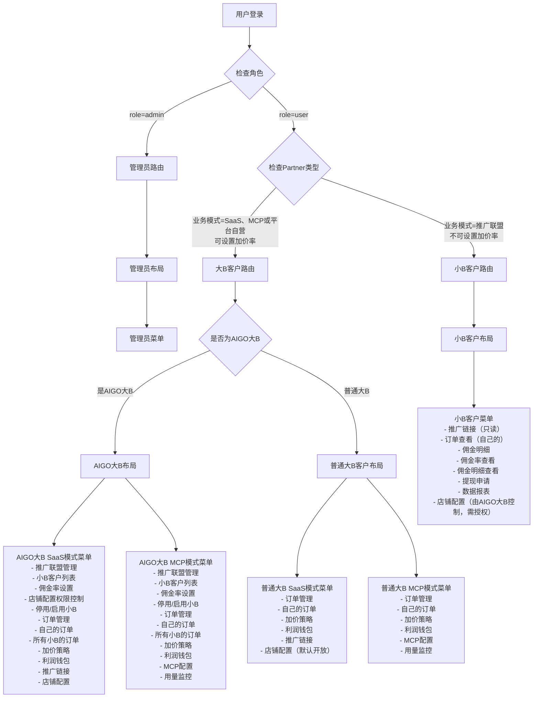
# 七、业务模式说明

## 7.1 大B客户（可设置加价率）

### 7.1.1 AIGO大B与普通大B能力对比

| 功能/能力                     | AIGO大B（SaaS，平台自营）                           | 普通大B（SaaS）                                      | 普通大B（MCP）                                      |
|------------------------------|-----------------------------------------------------|-----------------------------------------------------|-----------------------------------------------------|
| 加价率设置                    | ✅ 从 P1 → P2，支持自定义加价率                     | ✅ 从 P1 → P2，支持自定义加价率                     | ✅ 从 P0 → P2，支持自定义加价率                     |
| 推广链接                      | ✅ 可以生成推广链接（可用于自身及挂载小B）         | ✅ 可以生成推广链接（仅自己使用）                   | ✅ 可以生成推广链接（仅自己使用）                   |
| 推广联盟管理（小B客户）       | ✅ 可以管理推广联盟（仅 AIGO 大B开放）             | ❌ 不可管理推广联盟                                  | ❌ 不可管理推广联盟                                  |
| 店铺配置功能                  | ✅ 默认开放，可配置店铺品牌、Logo、店铺代码等      | ✅ 默认开放，可配置店铺品牌、Logo、店铺代码等      | ✅ 默认开放，可配置店铺品牌、Logo、店铺代码等      |
| API 密钥与 MCP 集成          | ❌ 不涉及（SaaS 自营模式，不以 MCP 为主）          | ❌ 不涉及                                           | ✅ 可以管理 API 密钥和 MCP 集成                     |
| 用量监控                      | ❌ 不涉及                                           | ❌ 不涉及                                           | ✅ 可以查看用量监控                                  |
| 订单/利润/佣金/数据报表查看   | ✅ 可以查看订单、利润、数据报表                    | ✅ 可以查看订单、利润、数据报表                    | ✅ 可以查看订单、佣金、数据报表                    |

> 说明：推广联盟管理（小B客户）能力当前仅对 AIGO 大B 开放；普通大B 无法管理挂载小B，仅能管理自身业务与订单。

### 7.2 小B客户（只获取链接）

**推广联盟模式：**

- 不能设置加价率
- 只能获取推广链接（由AIGO大B分配）
- 可以查看自己的订单
- 可以查看自己的佣金（按佣金比例计算）
- 佣金比例由AIGO大B设置
- **统一挂载在AIGO大B下**（所有推广联盟用户）
- **店铺配置功能**：由AIGO大B在推广联盟管理中控制是否开放（需授权后可见和使用）
# 六、业务流程说明

## 6.1 用户申请流程（大B/小B统一流程）

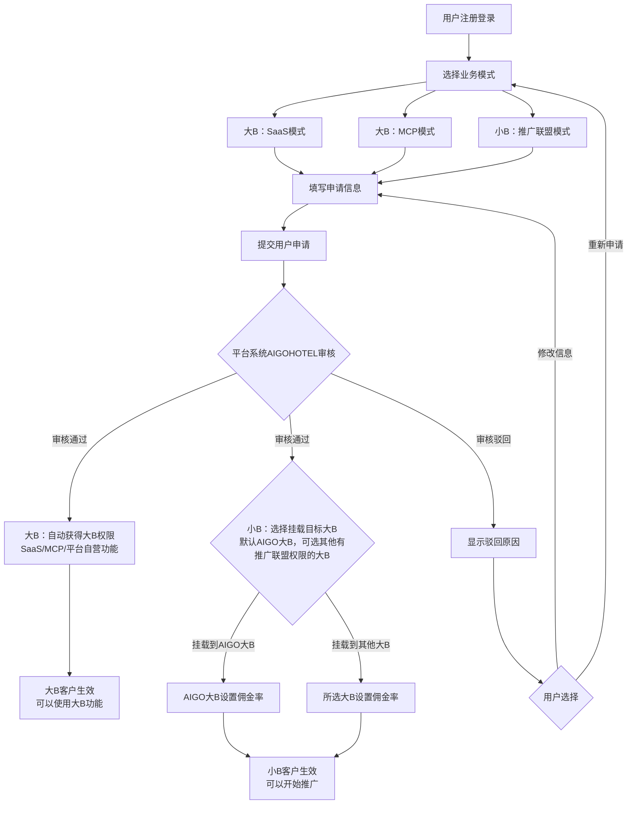

## 6.2 有推广联盟管理权限的大B管理范围

- 只有 `can_manage_affiliate = 1` 的大B客户才能管理推广联盟
- 默认情况下，只有AIGO大B具有此权限
- 管理员可以通过配置为其他大B客户开放推广联盟管理权限（未来扩展功能）

**可执行操作：**

1. ✅ 查看所有挂载在自己下的小B客户的订单
2. ✅ 修改挂载在自己下的小B客户的佣金比例
3. ✅ 停用/启用挂载在自己下的小B客户
4. ✅ 设置加价策略（影响挂载在自己下的小B链接价格）
5. ✅ 控制挂载在自己下的小B的店铺配置权限（开启/关闭）

## 6.3 订单关联关系

**订单生成时的关联：**

- 当订单由小B推广链接生成时：
  - 订单关联大B客户（`order.partnerId = 挂载大B的 partnerId`，该大B是订单的业务归属方 / 实际销售方）；
  - 订单必须关联小B客户（`order.smallBPartnerId = 小B客户的 partnerId`，用于识别推广来源）；
  - 订单价格：使用挂载大B设置的加价比例按每晚计算，每晚得到订单金额 P2，订单总金额为所有晚的 P2 总和；
  - 订单佣金：按挂载大B为小B设置的佣金比例按每晚计算小B佣金，订单总佣金为所有晚的佣金总和；
  - 订单的 `partnerBusinessModel` 来自大B客户（SaaS 或 MCP），小B仅作为推广方，不改变业务模式。

- 当订单由大B直接生成时（无小B参与）：
  - 订单关联大B客户（`order.partnerId = 大B客户的 partnerId`）；
  - `order.smallBPartnerId = NULL`（无小B关联）；
  - 订单价格同样使用大B客户设置的加价比例按每晚计算 P2，订单总金额为所有晚的 P2 总和；
  - 不产生小B佣金。

**订单查询权限：**

- AIGO大B：可以查询自己的订单 + 所有挂载小B的订单
  - 查询条件：`order.partnerId = AIGO大B客户ID` OR `order.smallBPartnerId` IN（所有挂载小B的 ID 列表）；
- 普通大B客户：只能查询自己的订单
  - 查询条件：`order.partnerId = 大B客户ID` AND `order.smallBPartnerId IS NULL`（仅自己直接生成的订单）；
- 小B客户：只能查询自己的订单
  - 查询条件：`order.smallBPartnerId = 小B客户ID`；
- 平台系统 AIGOHOTEL（管理员系统）：可以查询所有订单。

**订单利润分配（按每晚计算后汇总）：**

- 当订单由小B推广链接生成时：
  - **每晚计算**：
    - 每晚平台代收款项：每晚订单金额 P2（C 端购买价格）；
    - 每晚平台利润：每晚分销价 P1 - 每晚订单底价 P0（平台加价部分，SaaS 和 MCP 模式相同）；
    - 每晚订单总利润：每晚订单金额 P2 - 每晚订单底价 P0；
    - 每晚小B佣金：`每晚小B佣金 = 每晚订单金额 P2 × 佣金比例`（由挂载大B设置）；
    - 每晚大B利润：`每晚大B利润 = 每晚订单金额 P2 - 每晚分销价 P1 - 每晚小B佣金`（SaaS 和 MCP 模式相同）。
  - **订单汇总**：
    - 平台代收款项：订单总金额 P2（所有晚的 P2 总和）；
    - 平台总利润：订单总分销价 P1 - 订单总底价 P0（所有晚的平台利润总和）；
    - 订单总利润：订单总金额 P2 - 订单总底价 P0（所有晚的利润总和）；
    - 订单总小B佣金：所有晚的小B佣金总和；
    - 订单总大B利润：所有晚的大B利润总和。
  - **结算流程**（按订单汇总金额结算）：
    - 当前：平台代收订单总金额 P2 → 扣除平台总利润（总分销价 P1 - 总订单底价 P0）→ 结算给 AIGO 大B → AIGO 大B结算总佣金给小B；
    - 后期规划：平台代收订单总金额 P2 → 扣除平台总利润（总分销价 P1 - 总订单底价 P0）→ 结算给普通大B → 普通大B结算总佣金给小B（当前不开放普通大B推广联盟权限）。

- 当订单由大B直接生成时（无小B参与）：
  - **每晚计算**：
    - 每晚平台代收款项：每晚订单金额 P2；
    - 每晚平台利润：每晚分销价 P1 - 每晚订单底价 P0（SaaS 和 MCP 模式相同）；
    - 每晚大B利润：`每晚大B利润 = 每晚订单金额 P2 - 每晚分销价 P1`（SaaS 和 MCP 模式相同）；
  - **订单汇总**：
    - 平台代收款项：订单总金额 P2（所有晚的 P2 总和）；
    - 平台总利润：订单总分销价 P1 - 订单总底价 P0（所有晚的平台利润总和）；
    - 订单总大B利润：所有晚的大B利润总和；
  - 无小B佣金。
# 七、价格与佣金体系

> 说明：本章节中的价格均为统一口径（例如“含税结算价”），平台利润、大B利润、小B佣金的计算在所有 PRD 中统一使用此处公式。

## 7.1 大B链接价格链路（SaaS/MCP模式，按每晚计算）

```
每晚订单底价 P0（供应商成本）
    ↓ 平台加价，生成 P1
每晚分销价 P1 = 每晚订单底价 P0 × (1 + 平台加价率)
    ↓ 大B设置加价率，从 P1 到 P2
每晚订单金额 P2 = 每晚分销价 P1 × (1 + 大B加价率)
    ↓ 大B链接价格
大B链接价格 = 每晚订单金额 P2（按每晚展示）
    ↓ 订单汇总
订单总金额 P2 = 所有晚的 P2 总和
```

**大B场景下的利润拆分（按每晚）：**

- 平台利润：`平台利润 = P1 - P0`
- 大B利润：`大B利润 = P2 - P1`
- 小B未参与时，无佣金分成

## 7.2 小B链接价格链路（推广联盟模式，按每晚计算）

```
每晚订单底价 P0（供应商成本）
    ↓ 平台加价，生成 P1
每晚分销价 P1 = 每晚订单底价 P0 × (1 + 平台加价率)
    ↓ 挂载大B设置加价率，从 P1 到 P2
每晚订单金额 P2 = 每晚分销价 P1 × (1 + 挂载大B加价率)
    ↓ 小B链接价格（使用挂载大B加价率）
小B链接价格 = 每晚订单金额 P2（按每晚展示）
    ↓ 佣金与利润（按每晚计算）
每晚平台利润 = 每晚分销价 P1 - 每晚订单底价 P0
每晚小B佣金 = 每晚订单金额 P2 × 佣金比例（由挂载大B设置）
每晚大B利润 = 每晚订单金额 P2 - 每晚分销价 P1 - 每晚小B佣金
    ↓ 订单汇总
订单总金额 P2 = 所有晚的 P2 总和
订单总平台利润 = 所有晚的平台利润总和
订单总小B佣金 = 所有晚的小B佣金总和
订单总大B利润 = 所有晚的大B利润总和
```


### 7.3 关键规则

1. 价格计算按每晚进行，订单总金额为所有晚的金额总和：
   - `订单总金额 P2 = Σ P2(每晚)`
   - `订单总平台利润 = Σ (P1 - P0)`
   - `订单总小B佣金 = Σ (P2 × 佣金比例)`
   - `订单总大B利润 = Σ (P2 - P1 - 佣金)`
2. 大B链接价格：由该大B设置的加价率决定；链路为 `P0 → P1（平台加价）→ P2（大B加价）`。
3. 小B链接价格：由挂载大B的加价率决定（通过 `parent_partner_id` 关联）；链路为 `P0 → P1（平台加价）→ P2（挂载大B加价）`，展示价格为 P2。
4. 小B佣金：
   - 佣金比例由挂载大B设置，计算基数为 P2，即：`每晚小B佣金 = P2 × 佣金比例`；
   - 小B只能查看佣金比例及自己的佣金明细，不可修改佣金比例。
5. 佣金比例限制（保证大B利润不为负）：
   - 保存大B配置的佣金比例时，需要满足：
     - 当前加价比例 & 价格体系下，`P2 - P1 - P2 × 佣金比例 ≥ 0`，否则禁止保存并提示“大B利润为负，不允许该佣金比例配置”。
6. 链接与订单关联：
   - 小B链接通过 `parent_partner_id` 字段关联到挂载大B；
   - 订单生成时：`partner_id` 字段为挂载大B的 ID，`small_b_partner_id` 字段为小B的 ID；
   - 限制：同一业务模式下，小B最多挂载一个大B（防止价格链路和佣金分配混乱）。
7. SaaS 与 MCP 模式的价格链路相同：`P0 → P1 → P2`，差异仅在业务模式标签和渠道来源，不影响价格与利润计算公式。

### 7.4 结算流程（按订单汇总金额）

> 统一口径：平台只结算给大B和供应商，小B佣金一律由挂载的大B结算，平台不直接向小B打款，只负责记账与监管。

**当前模式：仅 AIGO 大B可以管理推广联盟小B**

- 平台代收订单总金额 P2；
- 扣除平台总利润 `(总分销价 P1 - 总订单底价 P0)`；
- 将剩余金额结算给 AIGO 大B / 普通大B：`结算金额 = 订单总金额 P2 - 平台总利润`；
- 对于推广联盟订单：
  - 挂载的大B（当前仅 AIGO 大B 具备该权限）基于订单维度的佣金比例和订单金额，向小B结算佣金；
  - 平台记录订单的（佣金比例）及结算数据，用于大B结算小B和平台侧监管、对账；
  - 平台不直接将佣金打入小B账户。

**后期模式：开放普通大B的推广联盟权限（规划中）**

- 平台代收订单总金额 P2；
- 扣除平台总利润 `(总分销价 P1 - 总订单底价 P0)`；
- 将剩余金额结算给对应大B（包括 AIGO 大B与普通大B）：`结算金额 = 订单总金额 P2 - 平台总利润`；
- 允许具备推广联盟权限的普通大B也挂载小B，并基于订单维度的（佣金比例）和订单金额，向小B结算总佣金；
- 平台仍然不直接向小B结算，只提供数据与对账支持。
# 八、系统关系总览

## 8.1 三层管理体系

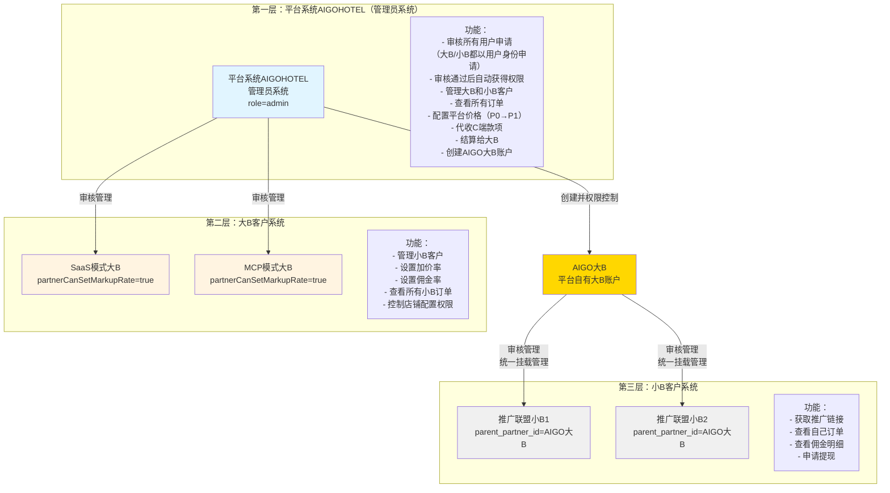

## 8.2 关键业务规则

**用户分类：**

| 角色类型 | role | 业务模式 | partnerCanSetMarkupRate | isAigoBigb | parent_partner_id | 权限说明 |
|---------|------|---------|------------------------|------------|-------------------|---------|
| **平台系统AIGOHOTEL（管理员系统）** | admin | - | - | - | - | 审核所有用户申请，管理所有大B和小B客户，代收C端款项，结算给大B |
| **AIGO大B** | user | SaaS | true | true | - | 可管理推广联盟 |
| **普通大B客户** | user | SaaS或MCP | true | false | - | 不可管理推广联盟 |
| **小B客户** | user | 推广联盟 | false | - | AIGO大B的ID | 挂载在AIGO大B下 |

**申请流程：**


**权限划分：**

- 大B客户可以设置加价率，影响小B链接价格
- AIGO大B可以设置/修改小B的佣金比例
- AIGO大B可以查看所有挂载小B的订单
- AIGO大B可以控制小B的店铺配置权限
- **AIGO大B结算佣金给小B**（当前实现）
- 普通大B结算佣金给小B（后期规划功能，当前不开放推广联盟权限）
- SaaS大B默认可以使用店铺配置功能
- 推广联盟小B的店铺配置功能由AIGO大B控制（需授权）
- 小B客户只能查看自己的订单和佣金
- 小B客户可以查看佣金并向挂载大B申请结算/提现（由大B处理）

**价格体系：**

- SaaS模式：P0 → P1（平台加价）→ P2（大B加价）→ 小B链接价格
- MCP模式：P0 → P1（平台加价）→ P2（大B加价）→ 小B链接价格
- 小B佣金 = 订单总金额P2 × 佣金比例（由AIGO大B设置）
- **结算流程**：
  - **当前**：平台代收P2 → 扣除平台利润(P1-P0) → 结算给AIGO大B → AIGO大B结算佣金给小B
  - **后期规划**：平台代收P2 → 扣除平台利润(P1-P0) → 结算给普通大B → 普通大B结算佣金给小B（当前不开放）
